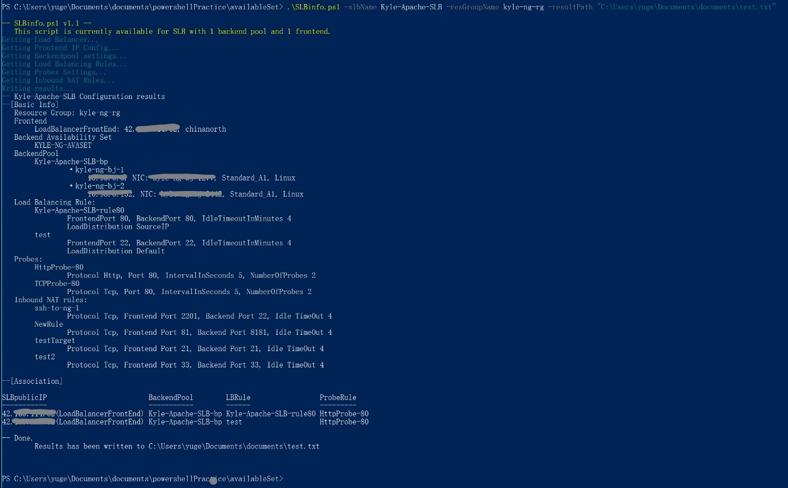
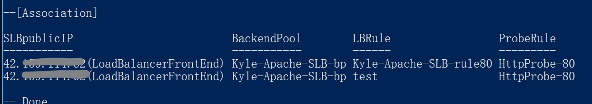

# 使用 PowerShell 脚本查看 ARM 模式下 SLB 配置

在 ARM 模式中，我们可以通过 PowerShell 调用 API 的方式查看 SLB 的配置，包括前端 IP、后端池内 VM、Health Probe 等配置。但由于 SLB 架构复杂性，有些配置无法通过简单的命令直接查看到，使用起来比较复杂。特别是查看后端池 VM 需要根据 SLB 绑定的 NIC 对每一台虚拟机进行查询。如果订阅中 ARM 的 VM 数量众多，查询起来也比较费力。

为了一步获取 SLB 配置，以下整理了 PowerShell 获取 SLB 配置的相关命令，并提供了一次性自动获取 SLB 全部配置的 PowerShell 脚本作为示例，保存后直接运行即可。

自动化获取 SLB 脚本 [getSLBinfo.ps1](https://github.com/wacn/AOG-CodeSample/blob/master/LoadBalancer/PowerShell/getSLBinfo.ps1) :

```
[Detail] getSLBinfo.ps1
通过 PowerShell 脚本，自动获取 SLB 配置（这里以一个 Frontend IP，一个 Backend Pool 的情境为例），登录（Login-AzureRmAccount）后使用 PowerShell 运行脚本即可。
Required Input:
-SLBname
-ResourceGroupName
Optional Input:
-resultPath (Default C:\temp\SLB-SLBname-info.txt)
Output directory:
According to input param -resultPath (Default C:\temp\SLB-SLBname-info.txt)
```

运行脚本，截图如下 :



SLB 各个组件的介绍以及创建 SLB 的步骤可以参考：

[使用 Azure 门户创建面向 Internet 的负载均衡器](https://docs.azure.cn/zh-cn/load-balancer/load-balancer-get-started-internet-portal)


以下为脚本中使用到的 SLB 相关 PowerShell 命令。

- 获取 SLB 对象

    `$slb = Get-AzureRmLoadBalancer -Name $slbName -ResourceGroupName $resGroupName; `

- 查看 Frontend 配置

    获取 SLB 第 i+1 个的 Frontend 配置，这里无法直接从 SLB 获取 Front IP 的地址，只能查看到 Front IP 的名字（$fe.PublicIpAddress.Id 的 publicIPAddresses 项） 

    `$fe = $slb.FrontendIpConfigurations[i]; `

    但可以根据 `$feIpConfStr`，再查询 Frontend IP 的地址

    `Get-AzureRmPublicIpAddress -Name $feIpConfStr -ResourceGroupName $resGroupName;`

- 查看 Probe 配置

    获取 SLB 的 Probes（探测器）配置，包括协议（HTTP/TCP）、端口、间隔时长和探测次数

    `$rule = $slb.Probes;`

- 查看 NAT Rules 配置

    获取 SLB 的 NAT Rules 配置，包括前端 Port、后端 Port、IdleTimeout、协议等。

    `$rule = $slb.InboundNatRules;`

- 查看 Backend Pool 配置

    获取 SLB 第 i+1 个的 Backendpool 配置。

    `$be = $slb.BackendAddressPools[i];`

    这里无法直接查看到具体的 Available Set 和 VM 名字，但能根据挂载在这个 SLB 后的 NIC 信息（`$be.BackendIpConfigurations.id` 的 networkInterfaces 内容 `$nicArray`），与各台在 Availability Set 中的 VM NIC 比较，找到相应的 VM 获取更多信息。

    ```
    # 从 nic 查对应哪台 vm
    Get-AzureRmVM  -ResourceGroupName $resGroupName | foreach {
        $vmName = $_.Name;
        $avSetStr = $_.AvailabilitySetReference.Id;
        if($avSetStr -ne $null) {		# availability set
            $vmNicStr = $_.NetworkInterfaceIDs;
            $vmNic = $vmNicStr.Split("/")[8];
        $nicConf = Get-AzureRmNetworkInterface -Name $vmNic -ResourceGroupName $resGroupName;
        
            foreach ($n in $nicArray) {
                if ($n -eq $vmNic) {
                    echo $vmName + "     " + nicConf.IpConfigurations.PrivateIpAddress;
                }
            }
        }
    } 
    ```

- 查看 Load Balance Rules 配置

    获取 SLB 的 Load Balance Rules 配置， 包括 Rule 对应的前端 Port、后端 Port、IdleTimeout、LoadDistribution 、Probe 等。

    `$rule = $slb.LoadBalancingRules;`

    Rules 是关联 Frontend、Backend、Probe 的纽带，在示例中我们以表格形式展示了它们之间的关系（Association）：

    