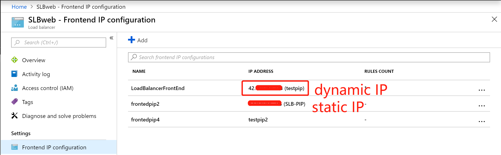
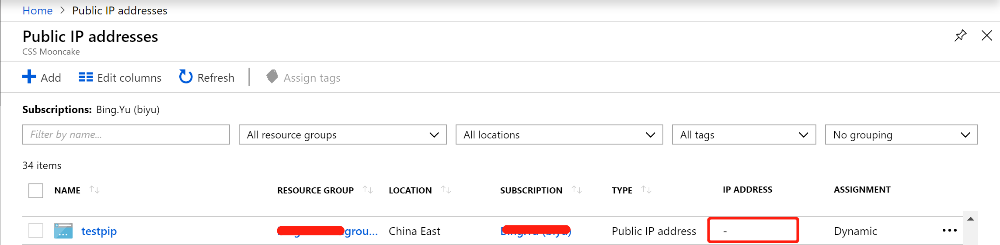
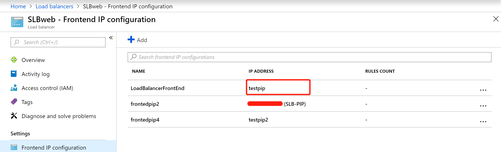
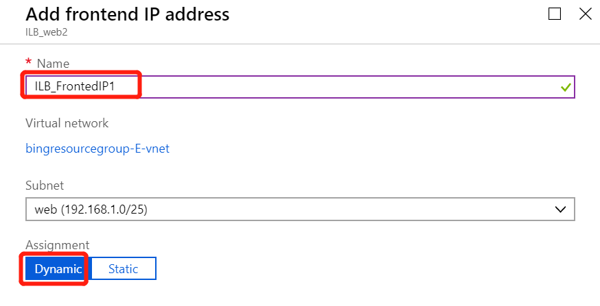
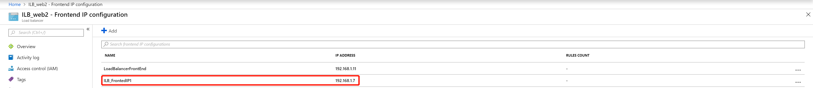

# 负载均衡器的前端动态 IP 地址的生命周期

## 背景知识

有关 Azure 平台 IP 地址分配机制和应用场景介绍：

- [Azure 中的 IP 地址类型和分配方法](https://docs.azure.cn/zh-cn/virtual-network/virtual-network-ip-addresses-overview-arm)

有关 Azure 平台针对负载均衡器的前端 IP 分配机制：

- [面向 Internet 的负载均衡器](https://docs.azure.cn/zh-cn/virtual-network/virtual-network-ip-addresses-overview-arm#internet-facing-load-balancers)

- [内部负载均衡器](https://docs.azure.cn/zh-cn/virtual-network/virtual-network-ip-addresses-overview-arm#internal-load-balancers-ilb--application-gateways)

## 场景描述

### 面向 Internet 的负载均衡器

当部署了动态的前端 IP 地址后，如果未使用负载均衡规则关联到后端池，则此动态 IP 地址不会立即生成，直到使用负载均衡规则关联到后端池（至少有一台虚拟机）后，才会实际生成动态公共 IP ：

在此之前，只能看到此页面下有一个动态 IP 资源，但是未生成实际 IP 地址。

取消所有关联到此前端 IP 的规则后（包含负载均衡规则和 NAT 规则），公网 IP 页面下生成的 IP 地址消失：

负载均衡页面下之前生成的 IP 地址被释放：

### 内部负载均衡器

对于内部负载均衡器来说，添加前端私有动态 IP 地址时，选择对于子网后，可以观察到，一旦添加，IP 地址立即生成，即使没有任何负载均衡规则或是 NAT 规则。

