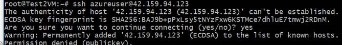
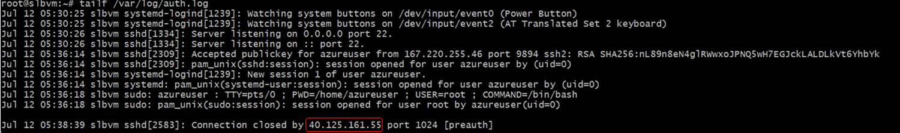
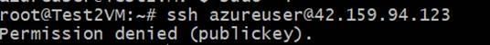
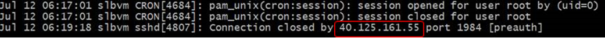

# Azure 负载均衡器后端虚拟机不同主动出站行为的源 IP 设计

Azure 中的虚拟机的主动出站行为主要有三种，具有实例级公共 IP 地址的虚拟机，无实例级公共 IP 地址的负载均衡虚拟机，无实例级公共 IP 地址的独立虚拟机，具体每种出站行为的工作原理和应用方式等，请参考 [Azure 中的出站连接](https://docs.microsoft.com/zh-cn/azure/load-balancer/load-balancer-outbound-connections#combinations)。

## 场景介绍

客户在可用性集前边加了 Azure 负载均衡器， 并把 Azure 负载均衡器的公网 IP 放到了 Web 应用访问的白名单里，对于虚拟机主动发起的向 Web 应用的请求，提示无法进行访问，排查后发现是客户的 Azure 负载均衡器上只配置了后端池，并没有配置任何的规则，导致虚拟机无法使用 Azure 负载均衡器前端的 IP 作为出站连接的源 IP，从而访问失败。

针对这种场景， 我们进行了测试。如果后端池虚机想使用 Azure 负载均衡器的公网 IP 作为出站连接的源 IP，需要在 Azure 负载均衡器上创建规则，这样才能让后端池与前端的公网 IP 关联起来， 这里的 rule 经测试，既可以是 load balance rule, 也可以是 nat rule。

## 测试 1

Azure 负载均衡器后端绑定虚拟机为后端池，不配置探测和负载均衡规则，但配置 Inbound NAT rule，测试发现虚拟机主动出站连接使用的是 Azure 负载均衡器的公网 IP:

测试源虚拟机是 Test2VM，前端 Azure 负载均衡器公网 IP 为 40.125.161.55， 目的虚拟机是 lbvm,对应的虚机公网地址为 42.159.94.123， 在源虚拟机上 ssh 登录目的虚拟机：

在目的虚拟机上 'tailf /var/log/auth.log'，实时观察 ssh 登录进来的请求的源 IP，可以看到请求的源 IP 是 Azure 负载均衡器的前端公网 IP。

## 测试 2

Azure 负载均衡器后端绑定虚拟机为后端池，不配置 Inbound NAT rule，**仅配置 load balance rule**，但由于配置 load balance rule 时需要先配置探测， 所以这种方式需要同时配置探测和均衡规则。

测试源虚拟机是 Test2VM，前端 Azure 负载均衡器公网 IP 为 40.125.161.55，目的虚拟机是 lbvm,对应的虚拟机公网地址为 42.159.94.123， 在源虚拟机上 ssh 登录目的虚拟机：

在目的虚拟机上 'tailf /var/log/auth.log'，实时观察 ssh 登录进来的请求的源 IP，可以看到访问的 IP 是 Azure 负载均衡器的前端公网 IP。

如果只是对于出站连接的这种场景，在配置负载均衡规则时，探测不一定非要处于健康状态，对于入向连接时，探测一定要处于健康状态，才能将请求转发到健康的后端池上。

综上，不一定非要配置探测才能让后端虚拟机使用 Azure 负载均衡器的公网 IP 作为出站源 IP，客户也可以通过创建 nat rule 实现后端池和前端公网 IP 的关联， 如果只是把虚拟机加到后端池中，而不添加任何规则的话，那么出站行为与 [Standalone VM with no Instance Level Public IP](https://docs.microsoft.com/azure/load-balancer/load-balancer-outbound-connections#defaultsnat) 是一致的。
