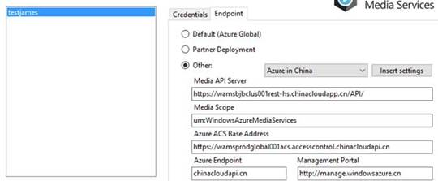
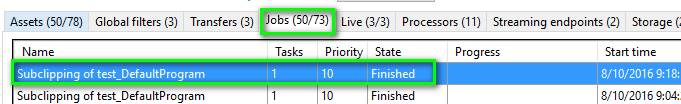

# 如何下载直播生成的视频文件

## 问题描述

使用媒体服务的直播服务后，会产生归档文件，如何将其下载到本地。

## 解决方案

建议使用 Azure Media Service Explore 下载直播后的视频文件，具体如下：

1. 下载工具：http://aka.ms/amse
2. 通过媒体服务帐号进行登录，请您务必使用 China 的 endpoint :
   
3. 登录成功后，在 **Assets** 中找到直播产生的视频文件，并且选择 **Subclip** 按钮：
   
4. 提交了这个任务后，可以通过 **Jobs** 查看状态，直到它显示 **Finished** 状态：
   
5. 返回到 **Assets** 界面，就可以看到这个新生产的文件，我们可以直接进行下载了：
   

