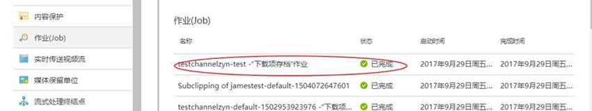
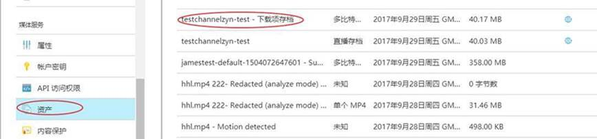

# 如何通过 Azure 门户下载直播生成的视频文件

## **问题描述**

使用媒体服务的直播服务后，会产生归档文件，如何通过门户将其下载到本地。

## **解决方案**

具体步骤如下：

1. 直播结束以后，点击 “**下载项存档**”:

   

2. 可以通过 **Job** 查看状态，直到它显示 **Finished** 状态：

   

3. 返回到资产界面，可以看到刚才的下载项存档文件：

   

4. 选中当前下载项存档文件，进行渐进式发布，然后通过下载 url 访问视频：

   

## **其他资源**

[使用 Azure Media Service Explore 下载直播后的视频文件](https://docs.azure.cn/articles/media-services/aog-media-services-qa-download-the-live-generated-video-files)