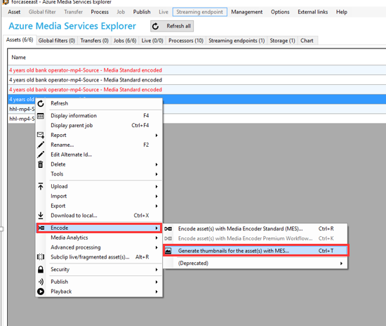
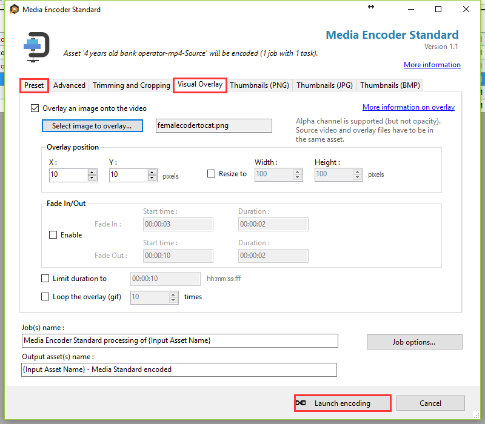

# 如何使用 Azure Media Service Explorer 添加水印

Azure 支持使用工具 Azure Media Services Explorer, 进行添加水印。具体步骤如下：

打开 Azure Media Services Explorer 工具，选中资产，右键【Encode】->【Generate thumbnails for the asset】

选择编码方式，之后选择要添加的水印即可进行编码。

> [!NOTE]
> loop 功能单用是支持的，且是相对于 gif 格式的文件来讲的播放次数，不是针对同一个渐入渐出效果循环多少次的设置。如果与渐入渐出效果混用是不支持的。