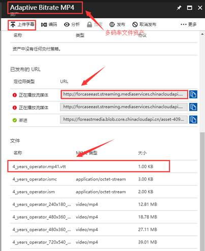
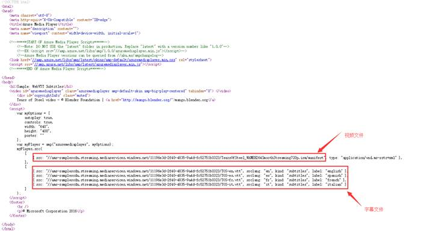
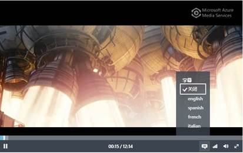

# 如何为媒体服务视频加载字幕

本文以 Azure Media Player 作为播放器，目前 AMP 所支持的字幕格式为 WebVTT 格式，登陆 Azure 门户，上传字幕文件：

拼接视频发布 URL 以及 webvtt 文件名称获取字幕文件 URL,如：

`http://forcaseeast.streaming.mediaservices.chinacloudapi.cn/04bee42b-e2bf-45dc-ac14-8b392a93b897/4_years_operator.mp41.vtt`

参考[该示例](http://amp.azure.net/libs/amp/latest/samples/dynamic_webvtt.html)，将字幕文件嵌入到 AMP 播放器所在的网页中：

打开播放器网页，选择字幕语言即可加载字幕：

