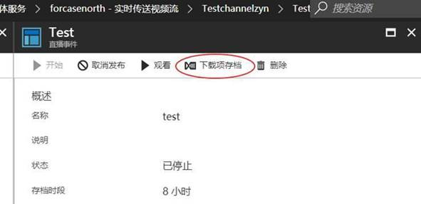
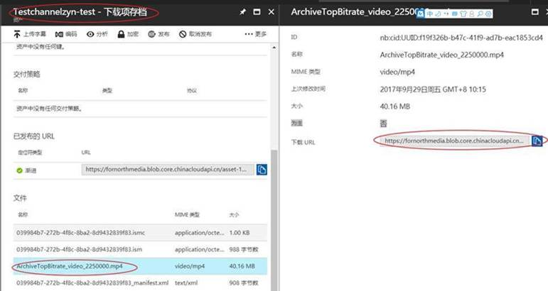
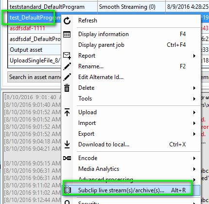
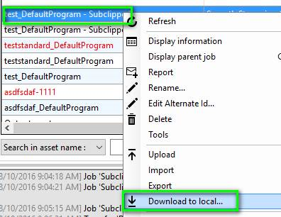

# 如何下载直播生成的视频文件

## 问题描述

使用媒体服务的直播服务后，会产生归档文件，如何将其下载到本地。

## 解决方案

可以使用以下两种方式进行下载：

- 通过 [Azure Portal](https://portal.azure.cn) 直接下载， 具体如下：

    1. 直播结束以后，点击 “**下载项存档**”:

        

    2. 可以通过 **Job** 查看状态，直到它显示 **Finished** 状态：

        

    3. 返回到资产界面，可以看到刚才的下载项存档文件：

        

    4. 选中当前下载项存档文件，进行渐进式发布，然后通过下载 url 访问视频：

        

- 使用 Azure Media Service Explore 下载直播后的视频文件，具体如下：

    1. 下载工具：http://aka.ms/amse。

    2. 通过媒体服务帐号进行登录，请您务必使用 China 的 endpoint :

        

    3. 登录成功后，在 **Assets** 中找到直播产生的视频文件，并且选择 **Subclip** 按钮：

        

    4. 提交了这个任务后，可以通过 **Jobs** 查看状态，直到它显示 **Finished** 状态：

        

    5. 返回到 **Assets** 界面，就可以看到这个新生产的文件，我们可以直接进行下载了：

        