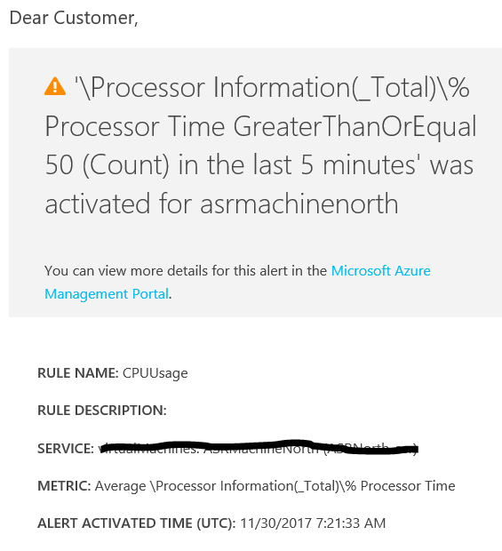
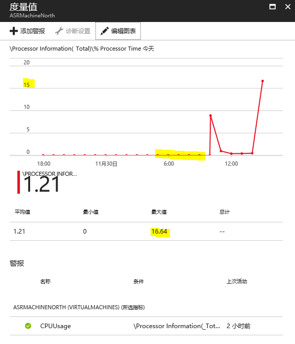
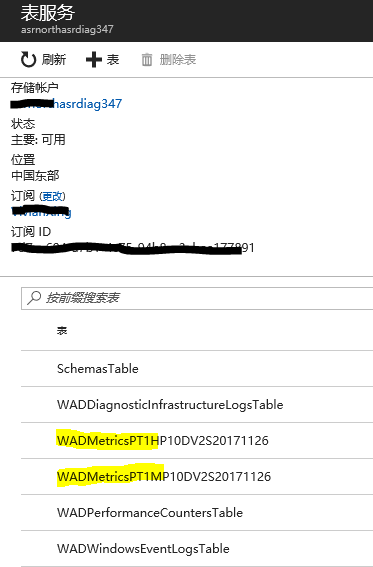
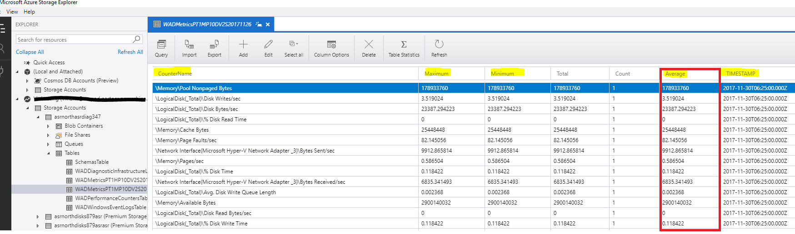
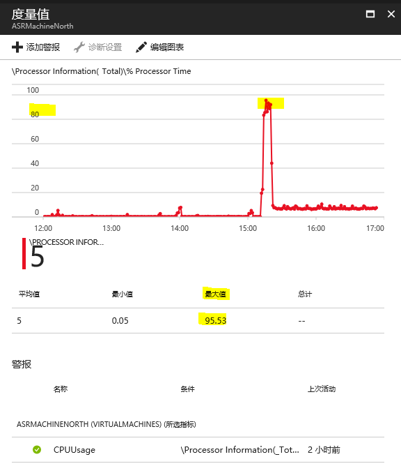
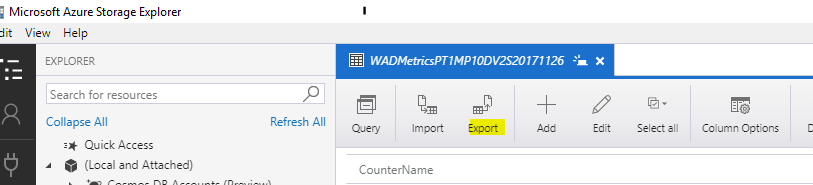

# Azure 虚拟机诊断图表的显示

Azure 诊断扩展可以提供 Azure 虚拟机级别的监视和诊断功能。 我们可以通过 [Azure 门户](https://portal.azure.cn)或者 [PowerShell](https://docs.azure.cn/zh-cn/virtual-machines/windows/extensions-diagnostics-template) 的方式启动对虚拟机的诊断，并通过门户查看到实时监控图。

## 使用中的场景描述

而当您在使用诊断图表时可能会遇到以下场景：您设置了并收到了关于虚拟机相关性能的监视警报，可是当您根据警报邮件中的链接查看性能指标时，图表上却没有相关数值。

例如，CPU 超过 50%的警报：

门户上的 CPU 图表却显示最大值是 16%：

这是什么原因呢？简单来讲，是因为您在显示图表时选择了较大的时间跨度，比如 24 小时。

具体我们要解释以下虚拟机诊断的机制。

## 虚拟机诊断机制

当我们启用虚拟机诊断，Azure 诊断扩展会收集虚拟机的性能数据上传到存储账户对的表 (Table) 中，然后通过 Microsoft.insights 这个资源提供程序从对应的表中获取数据，并展现出来。

您可以在 **存储账户**-> **表服务** 中看到这些表，我们以 Windows 虚拟机为例，列表如下图：

其中 WADMetrics 表存放虚拟机的性能数据。有 2 种类型：

`WADMetricsPT1H**`：时间粒度为 1 小时的聚合数据。 
`WADMetricsPT1M**`：时间粒度为 1 分钟的聚合数据。

用 [Storage Explorer](https://azure.microsoft.com/en-us/features/storage-explorer/) 等工具可以查看详细。以 `WADMetricsPT1MP10*` 表为例，每一行数据是单个性能指标在对应时间粒度（1 分钟）内的最大值、最小值、平均值等信息。

对于 WADMetrics 表的详细解释，请参考：[存储中的 WADMetrics 表](https://docs.azure.cn/zh-cn/virtual-machines/windows/extensions-diagnostics-template#wadmetrics-tables-in-storage)。

## 性能图表的显示

对应到我们的虚拟机性能的图表，当我们选择较小的时间跨度，门户会抽取 WADMetricsPT1M 表生成图表，在这里，图表取的是 Average 值，即每一分钟的平均值。而非瞬时最大值。

而当您选择较大时间跨度（当时间跨度超过 17 个小时），门户就会抽取 `WADMetricsPT1H**` 表中的内容，而显示的数值为一小时粒度内平均值。

以我们的虚拟机为例，当我们把时间跨度缩短到 5 小时：

这时就可以看到 CPU 最大数值 95%，符合报警邮件中的内容。

## 导出存储服务表数据到 csv

如果您需要查看 CPU 使用的详细信息，比如瞬时最大最小值，您可以尝试从 Storage Explorer 导出 Table。

或者用 PowerShell 导出您需要的 Table 到 CSV 进行进一步的分析和图表制作： [使用 PowerShell 将存储服务表数据导出到 csv 文件](https://docs.azure.cn/zh-cn/articles/azure-operations-guide/sample-code/aog-sample-code-storage-table-export-to-csv-via-powershell)。