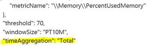
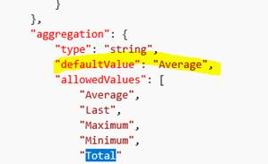
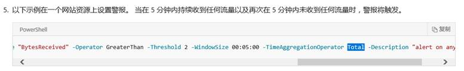
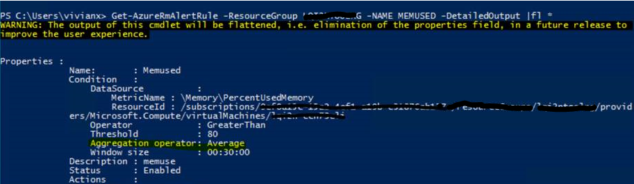

# 收到异常的监视指标相关的警报邮件

## 问题描述

在设置了监视指标相关的警报规则，比如，在 Linux 虚拟机上设置了警报规则，当内存使用量大于  70% 时触发警报并发送电子邮件。一段之间以后，您收到了警报邮件，但当您在 Azure 门户中查看监视历史数据时发现该指标并没有出现过阈值的情况。

## 问题分析

在用 Powershell 或者 Azure CLI 添加警报规则时，将 `timeAggregation` 的值设置成了 `Total`，所以当一段时间内指标值总量达到阈值时警报被触发。



## 解决方法

对于监视指标类的警报， `aggregation` 默认值是 `Average`。



而 Total 适用于需要某一段时间内总量的计数的警报，如该文档：[在 Azure Monitor 中为 Azure 服务创建指标警报 - PowerShell](https://docs.azure.cn/zh-cn/monitoring-and-diagnostics/insights-alerts-powershell)所举事例：




如果是从 Azure 门户上添加的警报规则, `Aggregation` 默认值是 `Average`。

如果使用 Powershell 或者 CLI 脚本, 注意将 `Aggregation` 值设置为 `Average`。

创建好后，用 PowerShell 命令检查一下 `Aggregation` 的值：

```PowerShell
Get-AzureRMAlertRule -ResourceGroup <ResourceGroupName> -Name <AlertName> -Detailedoutput
```



## 参考文档

- [使用 Resource Manager 模板创建指标警报](https://docs.microsoft.com/zh-cn/azure/monitoring-and-diagnostics/monitoring-enable-alerts-using-template)
- [在 Azure Monitor 中为 Azure 服务创建指标警报 - PowerShell](https://docs.azure.cn/zh-cn/monitoring-and-diagnostics/insights-alerts-powershell)