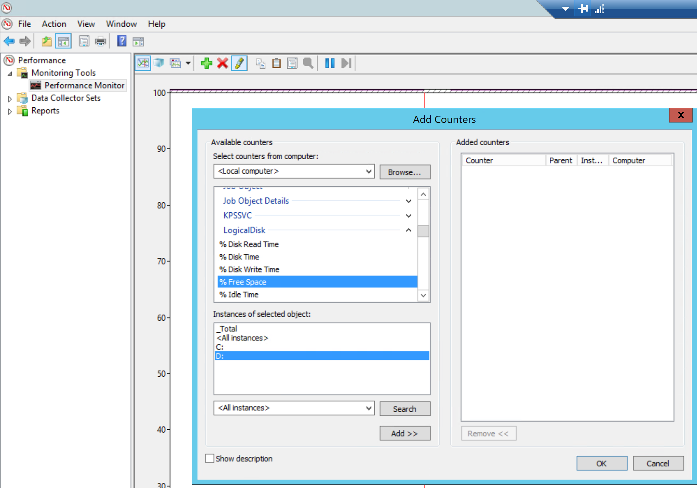
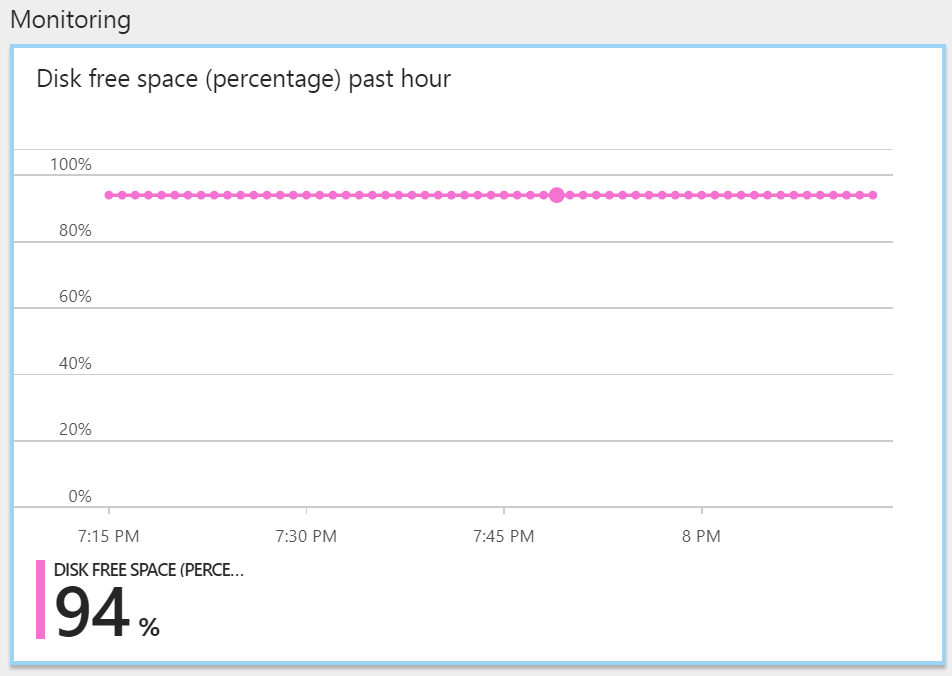
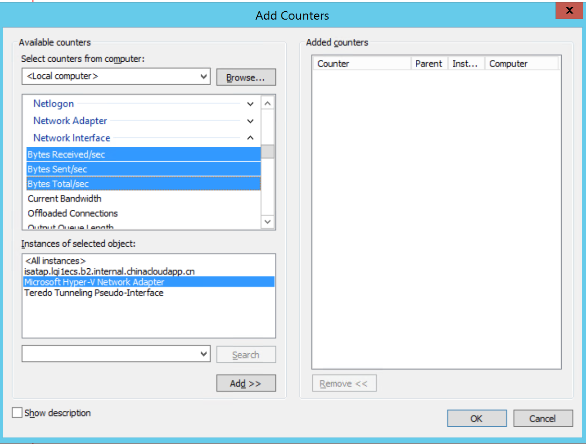
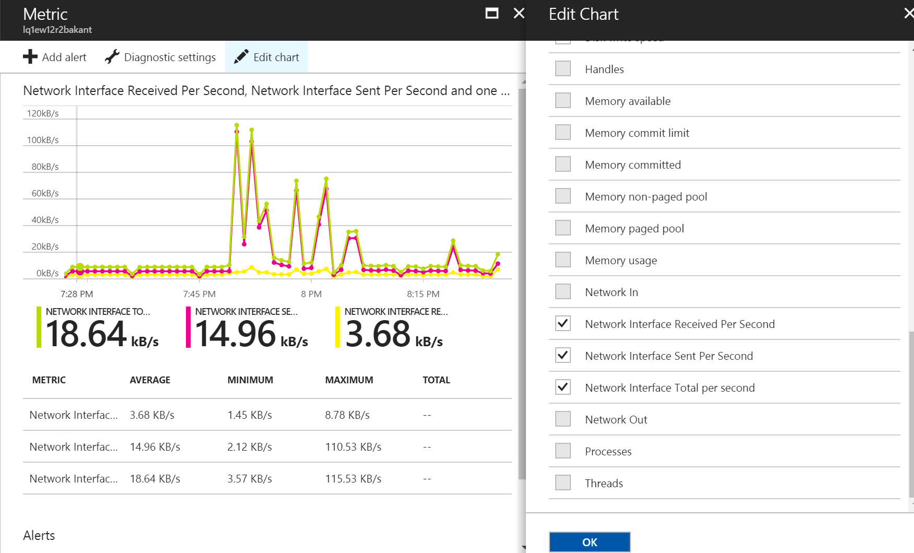

# 如何配置 Azure ASM Windows 诊断扩展及自定义性能指标

关于如何为 Azure ASM Windows 虚拟机添加诊断扩展，可以参考：[使用 PowerShell 在运行 Windows 的 Azure 虚拟机中启用诊断](https://docs.azure.cn/zh-cn/virtual-machines/windows/ps-extensions-diagnostics#enable-the-diagnostics-extension-if-you-use-the-classic-deployment-model)。

简单来讲，主要分为三步:

1. 获取虚拟机，诊断数据存储账号信息。
2. 为虚拟机定义诊断配置。
3. 更新虚拟机。

第二步中上述文档提供的配置样本，基本能满足用户对于性能监控的需求。但是，有些用户可能有一些特殊的性能指标需要监控，那么就需要自定义配置文件。一般来讲，在 Windows 中性能监视器能获取的性能数据，都可以通过诊断扩展和 "**Microsoft.insights**" 这个资源提供程序展现到 Azure 门户中。今天就给大家演示一下如何添加自定义性能指标。

性能指标是定义在 XML 配置文件的 PerformanceCounterConfiguration 段内，如下所示：

```XML
<PerformanceCounterConfiguration counterSpecifier="\LogicalDisk(_Total)\% Free Space" sampleRate="PT15S" unit="Percent">
        <annotation displayName="Disk free space (percentage)" locale="en-us"/>
      </PerformanceCounterConfiguration> 
```
> [!TIPS]
> counterSpecifier：监控的指标名称。  
> 该名称在 Windows 系统中必须是存在的，示例中的= `"\LogicalDisk(_Total)\% Free Space` 在资管管理器中对应的条目为对 Logical Disk 中所有的磁盘 (_Total) 的可用空间百分比 (% Free Space) 的平均值。  
> 与此类似，若只想知道单个逻辑磁盘的，如 C 盘，则可以替换为 `\LogicalDisk(C:)\% Free Space`。

> [!NOTE]
> **<All Instance>** 在书写时用星号（"*"）替代。如 `"\LogicalDisk(*)\% Free Space`。关于星号，以及其他一些特殊符号，在门户中显示会有一些问题，文章最后会统一介绍。



**sampleRate**：取样周期。

PT15S 表示以过去 15 秒为周期进行一次采样。Azure 门户最小的显示粒度是一分钟，那么一分钟就是四次采样，上传到存储账号的性能数据，其实已经对四次采样进行了统计学出来，算出了平均值，最小值和最大值，进行了相应的存放。

**Unit**：统计数字的单位。

常见的有 count， bytes，Percent，BytesPerSecond。会决定性能图显示的单位，见下图左下角。

**displayName**：该选项会决定在将性能展现在门户时的显示名称。见下图左上角。



下面以自定义添加三个网卡的指标为例，显示如何进行设置。该配置文件不仅适用于经典虚拟机，也适用于 ARM 虚拟机。

要添加的性能指标如下图所示：



相应的添加的配置如下：

```XML
<PerformanceCounterConfiguration counterSpecifier="\Network Interface(Microsoft Hyper-V Network Adapter)\Bytes Total/sec" sampleRate="PT15S" unit="BytesPerSecond">
        <annotation displayName="Network Interface Total per second" locale="en-us"/>
      </PerformanceCounterConfiguration>
	  <PerformanceCounterConfiguration counterSpecifier="\Network Interface(Microsoft Hyper-V Network Adapter)\Bytes Sent/sec" sampleRate="PT15S" unit="BytesPerSecond">
        <annotation displayName="Network Interface Sent Per Second" locale="en-us"/>
      </PerformanceCounterConfiguration>
	  <PerformanceCounterConfiguration counterSpecifier="\Network Interface(Microsoft Hyper-V Network Adapter)\Bytes Received/sec" sampleRate="PT15S" unit="BytesPerSecond">
        <annotation displayName="Network Interface Received Per Second" locale="en-us"/>
      </PerformanceCounterConfiguration>
```

加上要配置的资源 ID 和诊断存储账号，整个配置文件如下。请将代码中的 ResourceID 和 StorageAccount 改成自己的值。

```XML
<?xml version="1.0" encoding="utf-8"?>
<PublicConfig xmlns="http://schemas.microsoft.com/ServiceHosting/2010/10/DiagnosticsConfiguration">
    <WadCfg>
      <DiagnosticMonitorConfiguration overallQuotaInMB="4096">
        <DiagnosticInfrastructureLogs scheduledTransferLogLevelFilter="Error"/>
        <PerformanceCounters scheduledTransferPeriod="PT1M">
      <PerformanceCounterConfiguration counterSpecifier="\Processor(_Total)\% Processor Time" sampleRate="PT15S" unit="Percent">
        <annotation displayName="CPU utilization" locale="en-us"/>
      </PerformanceCounterConfiguration>
      <PerformanceCounterConfiguration counterSpecifier="\Processor(_Total)\% Privileged Time" sampleRate="PT15S" unit="Percent">
        <annotation displayName="CPU privileged time" locale="en-us"/>
      </PerformanceCounterConfiguration>
      <PerformanceCounterConfiguration counterSpecifier="\Processor(_Total)\% User Time" sampleRate="PT15S" unit="Percent">
        <annotation displayName="CPU user time" locale="en-us"/>
      </PerformanceCounterConfiguration>
      <PerformanceCounterConfiguration counterSpecifier="\Processor Information(_Total)\Processor Frequency" sampleRate="PT15S" unit="Count">
        <annotation displayName="CPU frequency" locale="en-us"/>
      </PerformanceCounterConfiguration>
      <PerformanceCounterConfiguration counterSpecifier="\System\Processes" sampleRate="PT15S" unit="Count">
        <annotation displayName="Processes" locale="en-us"/>
      </PerformanceCounterConfiguration>
      <PerformanceCounterConfiguration counterSpecifier="\Process(_Total)\Thread Count" sampleRate="PT15S" unit="Count">
        <annotation displayName="Threads" locale="en-us"/>
      </PerformanceCounterConfiguration>
      <PerformanceCounterConfiguration counterSpecifier="\Process(_Total)\Handle Count" sampleRate="PT15S" unit="Count">
        <annotation displayName="Handles" locale="en-us"/>
      </PerformanceCounterConfiguration>
      <PerformanceCounterConfiguration counterSpecifier="\Memory\% Committed Bytes In Use" sampleRate="PT15S" unit="Percent">
        <annotation displayName="Memory usage" locale="en-us"/>
      </PerformanceCounterConfiguration>
      <PerformanceCounterConfiguration counterSpecifier="\Memory\Available Bytes" sampleRate="PT15S" unit="Bytes">
        <annotation displayName="Memory available" locale="en-us"/>
      </PerformanceCounterConfiguration>
      <PerformanceCounterConfiguration counterSpecifier="\Memory\Committed Bytes" sampleRate="PT15S" unit="Bytes">
        <annotation displayName="Memory committed" locale="en-us"/>
      </PerformanceCounterConfiguration>
      <PerformanceCounterConfiguration counterSpecifier="\Memory\Commit Limit" sampleRate="PT15S" unit="Bytes">
        <annotation displayName="Memory commit limit" locale="en-us"/>
      </PerformanceCounterConfiguration>
      <PerformanceCounterConfiguration counterSpecifier="\Memory\Pool Paged Bytes" sampleRate="PT15S" unit="Bytes">
        <annotation displayName="Memory paged pool" locale="en-us"/>
      </PerformanceCounterConfiguration>
      <PerformanceCounterConfiguration counterSpecifier="\Memory\Pool Nonpaged Bytes" sampleRate="PT15S" unit="Bytes">
        <annotation displayName="Memory non-paged pool" locale="en-us"/>
      </PerformanceCounterConfiguration>
      <PerformanceCounterConfiguration counterSpecifier="\PhysicalDisk(_Total)\% Disk Time" sampleRate="PT15S" unit="Percent">
        <annotation displayName="Disk active time" locale="en-us"/>
      </PerformanceCounterConfiguration>
      <PerformanceCounterConfiguration counterSpecifier="\PhysicalDisk(_Total)\% Disk Read Time" sampleRate="PT15S" unit="Percent">
        <annotation displayName="Disk active read time" locale="en-us"/>
      </PerformanceCounterConfiguration>
      <PerformanceCounterConfiguration counterSpecifier="\PhysicalDisk(_Total)\% Disk Write Time" sampleRate="PT15S" unit="Percent">
        <annotation displayName="Disk active write time" locale="en-us"/>
      </PerformanceCounterConfiguration>
      <PerformanceCounterConfiguration counterSpecifier="\PhysicalDisk(_Total)\Disk Transfers/sec" sampleRate="PT15S" unit="CountPerSecond">
        <annotation displayName="Disk operations" locale="en-us"/>
      </PerformanceCounterConfiguration>
      <PerformanceCounterConfiguration counterSpecifier="\PhysicalDisk(_Total)\Disk Reads/sec" sampleRate="PT15S" unit="CountPerSecond">
        <annotation displayName="Disk read operations" locale="en-us"/>
      </PerformanceCounterConfiguration>
      <PerformanceCounterConfiguration counterSpecifier="\PhysicalDisk(_Total)\Disk Writes/sec" sampleRate="PT15S" unit="CountPerSecond">
        <annotation displayName="Disk write operations" locale="en-us"/>
      </PerformanceCounterConfiguration>
      <PerformanceCounterConfiguration counterSpecifier="\PhysicalDisk(_Total)\Disk Bytes/sec" sampleRate="PT15S" unit="BytesPerSecond">
        <annotation displayName="Disk speed" locale="en-us"/>
      </PerformanceCounterConfiguration>
      <PerformanceCounterConfiguration counterSpecifier="\PhysicalDisk(_Total)\Disk Read Bytes/sec" sampleRate="PT15S" unit="BytesPerSecond">
        <annotation displayName="Disk read speed" locale="en-us"/>
      </PerformanceCounterConfiguration>
      <PerformanceCounterConfiguration counterSpecifier="\PhysicalDisk(_Total)\Disk Write Bytes/sec" sampleRate="PT15S" unit="BytesPerSecond">
        <annotation displayName="Disk write speed" locale="en-us"/>
      </PerformanceCounterConfiguration>
      <PerformanceCounterConfiguration counterSpecifier="\PhysicalDisk(_Total)\Avg. Disk Queue Length" sampleRate="PT15S" unit="Count">
        <annotation displayName="Disk average queue length" locale="en-us"/>
      </PerformanceCounterConfiguration>
      <PerformanceCounterConfiguration counterSpecifier="\PhysicalDisk(_Total)\Avg. Disk Read Queue Length" sampleRate="PT15S" unit="Count">
        <annotation displayName="Disk average read queue length" locale="en-us"/>
      </PerformanceCounterConfiguration>
      <PerformanceCounterConfiguration counterSpecifier="\PhysicalDisk(_Total)\Avg. Disk Write Queue Length" sampleRate="PT15S" unit="Count">
        <annotation displayName="Disk average write queue length" locale="en-us"/>
      </PerformanceCounterConfiguration>
      <PerformanceCounterConfiguration counterSpecifier="\LogicalDisk(_Total)\% Free Space" sampleRate="PT15S" unit="Percent">
        <annotation displayName="Disk free space (percentage)" locale="en-us"/>
      </PerformanceCounterConfiguration>
      <PerformanceCounterConfiguration counterSpecifier="\LogicalDisk(_Total)\Free Megabytes" sampleRate="PT15S" unit="Count">
        <annotation displayName="Disk free space (MB)" locale="en-us"/>
      </PerformanceCounterConfiguration>
	  <PerformanceCounterConfiguration counterSpecifier="\Network Interface(Microsoft Hyper-V Network Adapter)\Bytes Total/sec" sampleRate="PT15S" unit="BytesPerSecond">
        <annotation displayName="Network Interface Total per second" locale="en-us"/>
      </PerformanceCounterConfiguration>
	  <PerformanceCounterConfiguration counterSpecifier="\Network Interface(Microsoft Hyper-V Network Adapter)\Bytes Sent/sec" sampleRate="PT15S" unit="BytesPerSecond">
        <annotation displayName="Network Interface Sent Per Second" locale="en-us"/>
      </PerformanceCounterConfiguration>
	  <PerformanceCounterConfiguration counterSpecifier="\Network Interface(Microsoft Hyper-V Network Adapter)\Bytes Received/sec" sampleRate="PT15S" unit="BytesPerSecond">
        <annotation displayName="Network Interface Received Per Second" locale="en-us"/>
      </PerformanceCounterConfiguration>
    </PerformanceCounters>
    <Metrics resourceId="/subscriptions/9ef8a15c-15a2-4ef1-a19b-e31876ab177c/resourceGroups/lqi1ecs/providers/Microsoft.ClassicCompute/virtualMachines/lq1ew12r2bakant" >
        <MetricAggregation scheduledTransferPeriod="PT1H"/>
        <MetricAggregation scheduledTransferPeriod="PT1M"/>
    </Metrics>
    <WindowsEventLog scheduledTransferPeriod="PT1M">
      <DataSource name="Application!*[System[(Level = 1 or Level = 2)]]"/>
      <DataSource name="Security!*[System[(Level = 1 or Level = 2)]"/>
      <DataSource name="System!*[System[(Level = 1 or Level = 2)]]"/>
    </WindowsEventLog>
      </DiagnosticMonitorConfiguration>
    </WadCfg>
    <StorageAccount>liblqi</StorageAccount>
</PublicConfig>
```

将其保存为 XML 格式。  

更新经典虚拟机诊断配置的命令如下 :

```PowerShell
# 指定云服务和虚拟机
$Service_Name = "lqi1ecs"
$VM_Name = "lq1ew12r2bakant"

# 生成存储账号上下文，用于配置虚拟机的诊断扩展，确保虚拟机有权限向存储账号写入数据。
$storage_account = "liblqi"
$storagekey = Get-AzureStorageKey -StorageAccountName $storage_account
$Storage_Context = new-azurestoragecontext -storageaccountname $storage_account -storageaccountkey $storagekey.primary

# 更新虚拟机诊断扩展
$Config_Path = "C:\Users\lqi.FAREAST\Desktop\WindowsAsmDiagnosticsConfig.xml"
$VM = Get-AzureVM -ServiceName $Service_Name -Name $VM_Name
$VM_Update = Set-AzureVMDiagnosticsExtension -DiagnosticsConfigurationPath $Config_Path -Version "1.*" -VM $VM -StorageContext $Storage_Context
Update-AzureVM -ServiceName $Service_Name -Name $VM_Name -VM $VM_Update.VM 
```

更新成功后，您将能从门户中选择并展示这些性能指标。



> [!IMPORTANT]
> 对于带星号，带中文字符的性能指标，Azure 门户无法进行处理，因此性能数据显示不出。因此尽量不要选 All Instance，尽量不用带中文字符的指标。