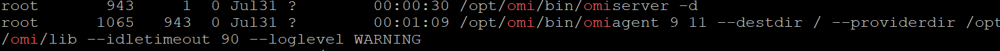
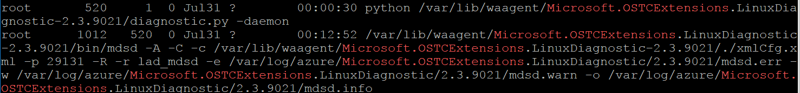
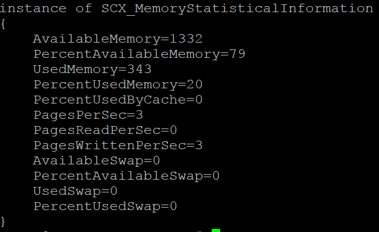

# 理解 Azure Linux 虚拟机的诊断工作原理

## 简介

在前文:[理解 Azure 虚拟机的负载监控](aog-monitoring-and-diagnostics-virtual-machines-load-monitoring-understanding.md),我们介绍了 Azure 虚拟机监控功能的工作原理和基本排查步骤。本文主要关注在 Linux 虚拟机中性能指标的获取，即 LinuxDiagnostic 的工作原理。

Linux 并非微软原生的系统，但在拥抱开源的路上，微软展现了其积极的姿态。为了让其平台能提供更多的对 Linux 的支持，微软在改进其 Windows 产品功能的同时，也不断在开发工具增加对 Linux 类似功能支持。

我们已经知道 Azure VM Agent（在 Linux 上即为 waagent 服务）是用于管理和维护来自 Azure Fabric 对虚拟机的指令的；对诊断扩展的安装，维护，删除等，也是经由该服务根据标准或用户自定义的配置进行自动进行。那么这个诊断具体是如何工作的呢？此处我们深入了解下该扩展：

在 Linux 中，LinuxDiagnostic 扩展与 OMI 联合，从虚拟机中收集性能数据，并上传到指定的存储账户中。

## 安装

1. waagent 收到来自 Azure Fabric 的命令，从 Fabric 指定位置下载诊断扩展到 **/var/lib/waagent/**。扩展安装包根据版本不同，命令类似于 Microsoft.OSTCExtensions_LinuxDiagnostic_2.3.9021.zip 。
2. 然后进行解压，创建文件夹 **/var/lib/waagent/Microsoft.OSTCExtensions.LinuxDiagnostic-2.3.9021/**（版本不同，文件夹名可能有所区别）。
3. 结合用户的输入（存储账号，配置的性能指标），生成配置文件 xmlCfg.xml。
4. 触发文件夹中的 Python 安装文件 diagnostic.py 进行扩展安装，安装主要包括：

    1. 安装依赖软件包
        调用 scx-1.6.2-337.universal.x64.sh 安装 omi 和 scx 软件包。这两个软件包用于收集系统性能数据，参见：[Microsoft OMI](https://github.com/Microsoft/omi) 。并设置性能数据收集的命名空间 **root/scx** 和 **root/omi**。
    2. 根据 xmlCfg.xml 配置诊断服务
    3. 启动 OMI 服务 omiserver :

        Omiserver 会同时启动 omiagent 服务。这两个服务在该场景中用于收集性能数据，响应来自 Diagnostic 的数据查询请求。
    
        

5.	启动 mdsd 服务

    

## 管理

waagent 服务维护扩展诊断和 OMI 服务的运行情况。

1.	若发现 OMI 服务停止，会尝试启动之。
2.	在其自身启动时，会检查 LinuxDiagnostic 和 OMI 的状态，如果未安装，进行安装配置；如果未启动，进行启动设置。

如果虚拟机运行久了，或者虚拟机有性能问题，可能造成上述的某个进程运行异常，导致性能数据无法成功上传到存储账号，因此无法显示。一般重启 waagent 服务或者重启虚拟机能解决大部分问题，因为 waagent 在重启过程中，会重新扫描其维护的各个扩展，重启 mdsd 服务。具体步骤如下：


停止 omi 服务和 waagent。停止 waagent 会同步停止 LinuxDiagnostic：

```
#/opt/omi/bin/omiserver -s
#systemctl stop waagent
```
启动 waagent。启动 waagent 会同步启动 omi 和 mdsd：

`# systemctl start waagent.service`

LinuxDiagnostic 主要用于从 OMI 获取定时获取性能数据，进行处理后上传到诊断存储账号对应的表中。

- 如果与 OMI 的通信出现异常，则无法获取性能数据。
- 如果与存储账号之间的通信或者认证出现异常，则无法上传性能数据。

排除该错误除了需要检查进程是否运行，还要检查扩展的日志输入中是否有报错。扩展日志 extension.log 已经做的很详细了，基本上哪一步或者哪个服务出现问题，都会在日志中有明确的体现。根据日志错误找到对应的模块或服务再进行排查往往事倍功半。日志文件：

```
/var/log/waagent.log
/var/log/azure/Microsoft.OSTCExtensions.LinuxDiagnostic/<version>/*
```

OMI 主要负责从系统中收集性能数据。通过手动获取性能数据判断是否性能数据收集正常。

`# /opt/omi/bin/omicli cql root/scx "SELECT AvailableMemory, PercentAvailableMemory, UsedMemory, PercentUsedMemory, PercentUsedByCache, PagesPerSec, PagesReadPerSec, PagesWrittenPerSec, AvailableSwap, PercentAvailableSwap, UsedSwap, PercentUsedSwap FROM SCX_MemoryStatisticalInformation"`



其他参考命令：
1.	查看 omicli 是否与 omi 服务通信正常：

    `# /opt/omi/bin/omicli id`

2.	若 OMI 工作有问题，重启虚拟机不能解决，建议重装。

    最简单的办法是卸载软件包：

    `# yum remove omi `

    重启 waagent。Waagent 启动过程中会检测其维护的扩展的状态，并进行自动修复。

    `# systemctl restart waagent.service`

## 相关链接

- [理解 Azure 存储的监控](aog-monitoring-and-diagnostics-storage-understanding.md)
- [理解 Azure 虚拟机的负载监控](aog-monitoring-and-diagnostics-virtual-machines-load-monitoring-understanding.md)