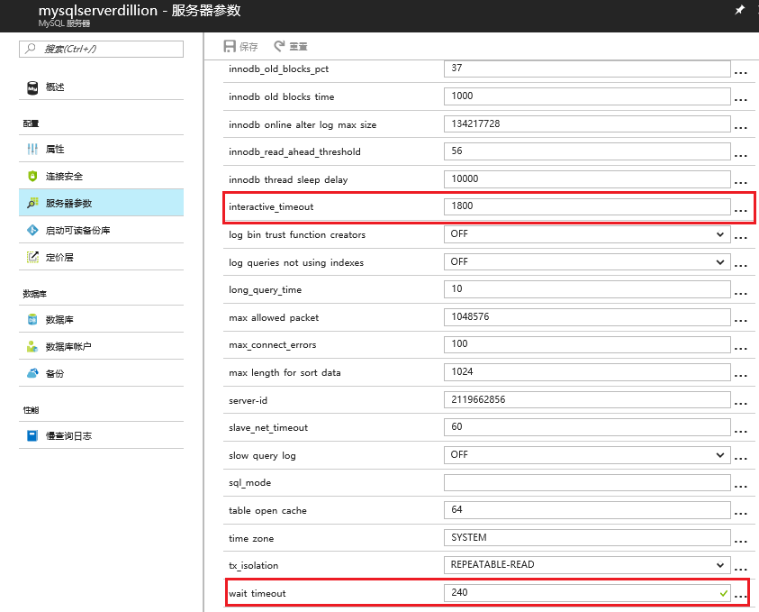

# 如何解决 MySQL DataBase on Auzre 连接被终止的问题

## 问题描述

在使用 MySQL DataBase on Auzre 的过程中，由于 mysql 语句执行时间过长或者 MySQL 客户端闲置时间过长导致 MySQL 数据库连接被终止。

## 问题分析

造成这个问题的原因，通常与 MySQL DataBase on Azure 服务器参数 `wait_timeout` 和 `intertactive_timeout` 的设置有关。<br>
- `wait_timeout` ：用于控制非交互式连接断开连接前等待活动的秒数；<br>
- `interactive_timeout` ：用于控制交互式连接断开连接前等待活动的秒数。<br>

有关参数详细信息，请参阅 [MySQL 参数信息](https://dev.mysql.com/doc/refman/5.5/en/server-system-variables.html#sysvar_wait_timeout)。

默认情况下，通过 Azure 门户可以设置 MySQL DataBase on Auzre 实例的 `wait_timeout` 时间为 120s （可选范围为 60 ~ 240s ）, `interacive_timeout` 时间为 1800s (可选范围为：10 ~ 1800s)。<br>
如果 mysql 语句执行时间过长或者 MySQL 客户端闲置时间过长，就可能会遇到连接被终止的问题。具体服务器参数信息，请参考[定制 MySQL Database on Azure 服务器参数](https://docs.azure.cn/zh-cn/mysql/mysql-database-advanced-settings)。

另外，如果 MySQL 客户端闲置时间过长，也有可能被 Azure 流量管理器终结。这个默认时间为 4 分钟（240s）。

## 解决方案

针对 MySQL 语句执行时间过长，我们可以采取以下方式防止连接被终止：

### 使用实例级 `wait_timeout` 和 `interactive_timeout`, 设置为最大值，优化查询语句，使其在设置时间内完成。 

1. 通过 [Azure 门户](https://portal.azure.cn) 修改 MySQL DataBase on Azure 服务器参数，分别将 `wait_timeout` 和 `interactive_timeout` 设置为最大值 240s, 1800s。如图所示：

    

    > [!NOTE]
    > `wait_timeout` 的最大值为 240s, `interactive_timeout` 的最大值为 1800s, 如果设置的值超过限制，保存时就会遇到未能更新 MySQL 服务器的错误。

2. 优化 mysql 语句，使其在设置时间内完成。

### 使用会话级别 `wait_timeout` 和 `interactive_timeout`

通过 Azure 门户可以设置 `wait_timeout` 和 `interactive_timeout` 的最大值分别为 240s，1800s。如果想要设置更大的值，可以设置会话级别的 `wait_timeout` 和 `interactive_timeout`。在建立交互式或非交互式连接之后，可以使用代码或者命令设置当前会话 MySQL 数据库连接 `wait_timeout` 和 `interactive_timeout` 的值。

例如，通过客户端连接到 MySQL DataBase on Azure 后, 可以使用以下命令修改当前会话 MySQL 数据库连接的 `wait_timeout` 和 `interactive_timeout` ，然后再执行 MySQL 语句:

```
#设置当前会话的 wait_timeout 和 interactive_timeout
set wait_timeout = 3600; 
set interactive_timeout = 7200;

#查看当前会话有关 timeout 的参数
show variables like '%timeout%';
```

针对 MySQL 客户端闲置时间过长被 Azure 流量管理器终结这种情况，可以通过设置 ”心跳” 的方式，防止被 Azure 流量管理器终结。

* Windows 系统

    通过运行，输入 “regedit”，打开注册表，在该目录下找到 KeepAliveTime （如果没有则添加，新建时设置数据类型为 REG_DWORD （32 位））,

    `HKEY_LOCAL_MACHINE\SYSTEM\CurrentControlSet\Services\Tcpip\Parameters\`

    修改 KeepAliveTime 时，值类型选十进制，输入值：60000。

    > [!Note]
    >这里时间为毫秒。修改完之后需要重启生效。

* Linux 系统

    需要修改 4 个操作系统的 keepalive 参数：

    1. `tcp_keepalive_probes` : 在认定连接失效之前，已发送的 TCP keepalive 探测包的个数。
        使用该值乘以 `tcp_keepalive_intvl` 表明连接在发送了 keepalive 之后可以保持多长时间无需做出回应。
    2. `tcp_keepalive_time` : 最后一次数据交换到 TCP 发送第一个保活探测包的间隔，即允许的持续空闲时长，也就是每次正常发送心跳的周期。
    3. `tcp_keepalive_intvl` : 发送探测包的间隔周期。
    4. `tcp_retries2` ：在决定终止该连接之前，数据包要重试发送的最大次数。

    使用以下命令修改:

    ```
    echo "6" > /proc/sys/net/ipv4/tcp_keepalive_time
    echo "1" > /proc/sys/net/ipv4/tcp_keepalive_intvl
    echo "10" > /proc/sys/net/ipv4/tcp_keepalive_probes
    echo "3" > /proc/sys/net/ipv4/tcp_retries2
    ```

    > [!Note]
    > `tcp_keepalive_time` 和 `tcp_keepalive_intvl` 值以秒表示。 要在系统重新启动后保留这些值，必须将它们添加到 /etc/sysctl.conf 文件中。