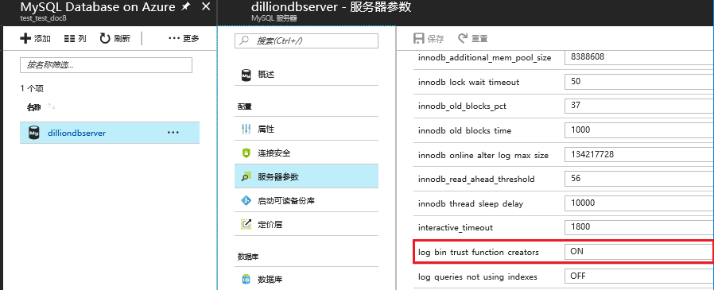

# 如何解决 MySQL Database on Azure 中无法创建函数的问题

## 问题描述

在使用 My SQL Database on Azure 中创建函数时报以下错误：

```
You do not have the SUPER privilege and binary logging is enabled (you *might* want to use the less safe log_bin_trust_function_creators variable)
```

## 问题分析

造成这个问题的原因，与 MySQL DataBase on Azure 服务器参数 `log_bin_trust_function_creators` 的设置有关。

`log_bin_trust_function_creators` 参数主要用于控制用户是否有权限创建或更改函数，更多详细信息请参阅 [MYSQL 服务器参数](https://dev.mysql.com/doc/refman/5.5/en/replication-options-binary-log.html#option_mysqld_log-bin-trust-function-creators)。

默认情况下，MySQL Database 服务器参数为 “**OFF**”。将该参数改为 “**ON**”，可以解决该问题。

> [!Note]
> 目前在使用 MySQL Database on Azure 时，用户没有 Super 权限，不能从客户端修改任意一个全局变量，所以只能通过 Azure 门户修改。详情请参考 [MySQL Database On Azure 服务限制](/mysql/mysql-database-operation-limitation)。

## 解决方法

### 通过 Azure Portal 修改服务器参数

登陆 Azure 门户，打开 MySQL 服务，在 MySQL 侧边栏中选中 “**服务器参数**”，修改 `log_bin_trust_function_creators` 参数值为 “**ON**”，点击 “**保存**” 按钮保存设置。

