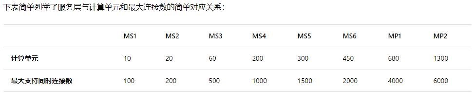
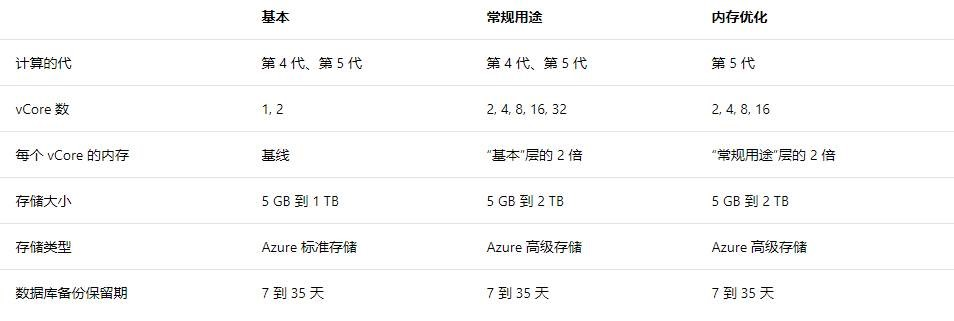

# Azure Database for MySQL 与 Azure 上的 MySQL 数据库的比较

1. Azure Database for MySQL 是基于新架构的，采用 vcore 虚拟核心计算性能。

    而 Azure 上的 MySQL 数据库是根据工作负荷所需的计算单元数确定服务层。更多细节您可以参考新版和老版的文档： [Azure 上的 MySQL 数据库服务层](https://docs.azure.cn/zh-cn/mysql-database-on-azure/mysql-database-service-tiers)

    

    [Azure Database for MySQL定价层](https://docs.azure.cn/zh-cn/mysql/concepts-pricing-tiers)

    

2. 新的 Azure Database for MySQL，wait timeout 值没有小于 4 分钟的规定了。

3. 新的 Azure Database for MySQ，可供您配置的参数更多了。

4. 新的 Azure Database for MySQL，您可以使用命令行工具创建数据库，User 等，旧的 Azure 上的 MySQL 数据库服务是不行的。

对于基于老模式 MySQL 存储大小上限也是 2T。

对于新旧数据库配置的选择我们建议您可以参考以下的对应关系：

MS1/MS2--------->基本 1vcore

MS3 -------------->基本 1vcore 或 2vcore 或常规用途 2vcore

MS4 -------------->常规用途 4vcore

MS5 -------------->常规用途 4vcore 或常规用途 8vcore

MS6 -------------->常规用途 8vcore

MP1 -------------->常规用途 8vcore 或常规用途 16vcore

MP2 -------------->常规用途 32vcore

更高-------------->优化内存

以上的对应关系仅供参考，具体级别的选择还需要根据具体的业务做相应的测试，然后选择最适合您的服务器级别。
