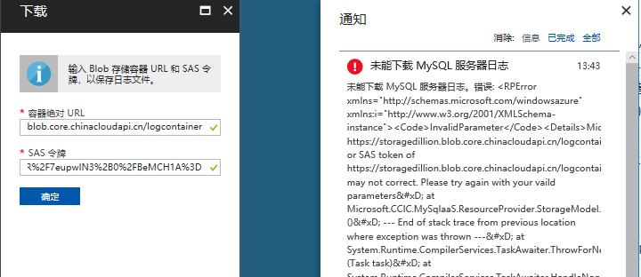
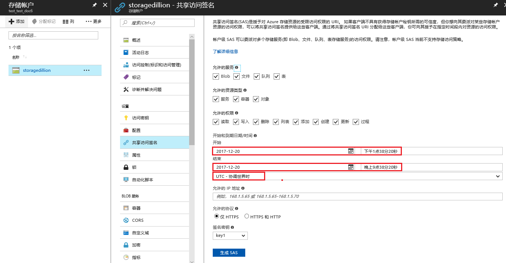
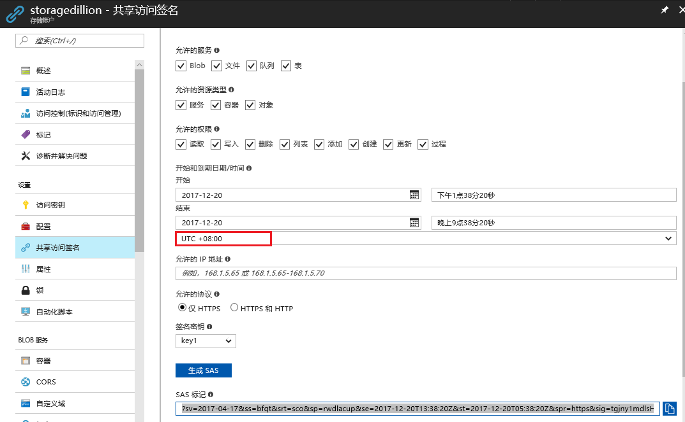
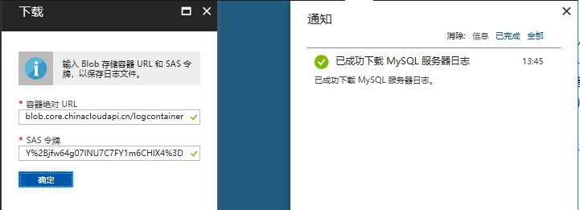

# 如何解决 MySQL DataBase on Azure 慢查询日志无法下载的问题

## 问题描述

在将 MySQL 慢查询日志下载到 Blob 容器时，遇到以下错误：



## 问题分析

通过共享访问签名（ SAS ）可以向客户端授予在指定时间段内对资源的访问权限。有关 SAS 令牌详细信息，请参阅[共享访问签名 (SAS)](https://docs.azure.cn/storage/common/storage-dotnet-shared-access-signature-part-1)。

在中国区 Azure 门户中通过存储账户生成 SAS 令牌时，默认会以北京时间（UTC+8）选取开始时间，但是时区默认选取的是 “**UTC 协调世界时**“ 。例如：本文测试时间：北京时间:2017-12-20 13:38。



点击“ **生成 SAS** ” 生成令牌时，Azure 会根据选取的参数将北京时间当作 UTC 时间来生成的 SAS 令牌，结果如下：

```
?sv=2017-04-17&ss=bfqt&srt=sco&sp=rwdlacup&se=2017-12-20T21:38:20Z&st=2017-12-20T13:38:20Z&spr=https&sig=4eXrhY8qM3frY09lyxVTjpUR%2F7eupwIN3%2B0%2FBeMCH1A%3D
```

>[!NOTE]
>SAS 令牌中的开始和到期时间必须以 UTC (协调世界时) 格式表示。

通过分析令牌我们可以看出，该令牌的开始时间为：“2017-12-20T13:38:20Z（UTC）”，即北京时间 2017-12-20 21:38:20。所以当前时间（北京时间:2017-12-20 13:38）不在 SAS 令牌指定的有效期内，导致 SAS 令牌在当前时间未生效，从而无法下载 MySQL 慢查询日志。

## 解决方案

通过修改 SAS 令牌的起止时间或者修改时区，使当前时间在 SAS 令牌的有效期内。例如：



点击 “**生成 SAS**”, 生成的 SAS 令牌如下：起止时间：2017-12-20T05:38:20Z~2017-12-20T13:38:20Z（UTC）,即北京时间 2017-12-20 13:38 ~ 2017-12-20 21:38。

```
?sv=2017-04-17&ss=bfqt&srt=sco&sp=rwdlacup&se=2017-12-20T13:38:20Z&st=2017-12-20T05:38:20Z&spr=https&sig=tgjny1mdlsH19%2BFiuY%2Bjfw64g07lNU7C7FY1m6CHlX4%3D
```

结果如下：

