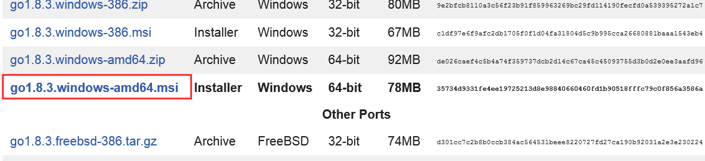
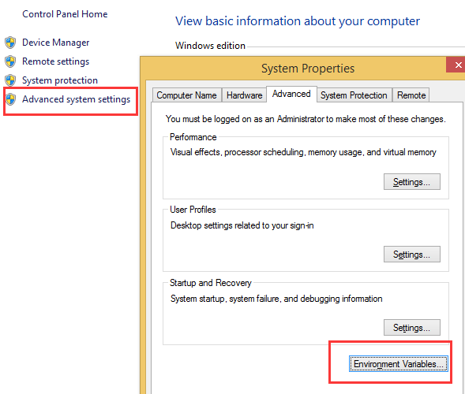
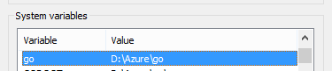
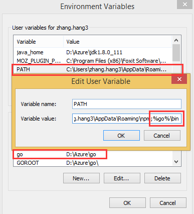
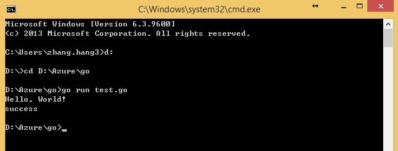
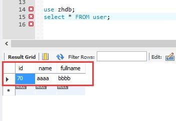

# Go 语言连接 MySQL PaaS

Go 语言工具下载链接点击[这里](https://golang.org/dl/)。

根据自己的需要选择合适的操作系统下载，例如我下载的是 go1.8.3.windows-amd64.msi。



下载后安装即可。

配置环境变量：







下面是 go 语言连接 MySQL PaaS 的脚本和方法：

```go
package main

import (
"fmt"
"database/sql"
_"github.com/go-sql-driver/mysql"
)

func main() {
   fmt.Println("Hello, World!")
   db,err := sql.Open("mysql","poddb%yongji:1qaz!QAZQAZ! @tcp(poddb.mysqldb.chinacloudapi.cn:3306)/zhdb")
   db.Exec("insert into user values(70,'aaaa','bbbb')")

   if err != nil{
          fmt.Println("0000000")
    }else{
           fmt.Println("success")
    }
}
```

运行 go 文件：



通过 workbench 连接到 MySQL PaaS，验证数据已经插入成功：

