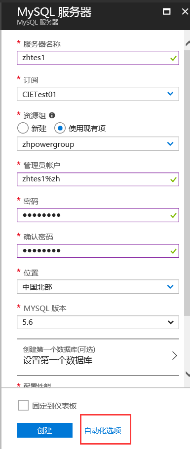
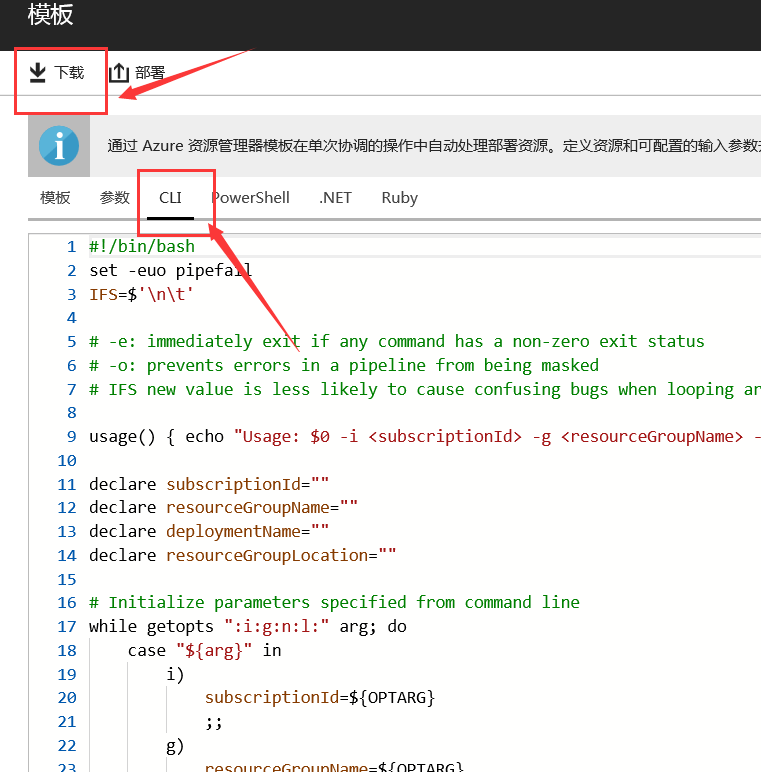
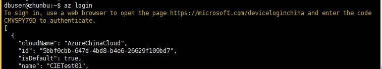
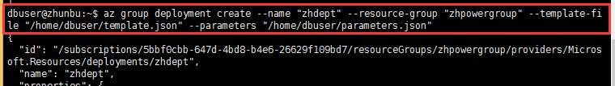
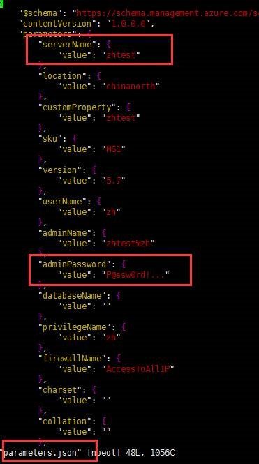

# 使用 az 命令通过模板创建 MySQL PaaS

选择新建 MySQL PaaS，填写参数之后，不选择创建，选择自动化模板，然后点下载，将 template.json 和 parameters.json 文件下载。

首先使用 `az` 命令登陆 Azure 门户账号：

接下来使用命令 `az group deployment` 来部署：

此处 `Servername` 以 `zhtest` 为例，其中 parameters.json 文件里，添加密码参数：

最后部署成功：

