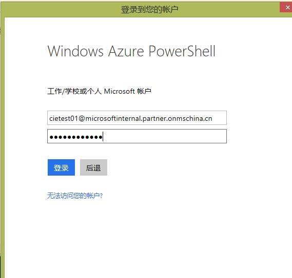
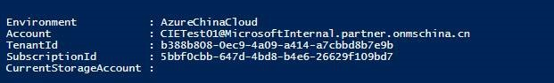
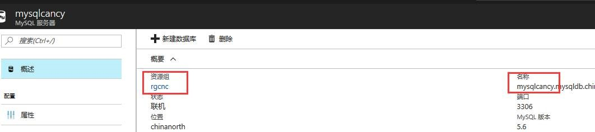
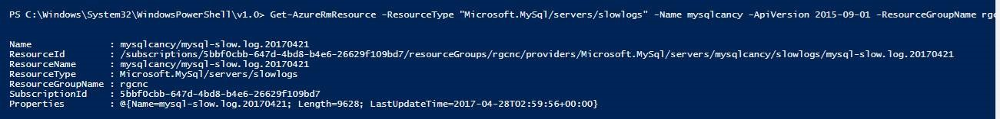
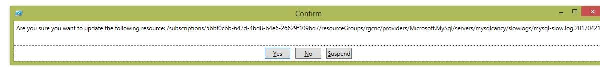
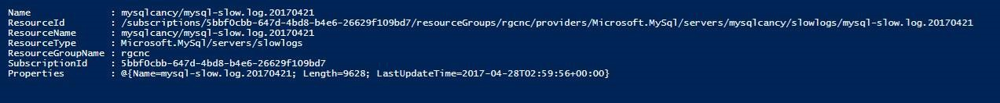
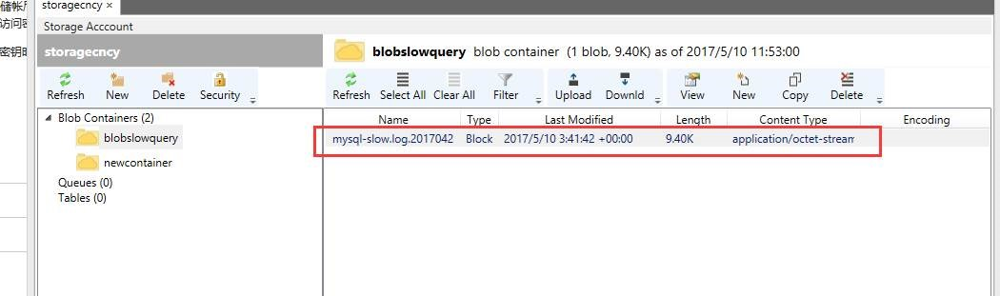

# 使用 PowerShell 命令下载慢查询日志

PowerShell 下载完整慢查询日志的方法，以下是详细步骤：

1. 登录 Azure：

    ```powershell
    Add-AzureRmAccount -EnvironmentName AzureChinaCloud
    ```

    

    输入您的口令，登录成功后，显示如下：

    

2. 修改并运行如下命令显示实例下所有的的慢查询日志：

    ```powershell
    Get-AzureRmResource -ResourceType "Microsoft.MySql/servers/slowlogs" -Name mysqlcancy -ApiVersion 2015-09-01 -ResourceGroupName rgcnc
    ```
    > [!NOTE]
    > 其中，Name 为您 MySQL 实例名，ResourceGroupName 为资源组名称，可在 Azure 门户查看：

    

    脚本运行成功后，显示如下：

    

3. 修改并执行如下脚本获取容器相关信息：

    ```powershell
    $account = Get-AzureRMStorageAccount -ResourceGroupName rgcnc -StorageAccountName storagecncy 注：ResourceGroupName 为存储帐户所在资源组名称，StorageAccountName 为存储帐户名称

    //若创建新容器执行此命令
    $container = New-AzureStorageContainer -Context $account.Context -Name newcontainer  注：Name 这您要创建的新的容器名

    //若使用原有容器，执行 Get 命令, 本 demo 中执行此命令
    $container = Get-AzureStorageContainer -Context $account.Context -Name blobslowquery 注：Name 为您存储帐户中已有的容器名

    $sasToken = New-AzureStorageContainerSASToken -Name $container.Name -Permission rwdl -StartTime (Get-Date).AddDays(-1) -Protocol HttpsOnly -ExpiryTime (Get-Date).AddDays(1) -Context $account.Context
    ```

4. 修改并运行如下命令下载特定的慢查询日志到容器中：

    ```powershell
    Set-AzureRmResource -ResourceType "Microsoft.MySql/servers/slowlogs" -ResourceName mysqlcancy/mysql-slow.log.20170421 -ApiVersion 2015-09-01 -ResourceGroupName rgcnc -PropertyObject @{copyDestinationContainerUri=$container.CloudBlobContainer.Uri.AbsoluteUri;CopyDestinationSasToken="$sasToken"} -UsePatchSemantics
    ```

    注：ResourceName 为步骤 2 中执行命令后结果中显示的 ResourceName。

    执行命令后弹出提示框，点击 Yes：
    

    执行成功，powershell 显示如下：
    

5. 验证：使用 Azure storage Explorer 登录 storage account 后，发现日志已保存到了容器中，如下所示：

    