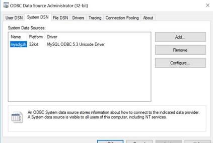
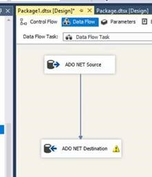
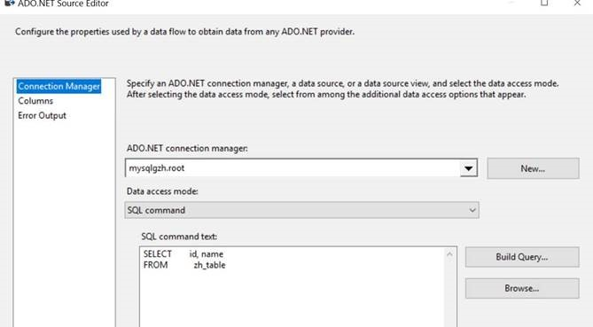
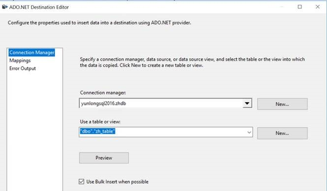
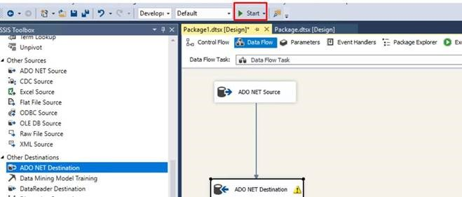
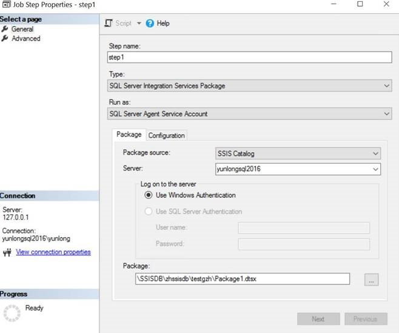
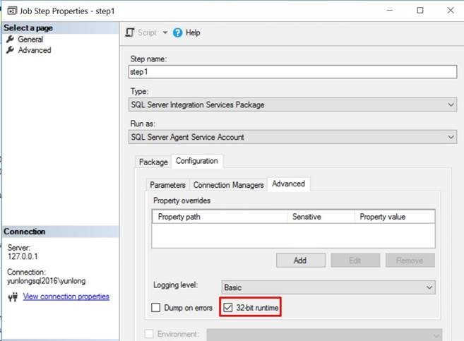
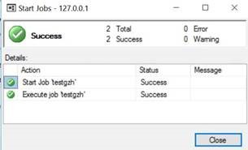

# 通过 SSIS 导入 MySQL 数据到 SQL Server

1. 安装并配置 ODBC 驱动：

    

2. 在 Visual Studio 中创建 SSIS package, 配置源组件和目标组件：

    

    

    

3. 点击 **start** 开始运行，运行成功后保存并发布包。

    

4. 在 SSMS 里面创建 job, 新增 step 配置如下：

    

5. 勾选 32 位运行环境：

    

6. 点击确定，运行 job, 即可成功运行：

    