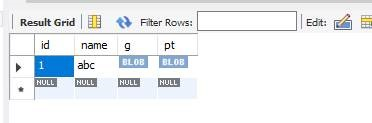

# MySQL PaaS 数据库如何支持空间数据

当前 MySQL PaaS 是支持空间数据的，如下的测试，仅供参考：

```sql
create table testgeo1(
id int(4) not null primary key auto_increment,
name char(20) not null,
g GEOMETRY,
pt POINT
);
```

```sql
SET @g = 'POINT(1 1)';
SET @g1 ='GEOMETRYCOLLECTION(POINT(1 1),LINESTRING(0 0,1 1,2 2,3 3,4 4))';

insert into testgeo1 values(0,'abc',GeomFromText(@g1),PointFromText(@g));
```

```sql
select * from testgeo1;
```


