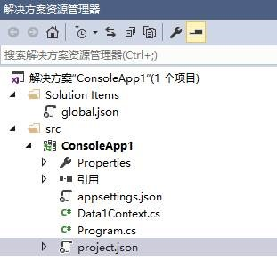
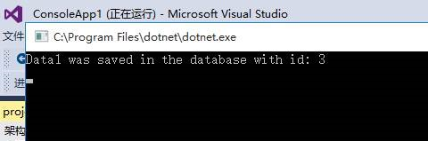
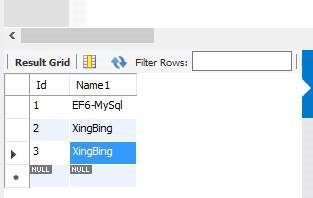

# 如何使用 MySQL EntityFramework 组件处理 MYSQL PaaS DB

MySQL Database on Azure 是 Azure 平台上推出的 MySQL 云数据库服务，通过全面兼容 MySQL 协议，为用户提供了一个全托管的性能稳定、可快速部署、高可用、高安全性的数据库服务。客户可以使用常见的支持 MySQL 的平台与技术进行开发与集成。本文演示了如何使用 MySQL EntityFramework 组件对 MySQL PaaS DB 进行操作。

**系统环境 / 应用程序信息**

ASP.NET 2005 Core / MYSQL EntityFrameWork Core

在 VS 2015 Net Core 的环境中，安装 EntityFrameWork Core 组件，代码和测试后结果如下：
 
其中 Data1Context.cs 文件为：

    using Microsoft.EntityFrameworkCore;
    using MySQL.Data.EntityFrameworkCore.Extensions;
    
    namespace ConsoleApp1
    {
        /// 

        /// The entity framework context with a data1 DbSet
        /// 

        public class Data1Context : DbContext
        {
            public Data1Context(DbContextOptions<Data1Context> options)
            : base(options)
            { }
    
            public DbSet<Data1> Data1 { get; set; }
        }
    
        /// 

        /// Factory class for EmployeesContext
        /// 

        public static class Data1ContextFactory
        {
            public static Data1Context Create(string connectionString)
            {
                var optionsBuilder = new DbContextOptionsBuilder<Data1Context>();
                optionsBuilder.UseMySQL(connectionString);
    
                //Ensure database creation
                var context = new Data1Context(optionsBuilder.Options);
                context.Database.EnsureCreated();
    
                return context;
            }
        }
    
        /// 

        /// A basic class for an Employee
        /// 

        public class Data1
        {
            public int Id { get; set; }
            public string Name1 { get; set; }
        }
    
    }

Program.cs 文件为：

    using System;
    using System.Collections.Generic;
    using System.Linq;
    using System.Threading.Tasks;
    using Microsoft.Extensions.Configuration;
    
    namespace ConsoleApp1
    {
        public class Program
        {
            public static void Main(string[] args)
            {
                var builder = new ConfigurationBuilder().AddJsonFile("appsettings.json", optional: false, reloadOnChange: true);
    
                var configuration = builder.Build();
    
                string connectionString = configuration.GetConnectionString("SampleConnection");
    
                // Create an employee instance and save the entity to the database
                var entry = new Data1() { Id = 3, Name1 = "XingBing" };
    
                using (var context = Data1ContextFactory.Create(connectionString))
                {
                    context.Add(entry);
                    context.SaveChanges();
                }
    
                Console.WriteLine($"Data1 was saved in the database with id: {entry.Id}");
                Console.ReadKey();
            }
        }
    }
    
appsettings.json 文件为：

    {
        "ConnectionStrings": {
            "SampleConnection": "server=XXXXXX.mysqldb.chinacloudapi.cn;userid=XXXXXX%YYYYYY;pwd=XXXXXXXXX;port=3306;database=xyudb;sslmode=none;"
        }
    }
    
project.json 文件为：

    {
        "version": "1.0.0-*",
        "buildOptions": {
            "debugType": "portable",
            "emitEntryPoint": true,
            "copyToOutput": {
            "include": "appsettings.json"
            }
        },
        "dependencies": {
            "Microsoft.Extensions.Configuration": "1.0.0",
            "Microsoft.Extensions.Configuration.Json": "1.0.0",
            "Microsoft.EntityFrameworkCore": "1.0.0",
            "MySql.Data.Core": "7.0.4-IR-191",
            "MySql.Data.EntityFrameworkCore": "7.0.4-IR-191"
        },
        "frameworks": {
            "netcoreapp1.0": {
                "dependencies": {
                    "Microsoft.NETCore.App": {
                    "type": "platform",
                    "version": "1.0.0"
                    }
                },
                "imports": [
                    "dnxcore50",
                    "portable-net452+win81"
                ]
            }
        }
    }

运行及测试结果：

组件地址：[MySql.Data.EntityFrameworkCore 7.0.7-m61](https://www.nuget.org/packages/MySql.Data.EntityFrameworkCore)
参考方法：[HowTo: Starting with MySQL EF Core provider and Connector/Net 7.0.4](http://insidemysql.com/howto-starting-with-mysql-ef-core-provider-and-connectornet-7-0-4/)
