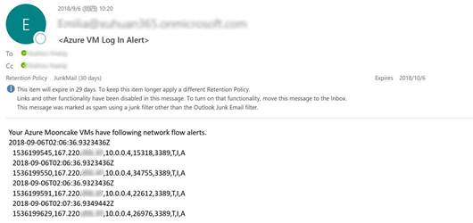

# 通过网络观察程序监测虚机 RDP 端口的被访问情况

## 问题描述

为了更好地监测 IP 地址对虚拟机 RDP 端口的访问记录，建议通过网络观察程序针对网络层的访问信息进行[日志流记录](https://docs.azure.cn/zh-cn/network-watcher/network-watcher-nsg-flow-logging-overview)，相关流日志信息会以 json 文件形式存储在指定的存储账户中。同时为了方便日常管理，建议对日志信息采用自动化脚本处理。

## 解决方法

1. 通过网络观察程序进行网络安全组流日志记录，来监测针对虚机 RDP 端口的访问，该功能的开启步骤请参考：[在 Azure 门户中管理网络安全组流日志](https://docs.azure.cn/zh-cn/network-watcher/network-watcher-nsg-flow-logging-portal)。
2. 为保存下来的流日志信息配置根据[计划](https://docs.azure.cn/zh-cn/automation/automation-schedules)定期运行的 runbook 脚本，实现邮件形式的通知服务。

该脚本以网络观察程序监测某台虚机 NSG 时生成的流日志文件为例，分析其中 RDP 端口的被访问情况，并将相关信息以邮件形式发送给指定收件人。

```powershell
#登录 Azure
Login-AzureRmAccount -EnvironmentName AzureChinaCloud;

#定位至流日志文件所在存储账户
$ResourceGroup = "alert-test";
$storageAccountName = "alerttestdiag";
$storageAccount = Get-AzureRmStorageAccount -ResourceGroupName $ResourceGroup -Name $storageAccountName;
$ctx = $storageAccount.Context;

#获取最新的日志文件
$Container = "insights-logs-networksecuritygroupflowevent";
$blobs = Get-AzureStorageBlob -Container $Container -Context $ctx;
$blobitem = $blobs[$blobs.count -1];
$content = $blobitem.icloudblob.DownloadText();

#将 json 格式的内容转换为自定义输出对象格式
$newcontent = $content | convertfrom-json;
$result = New-Object System.Collections.ArrayList;

#需要监控的 NSG 名称
$RDPrule = "UserRule_RDP";

foreach ($record in $newcontent.records){
    if ($record.properties.flows.rule -contains $RDPrule){
        $log = $record.properties.flows;
        $counter = $log.Count;
        for($i=0; $i -lt $counter; $i++){
            #寻找监控的 RDP 规则
            if ($log[$i].rule -eq $RDPrule){
                #遍历应用该 NSG 的所有虚机的 MAC 地址
                foreach ($mac in $log[$i].flows){
                    #分析每个 MAC 的日志流信息
                    foreach ($traffic in $mac.flowTuples){
                        #记录访问详情
                        if ($traffic -match "T,I,A"){
                            $result.Add($record.time) | Out-Null;
                            $result.Add([Environment]::NewLine);
                            $result.Add($traffic) | Out-Null;
                            $result.Add([Environment]::NewLine);
                        }
                    }
                }
            }
        }
    }
}

#若监测到对 RDP 端口的访问，则将访问请求发送邮件给指定账户
$recipient = "receiver@microsoft.com"
$ccRecipient = "receiver@microsoft.com"
$emailFrom = "sender@contoso.onmicrosoft.com"
$smtpServer = "smtp.office365.com"
$smtpPort = 587
$smtpCredential = new-object -typename System.Management.Automation.PSCredential -argumentlist "sender@contoso.onmicrosoft.com", (ConvertTo-SecureString "password" -AsPlainText -Force)

if ($result -ne $null)
    {
        $emailBody = 'Your Azure Mooncake VMs have following RDP access records:' + [Environment]::NewLine + $result;
        Send-MailMessage -Subject '<Azure VM RDP Records>' -Body $emailBody -To $recipient -Cc $ccRecipient -From $emailFrom -SmtpServer $smtpServer -Credential $smtpCredential -Port $smtpPort -UseSsl;
    }
```

运行该脚本后可以获得如下类似的邮件通知，请根据根据您的实际环境更改脚本中的 NSG 名称，邮箱服务器等参数。



> [!NOTE]
> 在运行 runbook 前，请先更新 Azure powershell 模块。