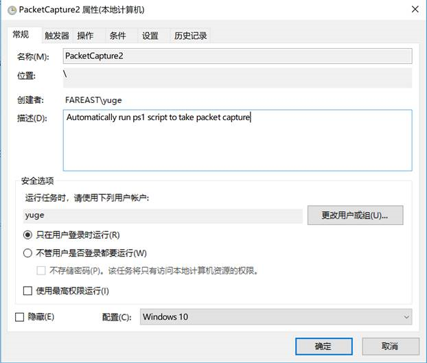
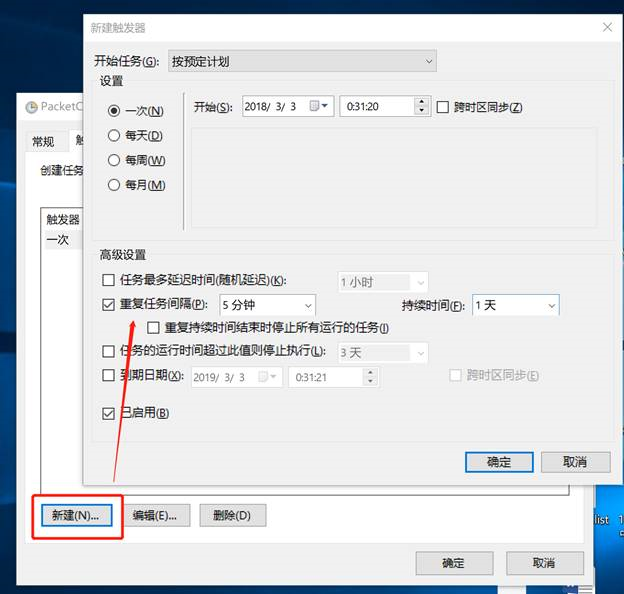
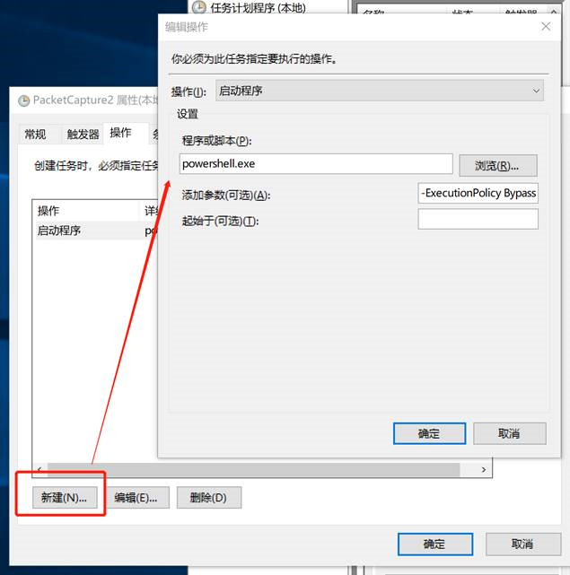
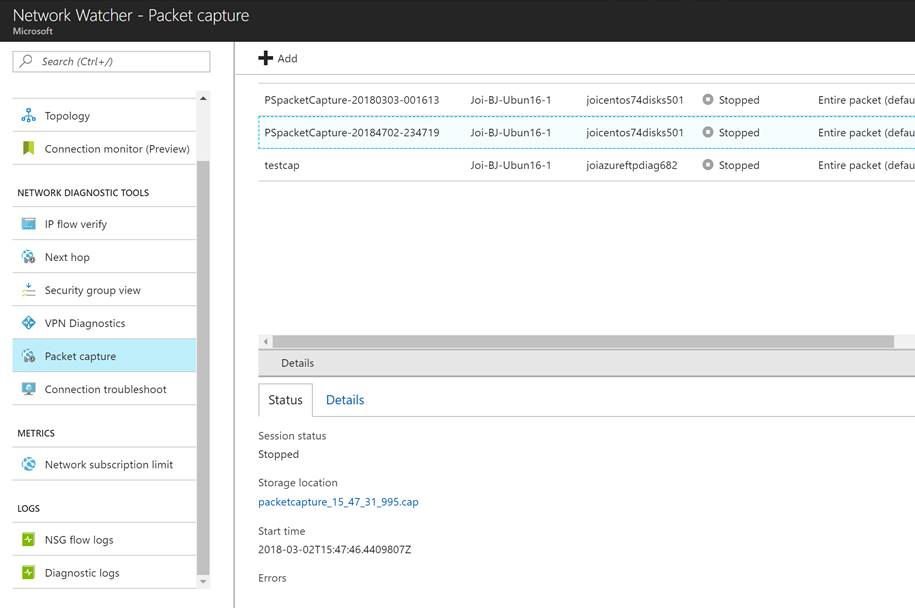
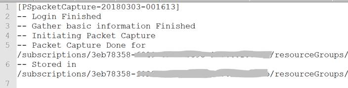

# 自动抓包实施网络入侵检测

我们使用网络观察程序（Network Watcher）的数据包捕获功能，可以实施网络入侵检测系统 (IDS) 并执行网络安全监视 (NSM)。 借助多种开源 IDS 工具来处理数据包捕获，并检查潜在网络入侵和恶意活动的签名，分析网络中是否存在任何有害入侵或漏洞。

## 应用场景

目前[官方文档](https://docs.azure.cn/zh-cn/network-watcher/network-watcher-intrusion-detection-open-source-tools) 中实现的 IDS 功能需要在获取数据包捕获的 CAP 文件后，让 Suricata 进行特征库匹配，再使用 ELK 等第三方工具将其可视化。

## 自动化 IDS 具体步骤

因此，如果想实现自动化的 IDS，需完成以下四个步骤：

1. 定期自动创建 CAP 文件

    Network Watcher 支持使用 PowerShell 命令对虚拟机抓包，定时捕获数据包这一需求可以通过

    1. Windows 自带的 Scheduler 调用 PowerShell 脚本来实现
        找一台 Windows 的机器在设定下反复执行 ps1 脚本
    2. 使用 Azure Automation – Runbook 服务执行脚本
        优点是您无需部署脚本在自己的机器上，缺点是 Automation/Runbook 需额外收费（费用与执行 ps1 脚本次数有关）。

    这部分在官方文档中未提供具体方法，本文[最后一节](#section1)以方式 1 为例，详细介绍配置步骤、并提供一个可运行的 PowerShell 脚本供参考。

2. 将存放在 Storage 中的 CAP 文件下载到本地

    通过 Python/.NET/JAVA 等调用 Blob Service REST API，可实现自动化下载。以下示例以 Python 为例。

    1. 连接存储

        在安装了适用于 Python 的 Azure 存储 SDK 的机器上，使用存储帐户名称和帐户密钥创建一个 BlockBlobService 对象。使用帐户名称和密钥替换“myaccount”和“mykey”。

        ```python
        block_blob_service = BlockBlobService(account_name='myaccount', account_key='mykey', endpoint_suffix='core.chinacloudapi.cn')
        ```

        安装 SDK 可通过 Python 包索引 (PyPI) 安装，参考命令如下：

        ```bash
        pip install azure-storage-blob
        ```

    2. 从 Blob 下载数据到本地

        若要从 blob 下载数据，建议使用 `get_blob_to_path`、`get_blob_to_stream`、`get_blob_to_bytes` 或 `get_blob_to_text`。 这些方法属于高级方法，在数据大小超过 64 MB 时执行必要的分块。

        以下演示了如何使用 `get_blob_to_path` 下载 “myblockblob” 这个 Blob 的内容，并将其存储到“out-capture.cap”文件。<br>
        `block_blob_service.get_blob_to_path('mycontainer', 'myblockblob', 'out-capture.cap')`<br>
        具体可参考：[如何通过 Python 使用 Azure Blob 存储](https://docs.azure.cn/zh-cn/storage/blobs/storage-python-how-to-use-blob-storage)

3. 通过 Suricata 处理数据包，生成警报文件

    在本地部署 Suricata 来处理捕获到的数据包，并根据与其给定威胁规则集匹配的数据包触发警报，存储在本地日志文件中。

    1. 安装 Suricata

        在 VM 的命令行终端中运行以下命令即可完成安装：

        ```bash
        sudo add-apt-repository ppa:oisf/suricata-stable
        sudo apt-get update
        sudo sudo apt-get install suricata
        ```

        若要验证安装，请运行命令 `suricata -h` 查看命令的完整列表。<br>
        更多安装方法可参考：[Suricate 安装](http://suricata.readthedocs.io/en/latest/install.html)。

    2. 设置威胁规则集

        安装完毕后需创建运行 Suricata 所需的规则，这里可以使用自己创建的规则，也可以使用许多提供商开发的规则集，将下载好的规则复制到 “/etc/suricata/” 路径下。<br>
        常见的规则集有[Emerging Threats](http://rules.emergingthreats.net/open/suricata/emerging.rules.tar.gz), Snort 开发的 VRT 规则。

    3. 生成警报并存储为日志

        使用 Suricata 处理数据包捕获，生成的警报将存在 “/var/log/suricata/fast.log” 下。<br>
        启用 Suricata 处理数据包捕获的命令如下：

        ```bash
        sudo suricata -c /etc/suricata/suricata.yaml -r <location_of_pcapfile>
        ```

4. （可选）第三方工具将结果可视化

    在虚拟机上部署 ELK（Elastic Stack + Logstash + Kibana），为 Suricata 日志生成索引并作可视化。<br>
    对于 Logstash 配置及 Kibana 模板，更多可参考：[设置 Elastic Stack](https://docs.azure.cn/zh-cn/network-watcher/network-watcher-intrusion-detection-open-source-tools#set-up-the-elastic-stack)。

    至此，用户可以通过可视界面，查看 Suricata 警报日志和威胁分析结果。

## <a id="section1"></a>附：定期自动创建 CAP 文件的参考步骤

本文提供自动创建 CAP 方法 1 的一个简单 DEMO 供参考，运行环境为 Win10：

1. 下载并修改 [PowerShell 脚本](https://github.com/wacn/AOG-CodeSample/tree/master/NetworkWatcher/PowerShell/aog-network-watcher-network-intrusion-detection-via-automatic-packet-capture/NWAutoPacketCapture.ps1)

    请根据实际情况修改前 23 行 {xxx} 大括号中内容；
    运行该脚本将执行一次数据包捕获的过程，过程日志将存储在 $filePath 路径下；
    捕获到的数据包将被命名为 “PSpacketCapture-yyyyMMdd-HHmmss”（如“PSpacketCapture-20180315-000000”），被存放在设定的 Storage 中

    > [!NOTE]
    > 1. 网络观察程序捕获的数据包的 名字不能重名，否则将无法写入。<br>
    >    本 DEMO 中数据包均以 Date 结尾，避免了重名的问题；<br>
    >    如果您有别的命名需要，请务必注意：重名可能导致数据包无法正常写入 Storage；<br>
    >    对此，附件 ps1 文件末尾附上了对重名包的检测和删除，供参考。<br>
    > 2. 捕获的数据包命名中可使用的特殊字符有限制，建议使用 . 或 – 或 _，不要用 / 或 : 等其他符号。

2. 配置 Scheduler，在 Scheduler（任务计划程序）中 “创建任务” 来定期调用 ps1 脚本。

    1. 常规选卡中输入 Name 和 Description，选择适当的 “用户或组” 及配置。

        

    2. 触发器选卡中根据需要设置开始时间、间隔和持续时间。

        

    3. 操作选卡中选择 “启动程序”，在 “程序或脚本” 一项填写 “powershell.exe”。

        “添加参数” 一项填写：“-ExecutionPolicy Bypass *xxx\AzurePacketCapture.ps1*” （斜体部分请替换为实际路径）。

        

    4. 另两个选卡根据实际需要设定。

3. ps1 脚本被运行完毕后可以在 Portal/Storage 中看到捕获的数据包，如下图所示：

    

    捕获的过程日志截取如下：

    