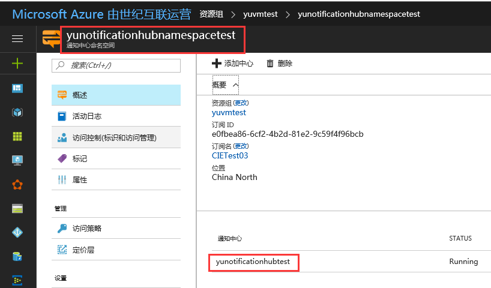

## 使用 Azure PowerShell 创建通知中心

本文主要介绍如何使用 PowerShell 基于 ARM 模式创建通知中心。

## 操作步骤

1. 创建通知中心命名空间：

    ```PowerShell
    New-AzureRmNotificationHubs Namespace -ResourceGroup 'yuvmtest' -Location 'China North' -Namespace 'yunotificationhubnamespacetest'
    ```

2. 创建通知中心：

    这里需要依赖第一步创建的通知中心命名空间及 json 模板。

    * Json 模板(根据需求修改 `name`、`sku` 参数即可)：

        ```Json
        {
            "type": "Microsoft.NotificationHubs/namespaces",
            "sku": {
                "name": "Standard"
            },
            "kind": "NotificationHub",
            "name": "yunotificationhubtest",
            "apiVersion": "2014-09-01",
            "location": "China North",
            "tags": {},
            "scale": null,
            properties": {
                "namespaceType": "NotificationHub"
            },
            "dependsOn": []
        }
        ```

    * PowerShell 语句：

        ```PowerShell
        New-AzureRmNotificationHub -Namespace 'yunotificationhubnamespacetest' -ResourceGroup 'yuvmtest' -InputFile "C:\InternalHub.json" 
        ```

3. 创建效果：

    