# 在.Net Core 的环境下使 UWP 可以正常接收 Azure Notification Hub event

伴随着.Net Core 的推出和普及，在最新版的 VS 2017 的环境下，UWP 的开发已经基于.Net Core libs。这使得 UWP 接收 Azure Notification Hub event 的实现有所改变。

## 前期准备

本文以 VS 2017 community 15.6.3 为例（运行平台是 Windows 10 version 1709）

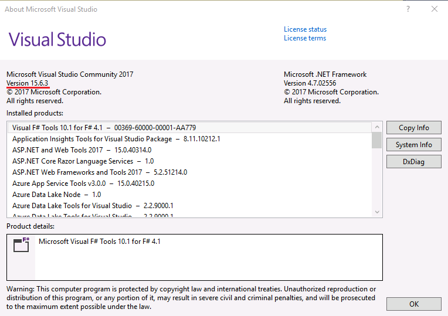

## 操作步骤

1. 创建 blank UWP

    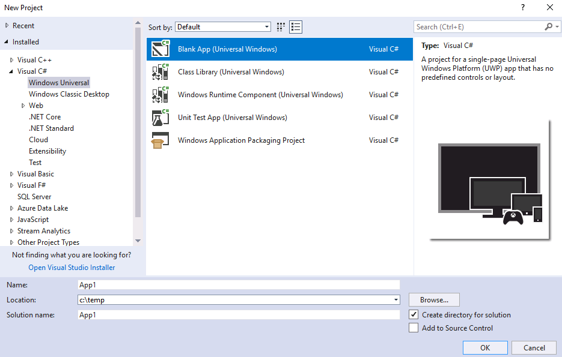

2. 为了使用最新的支持 .Net Core 的 Notification Hub SDK，这里的 UWP 可支持的最低版本必须是 16299 以上。

    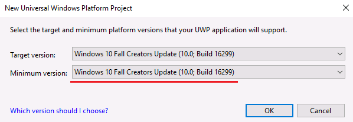

3. 添加 Notification Hub SDK 的引用

    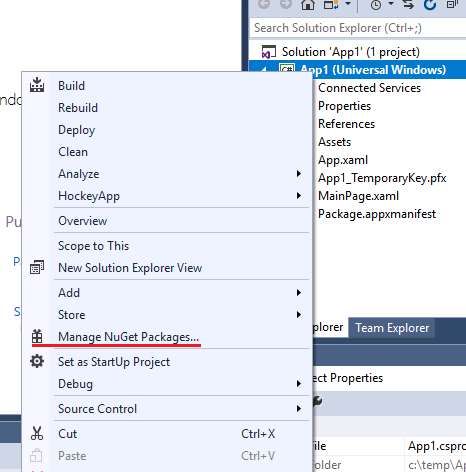

4. 在 NuGet 的 Browse 页面，勾选 **include prerelease**，并输入 notificationhubs。选择安装 v2.0.0 preview2 版本的 Microsoft.Azure.NotificationHubs。

    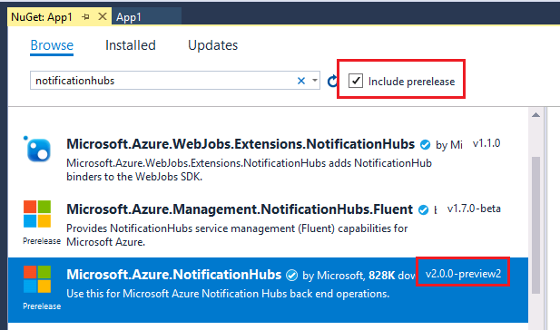

5. 根据向导安装完后，在 References 可看到如下的信息：

    

6. 我们需要在 Developer Center 上注册一个应用。

    1. 首先使用您的账号登录 [Developer Center](https://developer.microsoft.com/en-us/windows)。

        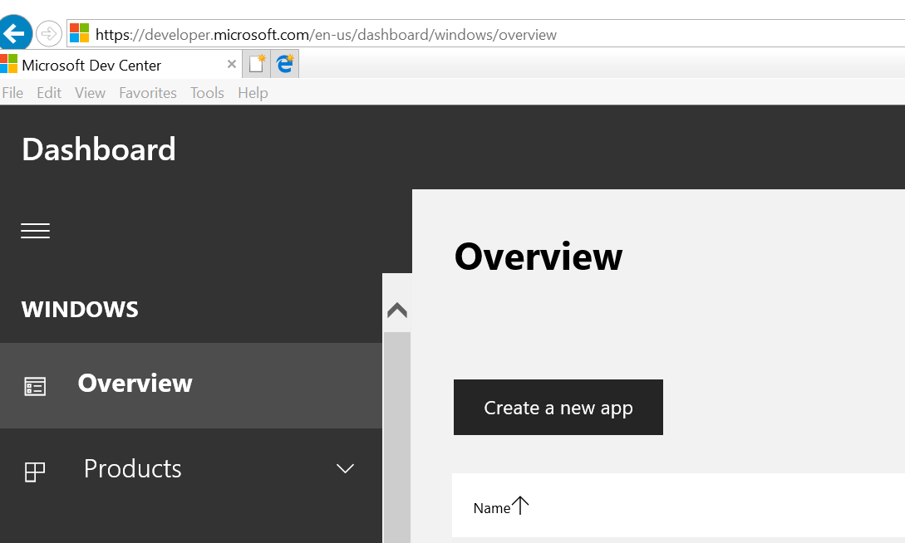

    2. 然后在 "**Overview**" 项下创建一个 App。

        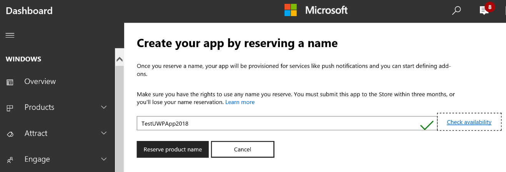

    3. 进入所创建的 App 后，我们需要 **Package SID** 信息。

        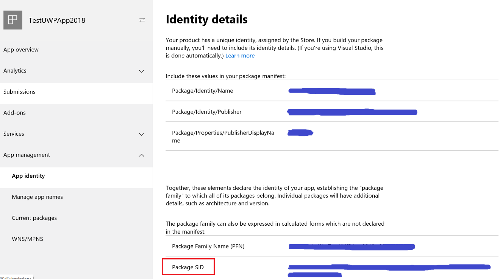

    4. 切入到 WNS/MPNS 项，并点击 Live Services site 连接获取对应的 **Security Key**.

        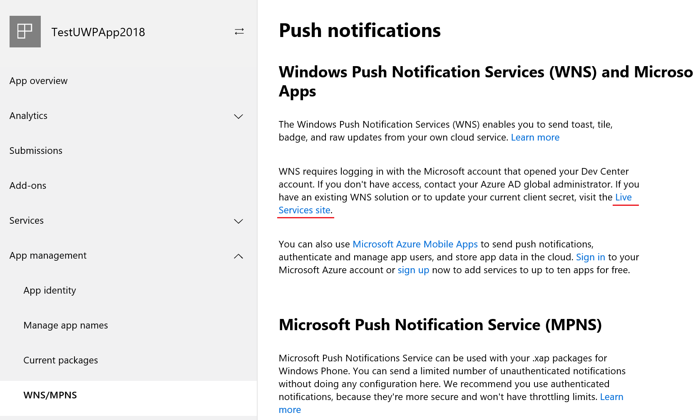<br>
        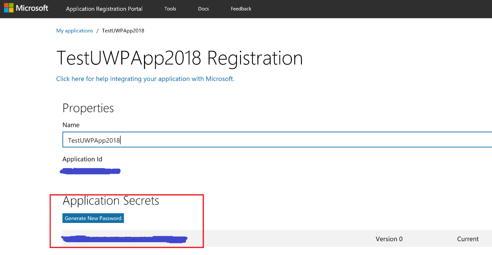

    5. 在 [Azure 门户](https://portal.azure.cn) 上创建一个 Notification Hub 服务.

        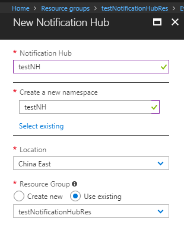

    6. 打开创建的 Notification Hub，选择 “**Windows (WNS)**”项，并把此前在 Developer Center 上注册的 App 的 **Package SID** 和 **Security Key** 填入。

        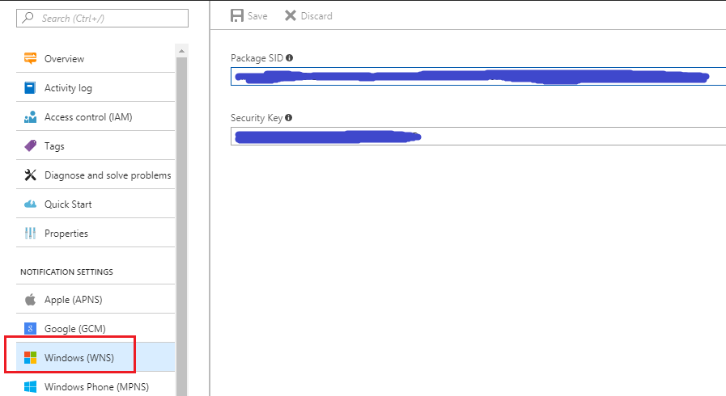

    至此，Azure 端的 Notification Hub 就完成了配置。

7. 现在我们需要返回到 VS 中，完成 UWP 的配置。

    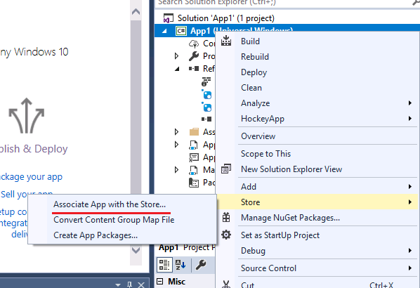

    1. 使用 Developer Center 的账号登录到 App Store 后，选择此前注册的 App，根据安装向导完成所有的步骤后，VS 端的配置也就完成了。
    2. 然后把如下代码输入到 App class 里。

        ```csharp
        private async void InitNotificationsAsync()
        {
            var channel = await PushNotificationChannelManager.CreatePushNotificationChannelForApplicationAsync();
            var hub = NotificationHubClient.CreateClientFromConnectionString("<DefaultListenSharedAccessSignature from Notification Hub Access Policies>", "<Notification Hub name>");
            var reg = new WindowsRegistrationDescription(channel.Uri);
            var result = await hub.CreateRegistrationAsync(reg);

            // Displays the registration ID so you know it was successful
            if (result.RegistrationId != null)
            {
                var dialog = new MessageDialog("Registration successful: " + result.RegistrationId);
                dialog.Commands.Add(new UICommand("OK"));
                await dialog.ShowAsync();
            }
        }
        ```

    3. 在函数 `protected override void OnLaunched(LaunchActivatedEventArgs e)` 的开始的位置加入代码 `InitNotificationsAsync();`，这样代码的修改也完成了。

8. 把 VS 中的 blank UWP 运行起来，我们可以看到如下成功注册的信息。

    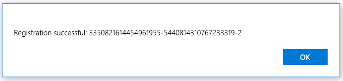

9. 使用 [Azure 门户](https://portal.azure.cn) 上 Notification Hub 中的 Test Send 功能来测试整条链路。

    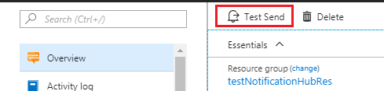<br>
    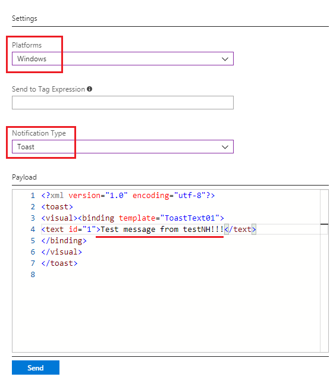

10. 点击 Send 并等待发送成功后，我们回到运行 blank UWP 的 Windows 10 里，在 notification bar 上可以看到我们从 Azure 门户发出的信息。

    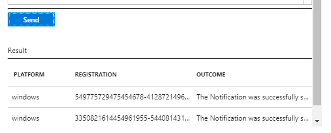<br>
    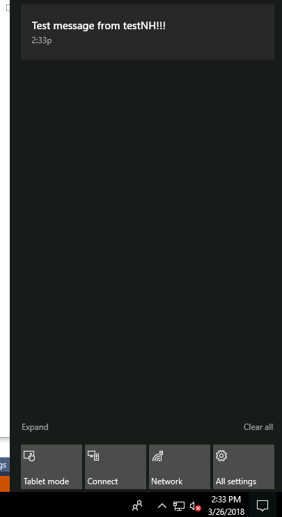