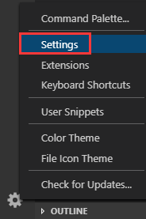
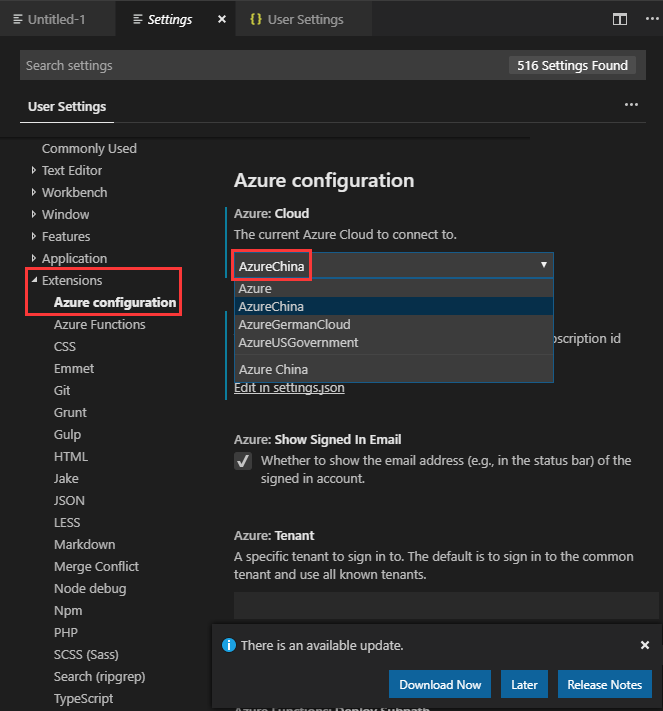
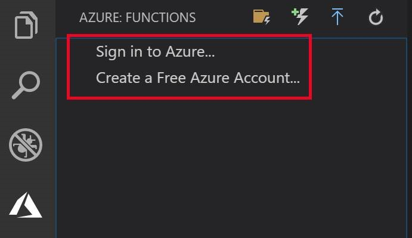
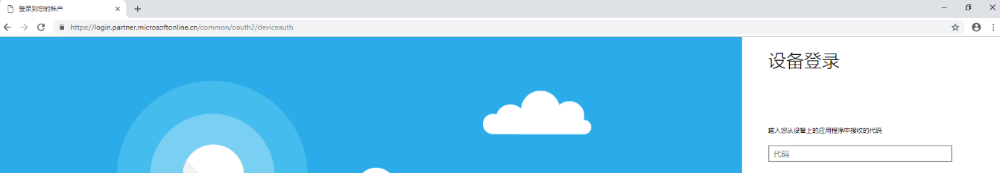
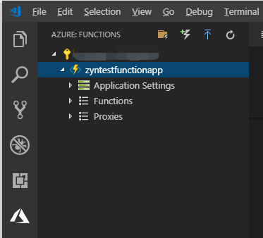

# Visual Studio Code 如何登录中国区 Azure

## 解决方案

1. 首先打开 VS Code，点击设置按钮，选择 **Settings**

    

2. 在跳转出来的页面，在 Extensions 节点选择 **Azure configuration**,选择 **Azure china**

    

3. 再点击 **Sign in to Azure...**，会出现[登录到中国区 Azure 的 URL](https://aka.ms/deviceloginchina)，输入 code 之后会跳转处登录账号的页面

    

    

4. 输入用户名以及密码之后可以正常登录到中国区 Azure，可以看到我的订阅

    