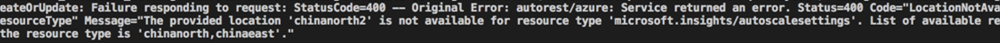
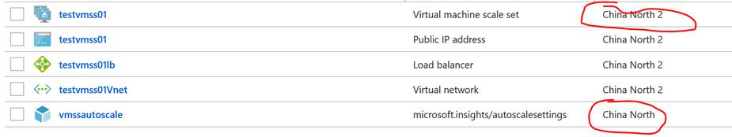
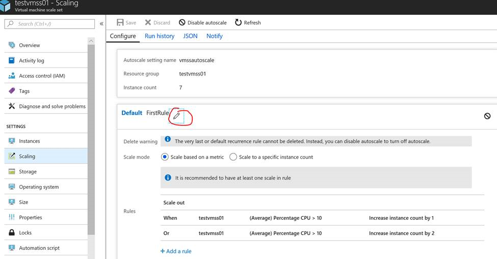
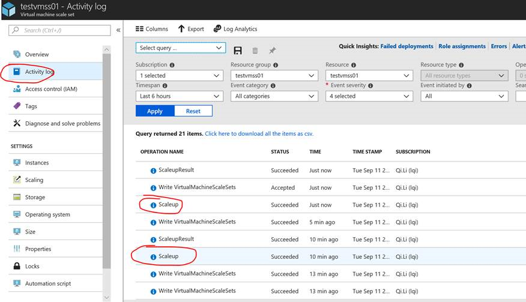

# 中国东部 2 与中国北部 2 的资源如何使用 autoscaling 功能

## 问题描述

目前新数据中心中国东部 2 和中国北部 2 的 autoscaling 功能还未上线。用户在门户为资源配置 autoscaling 时会遇到报错如下：



## 问题分析

要缓解该问题，可以将 autoscaling 创建在中国东部或中国北部,然后关联到新区域的资源。

## 解决方法

如下示例为在中国东部 2 的 VMSS 关联在中国东部的 autoscaling。取决于您的资源类型，autoscaling 规则和 profile 可能需要调整。

1. 用 Azure Powershell 创建 autoscale，并关联到 VMSS。括号内的部分请替换为用户环境信息；Location 选择 ChinaNorth or ChinaEast。

    ```powershell
    $Rule1 = New-AzureRmAutoscaleRule -MetricName "Percentage CPU" -MetricResourceId "{/subscriptions/9b65639b-59c0-4d6c-b9a5-411192b24e9b/resourceGroups/testvmss01/providers/Microsoft.Compute/virtualMachineScaleSets/testvmss01}" -Operator GreaterThan -MetricStatistic Average -Threshold 10 -TimeGrain 00:01:00 -ScaleActionCooldown 00:05:00 -ScaleActionDirection Increase -ScaleActionScaleType ChangeCount -ScaleActionValue "1" 

    $Rule2 = New-AzureRmAutoscaleRule -MetricName "Percentage CPU" -MetricResourceId "{/subscriptions/9b65639b-59c0-4d6c-b9a5-411192b24e9b/resourceGroups/testvmss01/providers/Microsoft.Compute/virtualMachineScaleSets/testvmss01}" -Operator GreaterThan -MetricStatistic Average -Threshold 10 -TimeGrain 00:01:00 -ScaleActionCooldown 00:10:00 -ScaleActionDirection Increase -ScaleActionScaleType ChangeCount -ScaleActionValue "2"

    $Profile1 = New-AzureRmAutoscaleProfile -DefaultCapacity "1" -MaximumCapacity "10" -MinimumCapacity "1" -Rule $Rule1, $Rule2 -Name "{FirstRule}"

    Add-AzureRmAutoscaleSetting -Location "ChinaNorth" -Name "{vmssautoscale}" -ResourceGroupName "{testvmss01}" -TargetResourceId "{/subscriptions/9b65639b-59c0-4d6c-b9a5-411192b24e9b/resourceGroups/testvmss01/providers/Microsoft.Compute/virtualMachineScaleSets/testvmss01}" -AutoscaleProfile $Profile1
    ```

2. 后期对 autoscale 的更新可以通过 Azure 门户来更改。

    

    

3. 查看 Scale 效果。

    
