# Eclipse 使用认证文件登录 Azure

Azure 很多服务都支持 Java，而且为了更方便 Java 开发者，我们提供了适用于在 Eclipse 上安装的 Azure 插件。不过目前该插件不能直接使用交互方式（用户名和密码）来登陆中国区 Azure，但是可以使用认证文件的方式来登陆。本文将详细介绍相关操作。

## 操作步骤

1. Eclipse 安装 Azure 插件：

    安装 [Azure Toolkit for Eclipse](https://docs.azure.cn/zh-cn/azure-toolkit-for-eclipse-installation)

2. 创建 AAD 认证服务凭证：

    下面分别介绍使用 Azure PowerShell 和 Azure Cli 两种方式创建认证凭据信息：

    - PowerShell 创建凭据

        Azure PowerShell 下载地址：[https://github.com/Azure/azure-powershell/releases](https://github.com/Azure/azure-powershell/releases)
        Azure PowerShell 入门：[https://docs.microsoft.com/zh-cn/powershell/azure/get-started-azureps?view=azurermps-4.4.1](https://docs.microsoft.com/zh-cn/powershell/azure/get-started-azureps?view=azurermps-4.4.1)

        1. 在 PowerShell 中，登录 Azure 账户：

            ```PowerShell
            Login-AzureRmAccount -EnvironmentName AzureChinaCloud
            ```

            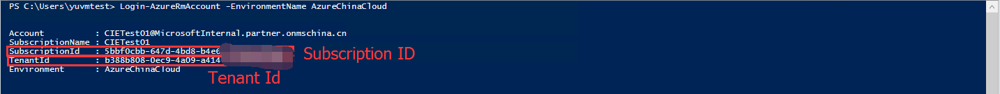

        2. 选择当前订阅 ID（注意此处使用的 SubscriptionId 也对应配置文件的 subscriptionId）：

            ```PowerShell
            Set-AzureRmContext -SubscriptionId "SubscriptionId"
            ```

        3. 创建 AD Application（注意此处设置的 Password 对应配置文件的 clientSecret）：

            ```PowerShell
            $azureAdApplication = New-AzureRmADApplication -DisplayName "<yourAppDisplayName>" -HomePage "<yourAppHomePageURL>" -IdentifierUris "<yourAppIdentifyURIs>" -Password "<yourPassword>"

            $azureAdApplication
            ```

            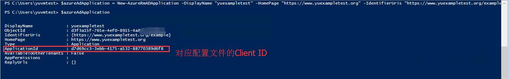

            > [!NOTE]
            > 命令中的参数根据您的实际情况进行替换。

        4. 为您的 AD 应用创建服务凭证：

            ```PowerShell
            New-AzureRmADServicePrincipal -ApplicationId $azureAdApplication.ApplicationId
            ```

        5. 为服务凭证授权。如果想了解更多内容，请参考：[Azure 门户中基于角色的访问控制入门](https://azure.microsoft.com/en-us/documentation/articles/role-based-access-control-what-is/)。

            > [!NOTE]
            > 注意在执行上一步后请稍等片刻（约 1 一分钟后）再执行以下步骤，不然 AD 凭据如果没有创建成功会报找不到的错误。

            ```PowerShell
            New-AzureRmRoleAssignment -RoleDefinitionName Contributor -ServicePrincipalName $azureAdApplication.ApplicationId 
            ```
            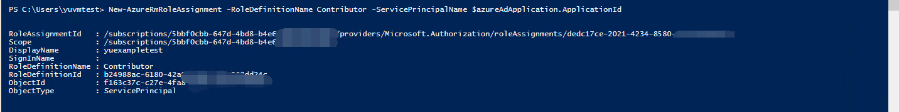

    - Azure-Cli 创建凭据：

        安装 Azure CLI 2.0：[https://docs.azure.cn/zh-cn/cli/install-azure-cli?view=azure-cli-latest](https://docs.azure.cn/zh-cn/cli/install-azure-cli?view=azure-cli-latest)
        通过 Azure CLI 登录 Azure：[https://docs.azure.cn/zh-cn/xplat-cli-connect](https://docs.azure.cn/zh-cn/xplat-cli-connect)

        1. 在 Azure_Cli 中，登录 Azure 账户：

            ```
            azure login -e AzureChinaCloud -u {your-username}
            ```

            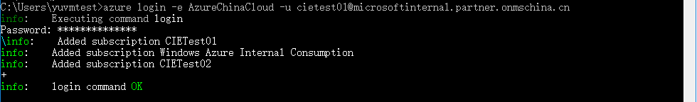

        2.	获取 Tenant_Id 及 Subscription Id：

            ```
            azure account show
            ```

            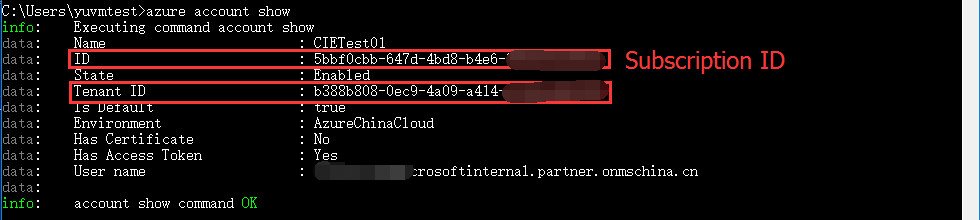

        3.	创建应用标识，请提供应用名称和密码，如以下命令所示：

            ```
            azure ad sp create -n exampleapp -p {your-password}
            ```

            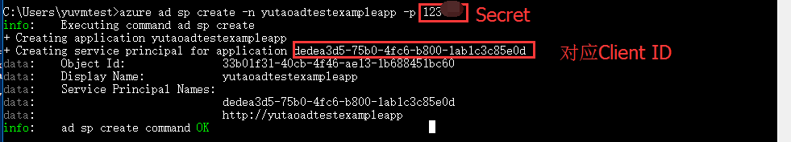

        4.	向服务主体授予对订阅的权限：

            ```
            azure role assignment create --objectId {Object Id} -o Owner -c /subscriptions/{subscriptionId}
            ```

            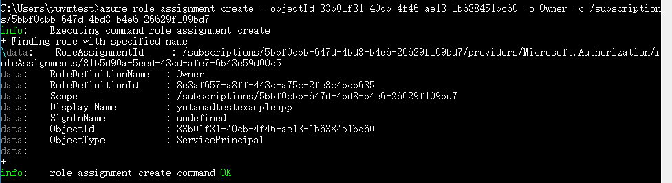

3. 构造认证文件：

    配置文件模板如下：

    ```Json
    {
        "clientId": "0675a148-8425-4cc4-8747-186831170476",
        "clientSecret": "123456",
        "subscriptionId": "e0fbea86-6cf2-4b2d-81e2-9119f4f96bcb",
        "tenantId": "b388b808-0ec9-4a09-a414-a7cbb11b7e9b",
        "activeDirectoryResourceId": "https://management.core.chinacloudapi.cn/",
        "activeDirectoryEndpointUrl": "https://login.chinacloudapi.cn",
        "resourceManagerEndpointUrl": "https://management.chinacloudapi.cn",
        "activeDirectoryGraphResourceId": "https://graph.chinacloudapi.cn/",
        "sqlManagementEndpointUrl": "https://management.core.chinacloudapi.cn:8443/",
        "galleryEndpointUrl": "https://gallery.chinacloudapi.cn/",
        "managementEndpointUrl": "https://management.core.chinacloudapi.cn/"
    }
    ```

    根据第二步获取的四个参数替换配置文件的前四个参数即可，文件保存为：名称.azureauth 。

4. Eclipse 登陆 Azure：

    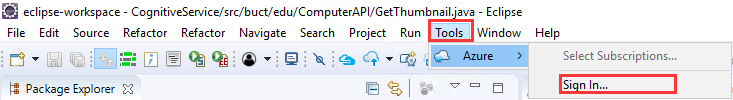
    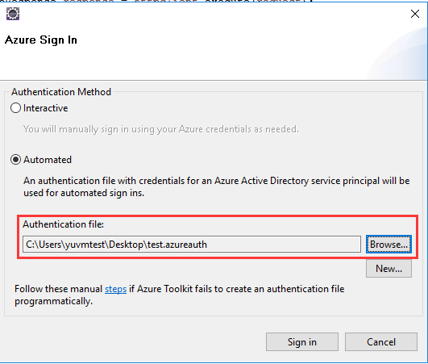

    登陆成功显示资源情况:
    
    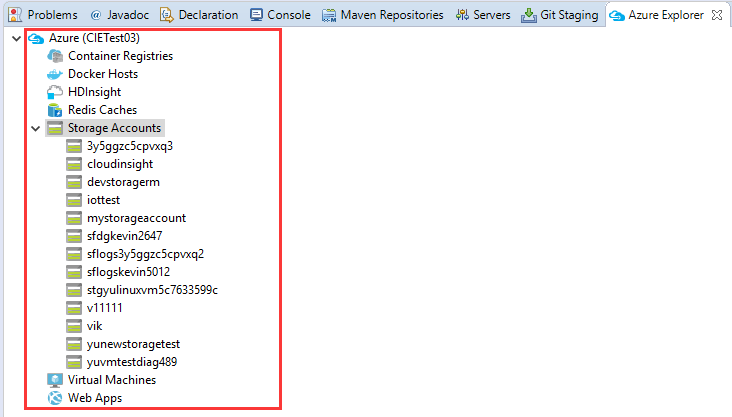

    > [!NOTE]
    > 目前只能显示 Azure 门户的部分资源。

## 使用示例

使用 Eclipse 发布 Azure Web 应用：

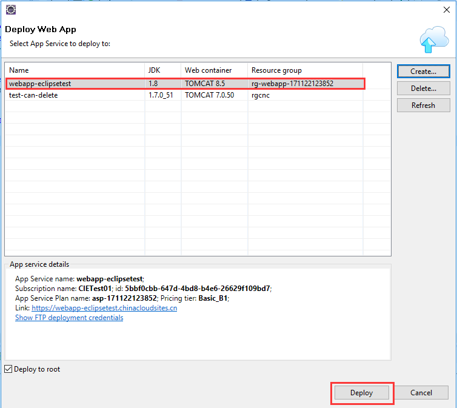

关于更多 Web 应用的演示，请参考[在 Azure 中创建第一个 Java Web 应用](https://docs.azure.cn/zh-cn/app-service/app-service-web-get-started-java)。

## 参考文档

- [使用 Azure CLI 创建服务主体来访问资源](https://docs.azure.cn/zh-cn/azure-resource-manager/resource-group-authenticate-service-principal-cli)
- [使用门户创建可访问资源的 Azure Active Directory 应用程序和服务主体](https://docs.azure.cn/zh-cn/azure-resource-manager/resource-group-create-service-principal-portal)
- [在 Azure 中创建第一个 Java Web 应用](https://docs.azure.cn/zh-cn/app-service/app-service-web-get-started-java)
- [通过 Azure CLI 登录 Azure](https://docs.azure.cn/zh-cn/xplat-cli-connect)