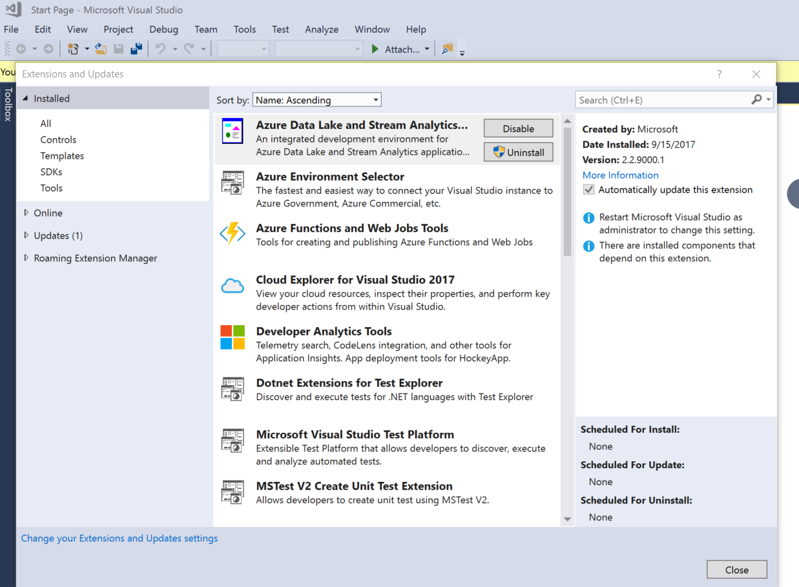
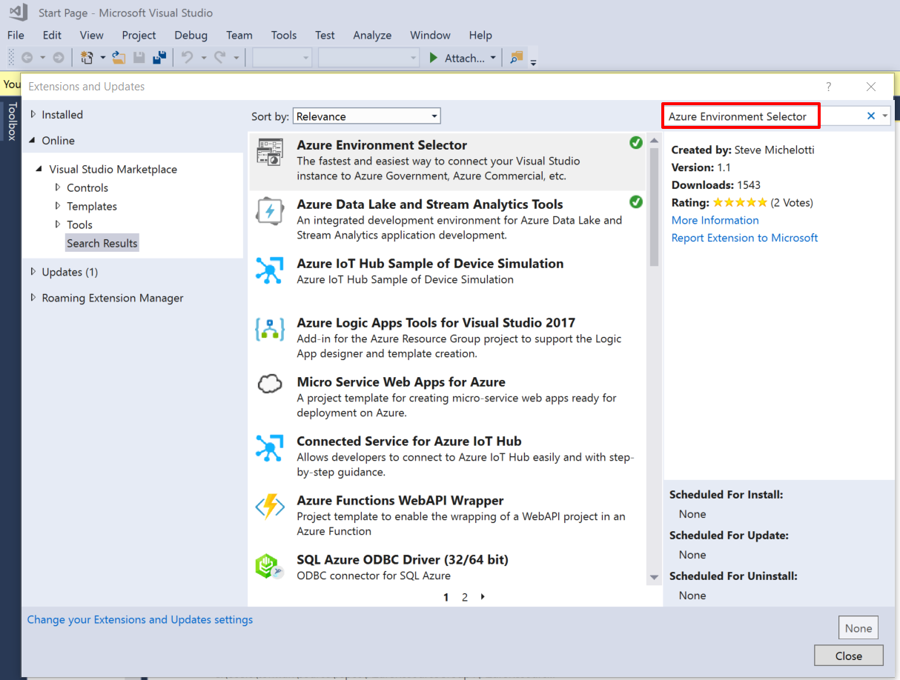
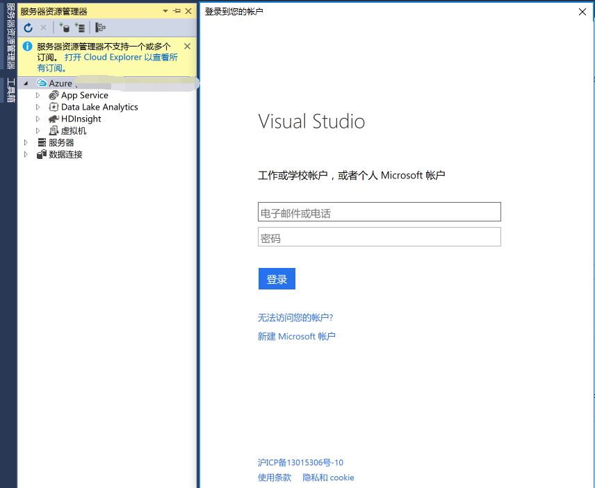
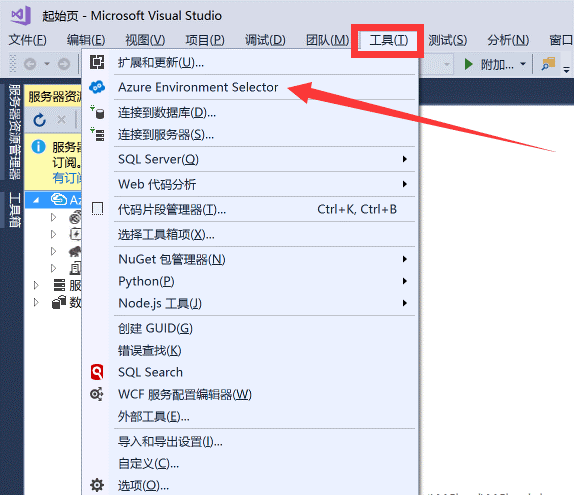
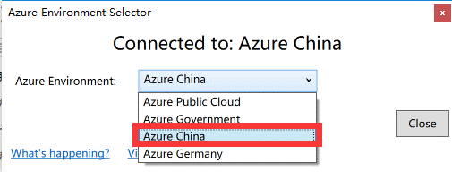
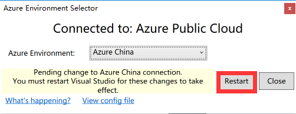

# VS2017 直接使用账户登录 Azure

## **问题描述**

Visual Studio 2017 (以下简称 VS2017) 在集成了 Azure 开发 SDK 的同时也提供了 Azure 的相关管理工具，例如 Azure Resource Group Tools，可以通过这些工具来协助管理员设计 Azure ARM 模板，并将其直接部署到 Azure 上。

但是由于 Visual Studio 默认是连接由微软运营的（国际版）Azure 的，所以无法直接使用世纪互联运营的 Azure 账户登录。本文将介绍如何在 Visual Studio 2017 上直接登录中国区 Azure 账户。

## **解决方案**

以下两种方式均可实现在 VS2017 中登录中国区 Azure 账户：

- 手动添加配置文件：

    1. 首先，需要安装 Azure .NET SDK for VS 2017。

    2. 安装成功后，关闭 Visual Studio 2017，然后到 `C:\Users\<user name>\AppData\Local\.IdentityService\AadConfigurations` 目录下，如果没有 AadConfigurations 目录，则新建该目录，之后将<a href="./media/aog-portal-management-qa-vs2017-login/AadProvider.Configuration.json" download target="_blank">此 Json 配置文件</a>下载到该文件夹下。

    3. 之后开启 Visual Studio 2017，参考以下截图，管理账户和订阅。

        

    4. 点开后，在第一个选项卡界面选择添加账户，之后就可以登录 Azure 账户了。

        

    5. 要用回国际版的 Azure 账户，把 C:\Users\<user name>\AppData\Local\.IdentityService\AadConfigurations 目录删除即可。

- 安装扩展，自动添加配置文件：

    1. 首先打开 Visual Studio 2017，点击导航栏中的 “**Tools**” -> 选择 “**Extensions and Updates**”,如下图所示：

        

    2. 点击之后会看到如下图所示的窗口：

        

    3. 在右上角的搜索栏里搜索 “**Azure Environment Selector**”,如下图所示：

        

    4. 选中该扩展后点击下载按钮即开始下载安装，安装后重新点击导航栏中的 “**Tools**”，看到里面多了一项 “**Azure Environment Selector**”，如下图所示：

        

    5. 点击该扩展后，会出现一个提示框，选择 "**Azure China**"，然后按照提示点击**重启**按钮来使配置生效。

        

    6. 重启生效后在部署模板时，就可以登陆中国区 Azure 账号来一键部署项目了。

        

<!-- Removed
    1. 首先，需要安装 Azure .NET SDK for VS 2017。

    2. 安装成功后，关闭 Visual Studio 2017，下载 <a href="./media/aog-portal-management-qa-vs2017-login/AzureEnvironmentSelector.vsix" download target="_blank"> extension </a>文件。

    3. 双击运行下载好的 extension 文件。

        

    4. 安装结束点击 Close。

        

    5. 开启 Visual Studio 2017，点击工具，选择 Azure Environment Selector。

        

    6. 选择 Azure China

        

    7. 点击 Restart

        

    8. 配置成功，即可以成功登录中国的订阅账号。

        

-->

## **参考文档**

[中国区 Azure 应用程序开发说明](/articles/developerdifferences)
