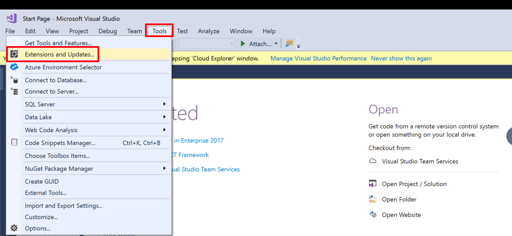
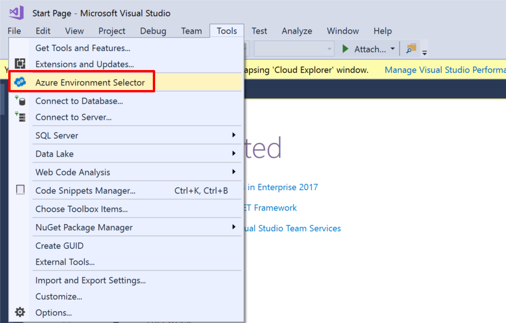
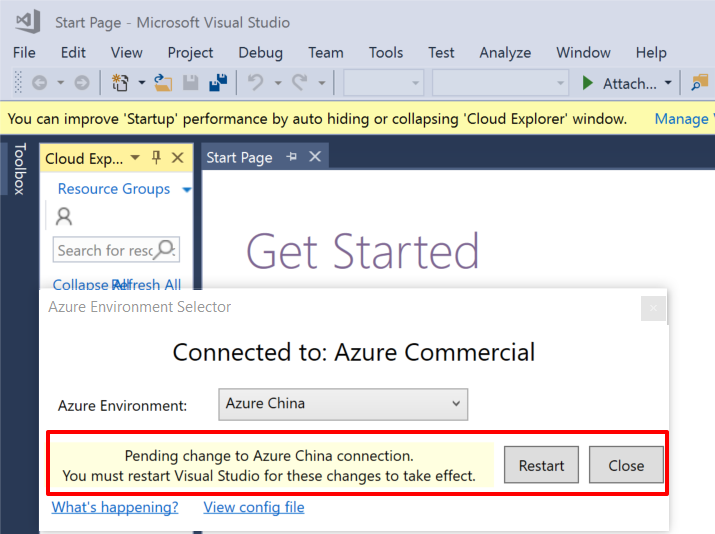

# 如何在 Visual Studio 2017 上安装扩展实现一键部署项目到中国区 Azure

## 适用场景

Visual Studio 2017 在集成了 Azure 开发 SDK 的同时也提供了 Azure 的相关管理工具，例如 Azure Resource Group Tools，可以通过这些工具来协助管理员设计 Azure ARM 模板，并将其直接部署到 Azure 上。由于默认 Visual Studio 是指向 Global Azure，为了能够直接指向中国区 Azure，之前需要通过一些繁琐的修改才能实现，本文将介绍如何在 Visual Studio 2017 上通过安装扩展来实现一键部署项目到中国区 Azure。

## 解决方案

1. 首先打开 Visual Studio 2017，点击导航栏中的 “**Tools**” -> 选择 “**Extensions and Updates**”,如下图所示：

    

    点击之后会看到如下图所示的窗口：

    

2. 在右上角的搜索栏里搜索 “**Azure Environment Selector**”,如下图所示：

    

3. 选中该扩展后点击下载按钮即开始下载安装，安装后重新点击导航栏中的 “**Tools**”，看到里面多了一项 “**Azure Environment Selector**”，如下图所示：

    

4. 点击该扩展后，会出现一个提示框，选择 Azure China，然后按照提示点击重启按钮来使配置生效。

    

5. 重启生效后在部署模板时，就可以登陆中国区 Azure 账号来一键部署项目了。