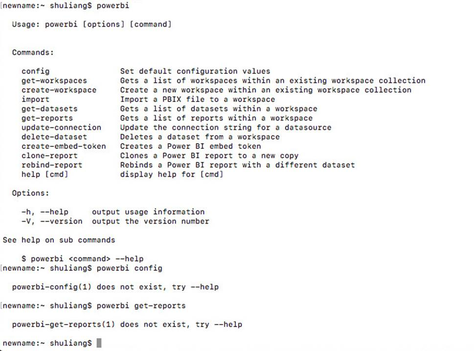
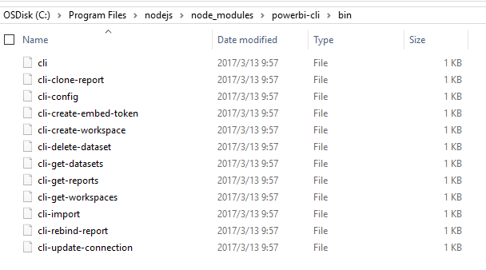
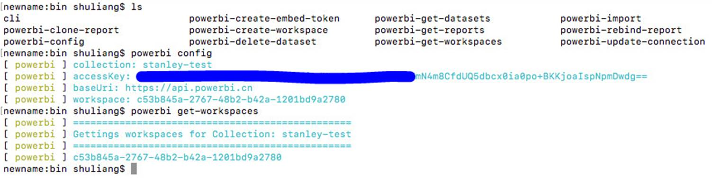

# Mac OS 环境下无法使用 PowerBI-Cli 工具故障排查

[PowerBI-Cli 工具](https://github.com/Microsoft/PowerBI-cli)可以很灵活地调用 Power BI Embedded 的 JavaScript API，从而完成诸如创建 workspace，上传报表，生成 token 等操作。有关 PowerBI-Cli 工具的具体介绍可参考：[PowerBI-Cli 工具使用指南](https://docs.azure.cn/zh-cn/articles/intelligence-analytics/aog-power-bi-embedded-cli-guidance)。

## 现象描述

PowerBI-Cli 工具目前仅支持 Windows 环境。用户在 Mac OS 环境下安装 PowerBI-Cli 工具，运行 `powerbi config` 命令后出现报错，错误信息为 "**powebi-config(1) does not exist, try --help**"。以下将对这个故障进行分析和解决。

## 原因分析

根据本地测试结果除了执行 `powerbi` 命令返回的是 PowerBI-Cli 语句用法以外，执行其他任何命令（如执行 `powerbi config`）均返回命令不存在的报错，如下所示：



在之后的排查过程中发现，在 Windows 环境下执行 PowerBI-Cli 命令时，系统调用 bin 目录 **C:\Program Files\nodejs\node_modules\powerbi-cli\bin** 下的相应脚本，例如运行 `powerbi config` 命令调用的是 bin 目录下的 cli-config 脚本文件。



但在 Mac OS 环境中，执行 `powerbi config` 命令时，由于环境的不同，系统调用的是 bin 目录 **/usr/local/lib/node_modules/powerbi-cli/bin** 下的 "powerbi-config" 脚本文件，因为该文件并不存在，所以出现报错信息。

## 解决方案

虽然目前 PowerBI-Cli 工具并无对 Mac OS 的支持，可以通过更改**/usr/local/lib/node_modules/powerbi-cli/bin** 目录(以下简称 bin 目录)下的文件名以及执行权限来修复此问题，具体步骤如下所示：

1. 在 Mac OS 环境中打开 Terminal，进入命令行界面；
2. 执行 `cd /usr/local/lib/node_modules/powerbi-cli/bin`，进入 bin 目录下；
3. 执行以下命令，将 bin 目录下所有文件开头三个字符 cli 改为 powerbi：

    ```
    for i in `ls`; 
    do mv -f $i `echo $i | sed 's/^.../powerbi/'`; 
    done,
    ```
    > [!TIP]
    > 注意代码中 **`** 和 **’** 的区别。

4. 执行 `mv powerbi cli`，将文件 powerbi 改回为 cli；
5. 执行 `chmod +x powerbi-*`，赋予所有 powerbi- 开头的文件以执行权限；
6. 之后再执行 PowerBI-Cli 命令，便可正常运行了。



## 总结

在本案例中，客户在 Mac OS 环境中运行 `powerbi config` 命令，系统错误地调用 bin 目录下不存在的脚本文件 powerbi-config，从而出现报错。虽然目前 PowerBI-Cli 工具并无对 Mac OS 环境的支持，但可通过简单的 shell 命令将 bin 目录中除了 cli 文件之外的所有脚本文件的文件名格式由 'cli-COMMAND' 改为 'powerbi-COMMAND'，并给改名后的脚本文件赋予执行权限，如此便可在 Mac OS 环境中顺利使用 PowerBI-Cli 工具了。