# 如何解决无法创建 Power BI Embedded 的问题

## 问题描述

用户在 [Azure 门户](https://portal.azure.cn)上创建 Power BI Embedded 的时候出现 “**请登录 Power BI**” 提示，同时无法进行下一步操作。提示信息如下：

> 你目前是以 xxxx@xxxxxx.partner.onmschina.cn 身份登录，但 Power BI 无法识别它。必须使用注册的 Power BI 帐户登录，才能创建 Power BI Embedded 资源。若要继续操作，要么注册 Power BI 帐户并关闭此边栏选项卡，要么注销并使用组织租户下注册的 Power BI 帐户登录。 
> [免费登录 Power BI](https://go.microsoft.com/fwlink/?linkid=873495) 
> [注销并以其他用户身份登录](https://portal.azure.cn/#menu/account)

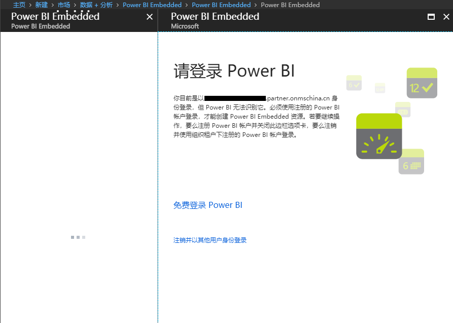

## 问题分析

在使用 Azure Power BI Embedded 之前，您首先需要申请 Power BI Pro 的许可证，然后才可以在 [Azure 门户](https://portal.azure.cn)中使用 Power BI Embedded 服务。

## 解决方法

### 前提条件

1. 如果您已经有了 Power BI 的许可证，可以直接登录 [Power BI 的管理界面](https://app.powerbi.cn) 使用 Power BI，可以跳过以下步骤直接参见[步骤 8](#step8)。
2. 如果您暂时还没有 Power BI 的许可证，请确保您拥有 Office 365 全局管理员或账单管理员的权限。具体操作步骤参见下文。

### 操作步骤

1. 使用您的账号登录 [Office 365 Admin center](https://portal.partner.microsoftonline.cn/AdminPortal/Home#/homepage)。

2. 在左侧 **账单** 栏下找到 **购买服务** 选项。在右侧的服务中找到 **Power BI Pro**。点击 **开始免费试用**。

    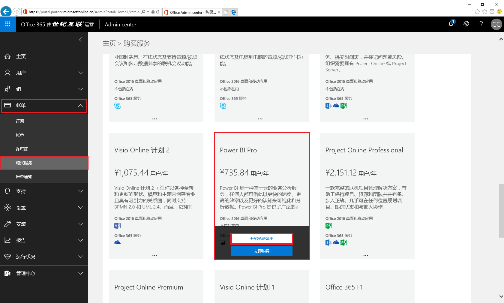

3. 购买成功后，**账单** 栏下找到 **许可证**，可以在右边看见购买的 Power BI Pro 的许可证，表示此时已经成功申请了试用。

    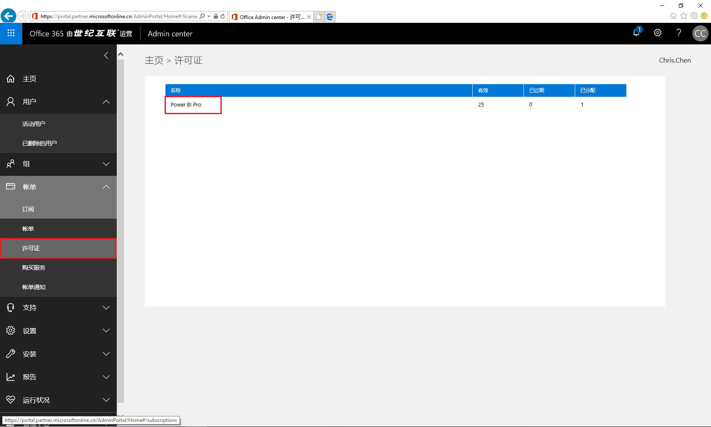

4. 回到左侧 **账单** 栏，点击 **订阅**。可以看到全局管理员自动获得了一个许可证。剩余可用 24 个。

    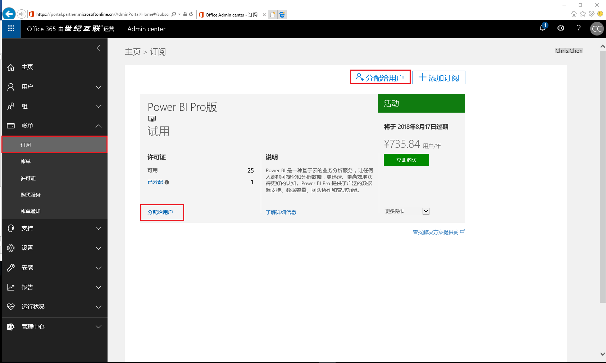

5. 点击许可证下方的 **分配给用户**，进入活动用户页面，单击需要授权的用户。

    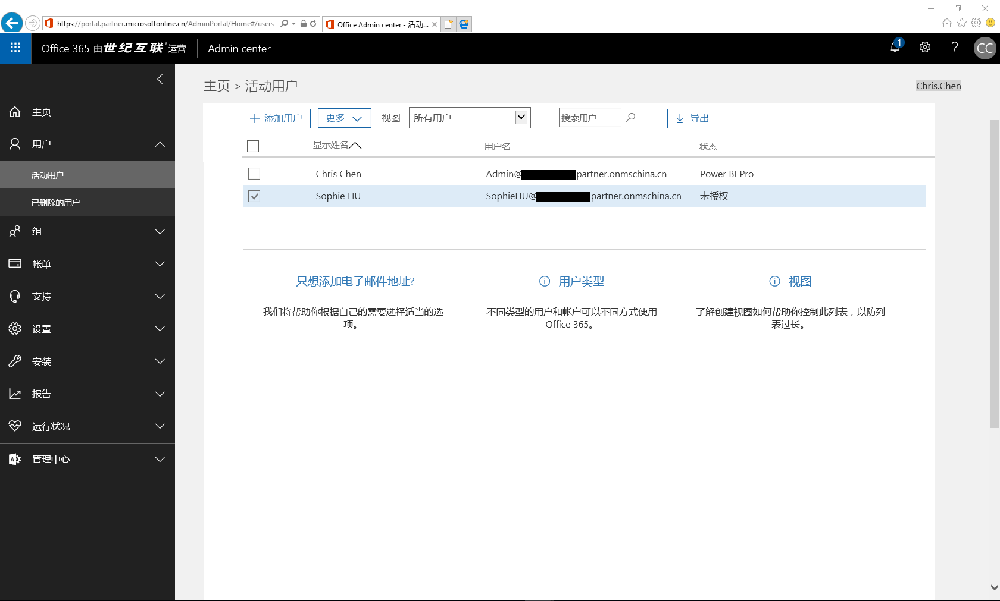

6. 在产品许可证栏点击 **编辑**。

    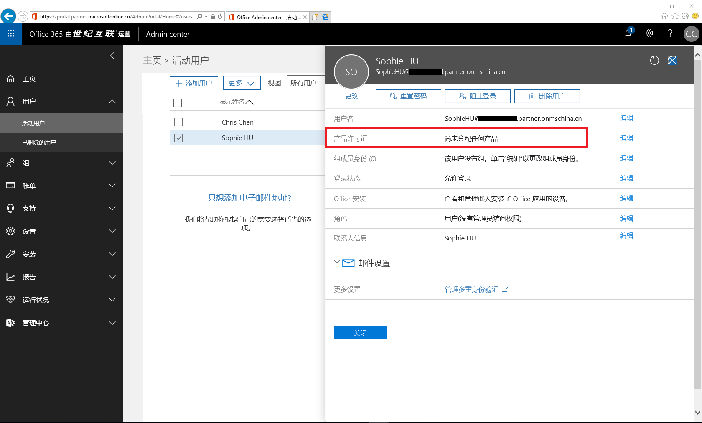

7. 将 Power BI Pro 的开关打开，并点击 **保存**。

    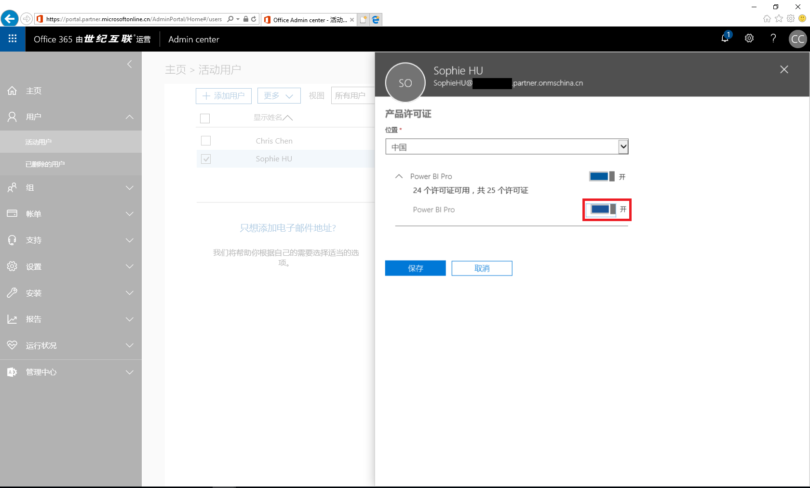

    保存完毕后可以看到新用户已经授权了 Power BI Pro 许可证。

    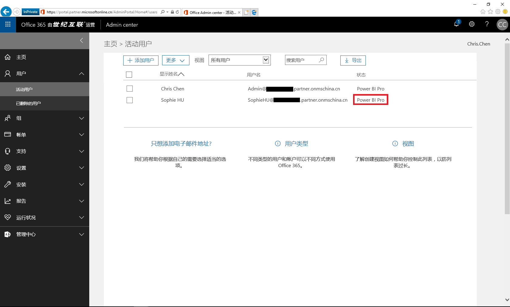

8. 此时登录 [Power BI 的管理界面](https://app.powerbi.cn)，就可以使用了 Power BI 服务了。

    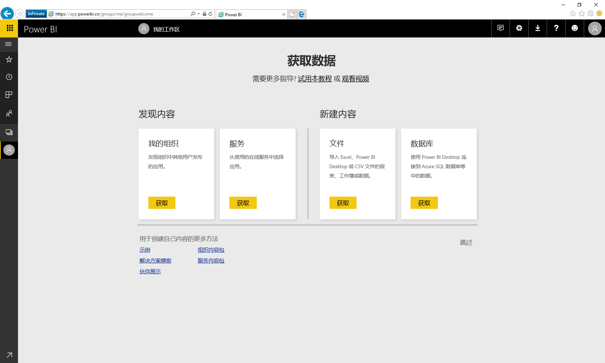

9. 接下来登录 [Azure 门户](https://portal.azure.cn)，此时您可以顺利的创建 Power BI Embedded。

    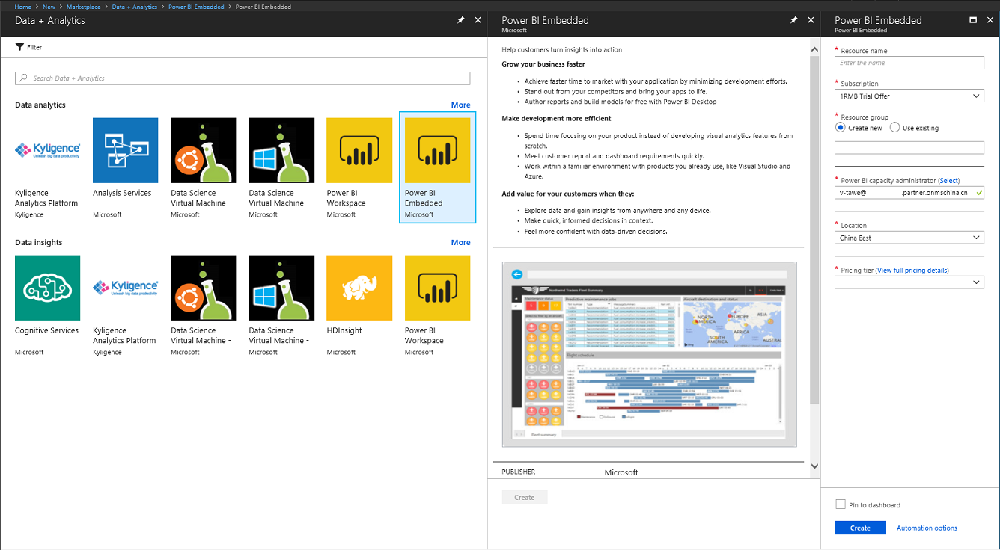

10. 创建成功后您就可以尽情使用 Power BI Embedded。

    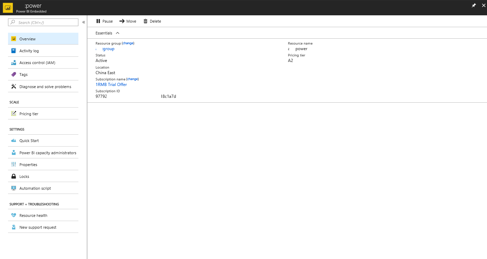