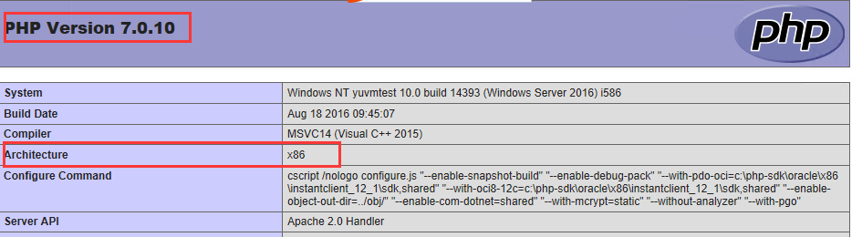
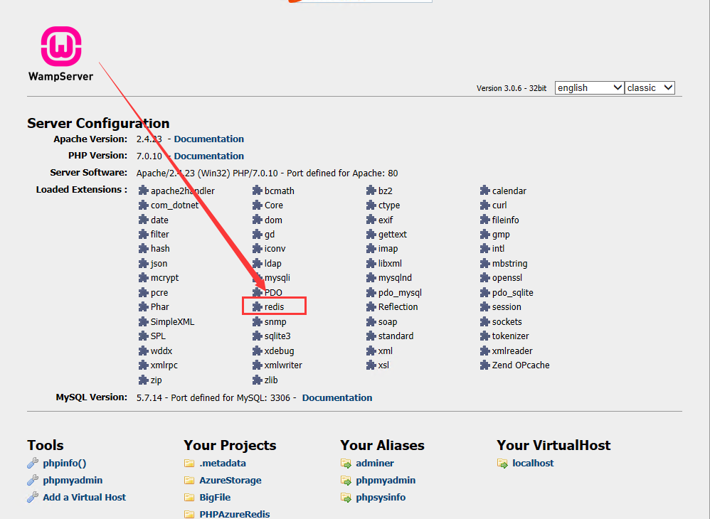

# 如何使用 PHP 连接 Azure Redis

## 概述

Azure Redis 缓存基于流行的开源 Redis 缓存，可以通过各种 Redis 客户端进行访问，这些客户端适用于许多编程语言。每个客户端有自身的 API，用于通过 Redis 命令调用 Redis 缓存实例。本文将主要介绍在 Windows 开发环境下如何使用 PHP7.0 连接 Azure Redis。

## 安装 Redis 扩展

要在 PHP 中连接 Redis，还需要在 PHP 中安装 phpredis 扩展来连接 Redis 服务器。Windows 下直接下载 phpredis 扩展，[下载 DLL 文件](https://pecl.php.net/package/redis)即可。

> [!NOTE]
> 下载过程中一定要注意 PHP 版本和位数的匹配，如果不确定，可以使用 `http://localhost/?phpinfo=1` 查看。



获取下载的文件解压得到 php_redis.dll，将 dll 文件放在安装目录 ext 下，同时修改 php.ini 文件，加入 redis 扩展，修改成功后可在 `http://localhost/` 确认。

```php
;extension=php_phpdbg_webhelper.dll
;extension=php_shmop.dll
extension=php_redis.dll
```



## 示例程序

```php
<?php

echo "Azure Redis Connect Test";
echo  "<br/>";

//连接本地的 Redis 服务
$redis = new Redis();
$redis->connect('<redis name>.redis.cache.chinacloudapi.cn', 6379);//在门户开启 6379 端口
$redis->auth("<redis password>");
echo "Connection to server sucessfully";

echo "<br/>";
//设置 redis 字符串数据
$redis->set("tutorial-name", "Redis tutorial");
// 获取存储的数据并输出
echo "Stored string in redis:: " . $redis->get("tutorial-name");

?>
```

> [!NOTE]
> 如果程序报找不到 Redis 类的异常，很可能是因为您的 dll 文件的版本不对或放置位置不对。

## 参考连接

- [PHP 连接和使用 Redis](https://www.awaimai.com/1861.html)
- [PHP 操作 Redis(一) PHP 连接 Redis，含 Redis 密码验证、指定某一 Redis 数据库](https://blog.csdn.net/justbear/article/details/73001852)
