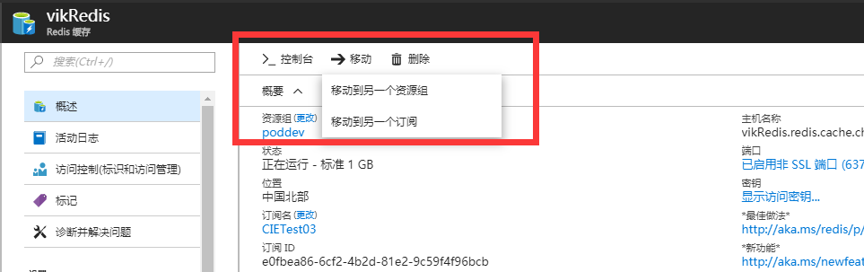

# 如何迁移 Azure Redis

在 Azure Redis 日常维护过程中，我们会遇到迁移 Redis 的情况，例如：进行跨资源组或者跨订阅，甚至是跨账户进行数据迁移，本文章将描述 Azure 对以上几种情况的支持。

## 跨资源组和跨订阅迁移 Redis 资源

Azure 提供了跨资源组和跨订阅迁移资源的功能，借助该功能，我们可以很轻松实现 Azure Redis 的迁移，请参考以下截图操作：



## 跨账号迁移 Redis 资源

Azure 是不提供跨账号直接迁移资源的，如果想要跨账号迁移 Redis，只能通过迁移 Redis 数据的形式来迁移。也就是说，可以借助 Azure Redis 的导入导出功能，将数据导出并保存，之后在新的账户中创建新的 Redis，在将之前导出的数据导入到新的 Redis 中。但需要注意，导入导出功能只有高级版的 Redis 才支持，基础版和标准版均不支持此操作。如果想要在基础版和标准版来实现迁移数据的过程，可以借助以下手动方法来迁移数据。

1. 将原有的 Redis Server 升级至高级版，之后在管理界面使用导出功能导出数据，导出的数据存储在选择的存储账户中，导出成功后，就可以将原 Redis Server 删除。

    > [!NOTE]
    > Redis Server 升级至高级版后是无法再降级到标准版的。

2. 在存储账户中找到导出的数据文件，这个文件实际是 Redis 的 RDB 备份文件，你可以将此 RDB 文件重命名为 Redis 的备份文件名称，之后放置本地 Redis Server 根目录下，并还原至本地 Redis Server (Version 3.2 +)。

3. 在本地 Redis Server 使用 `BGREWRITEAOF` 命令，将数据导出为 AOF 格式文件。

4. 执行以下命令，将 AOF 文件内容导入到 Azure Redis，确保 Azure Redis 6379 端口打开，如果数据量很大的话，建议在 Azure 的 Linux 虚拟机内进行操作。

    ```azurecli
    redis-cli -h kevincache.redis.cache.chinacloudapi.cn –a youaccesskey  -p 6379 --pipe < appendonly.aof
    ```

## 参考文档

[在 Azure Redis 缓存中导入和导出数据](https://docs.azure.cn/zh-cn/redis-cache/cache-how-to-import-export-data)