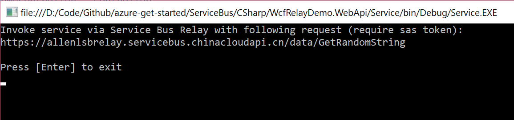
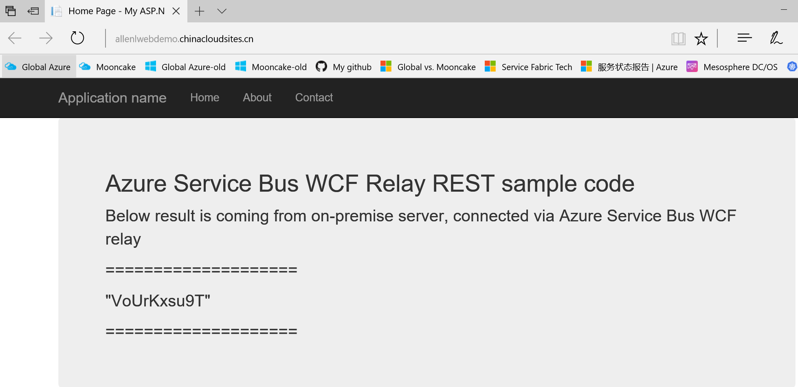

<properties
    pageTitle="Azure 服务总线中继消息 REST 代码示例"
    description="Azure 服务总线中继消息 REST 代码示例"
    service=""
    resource="servicebus"
    authors="Allan Li"
    displayOrder=""
    selfHelpType=""
    supportTopicIds=""
    productPesIds=""
    resourceTags="Sample Code, Service Bus, Relay, Rest API, Token"
    cloudEnvironments="MoonCake" />
<tags
    ms.service="sample-code-aog"
    ms.date=""
    wacn.date="06/05/2017" />

# Azure 服务总线中继消息 REST 代码示例

本示例代码演示如何生成简单的服务总线主机应用程序来公开基于 REST 的接口，使得 on-premises 应用能被外部网络通过 HTTP 进行访问，并要求客户端必须提供正确 Token 以提高安全性。

本示例代码使用 Windows Communication Foundation (WCF) REST 编程模型在服务总线上构建 REST 服务。有关详细信息，请参阅 WCF 文档中的 [WCF REST 编程模型](https://msdn.microsoft.com/zh-cn/library/bb412169.aspx)和[设计和实现服务](https://msdn.microsoft.com/zh-cn/library/ms729746.aspx)。

## 服务端

### On-premises WCF REST 服务

简单的定义一个获取随机字符串的 WCF REST 服务。

    [ServiceContract]
    public interface IDataService
    {
        [OperationContract, WebGet(ResponseFormat = WebMessageFormat.Json)]
        string GetRandomString();
    }
    public class DataService : IDataService
    {
        const string CHARS = "abcdefghijklmnopqrstuvwxyzABCDEFGHIJKLMNOPQRSTUVWXYZ0123456789";
        const int LENGTH = 10;

        public string GetRandomString()
        {
            var random = new Random();
            return new string(Enumerable.Repeat(CHARS, LENGTH).Select(s => s[random.Next(s.Length)]).ToArray());
        }
    }

### 服务总线中继服务

这里将通过配置文件的方式来托管服务，也就是将前面创建的服务用服务总线中继出去。

    // TODO: Update the values
    var serviceBusNamespace = "your service bus namespace";
    var relayServicePath = "data"; // you can define your own value

    // For China Azure
    var dataSvcUriString = $"https://{serviceBusNamespace}.servicebus.chinacloudapi.cn/{relayServicePath}";

    var webServiceHost = new WebServiceHost(typeof(DataService), new Uri(dataSvcUriString));
    webServiceHost.Open();

    Console.WriteLine("Invoke service via Service Bus Relay with following request (require sas token): ");
    Console.WriteLine($"{dataSvcUriString}/GetRandomString");
    Console.WriteLine();
    Console.WriteLine("Press [Enter] to exit");
    Console.ReadLine();

    webServiceHost.Close();

### 配置文件

其中 webHttpRelayBinding 的 security 设置成 relayClientAuthenticationType="RelayAccessToken"，这样就要求客户端提供正确 Token 才能进行访问。

    <system.serviceModel>
    <bindings>
        <webHttpRelayBinding>
        <binding name="default">
            <security relayClientAuthenticationType="RelayAccessToken"/>
        </binding>
        </webHttpRelayBinding>
    </bindings>
    <behaviors>
    <endpointBehaviors>
        <behavior name="sbTokenProvider">
        <transportClientEndpointBehavior>
            <tokenProvider>
            <sharedAccessSignature keyName="service bus key name" key="your key" />
            </tokenProvider>
        </transportClientEndpointBehavior>
        </behavior>
    </endpointBehaviors>
    </behaviors>
    <services>
        <service name="Service.DataService">
        <endpoint name="sbRelayEndpoint"
                    address=""
                    binding="webHttpRelayBinding"
                    bindingConfiguration="default"
                    behaviorConfiguration="sbTokenProvider"
                    contract="Service.IDataService" />
        </service>
    </services>
    <extensions>
        <!—Install Microsoft Service Bus NuGet package will automatically add needed all extensions -->
        ……
    </extensions>
    </system.serviceModel>

## 客户端

客户端使用一个简单 ASP.NET MVC 程序并发布到 Azure Web App。

### 生成服务总线的 Token

    private string createToken(string resourceUri, string keyName, string key)
    {
        TimeSpan sinceEpoch = DateTime.UtcNow - new DateTime(1970, 1, 1);
        var week = 60 * 60 * 24 * 7;
        var expiry = Convert.ToString((int)sinceEpoch.TotalSeconds + week);
        string stringToSign = HttpUtility.UrlEncode(resourceUri) + "\n" + expiry;
        HMACSHA256 hmac = new HMACSHA256(Encoding.UTF8.GetBytes(key));
        var signature = Convert.ToBase64String(hmac.ComputeHash(Encoding.UTF8.GetBytes(stringToSign)));
        var sasToken = String.Format(CultureInfo.InvariantCulture,
            "SharedAccessSignature sr={0}&sig={1}&se={2}&skn={3}",
            HttpUtility.UrlEncode(resourceUri),
            HttpUtility.UrlEncode(signature),
            expiry,
            keyName);
        return sasToken;
    }

## 添加 Token 作为头部

使用 HttpClient 调用通过服务总线中继出来的服务，并添加生成的 Token 作为头部。

    public ActionResult Index()
    {
        // TODO: update the values
        var serviceBusNamespace = "your service bus namespace";
        var relayServicePath = "data"; // you can define your own value
        var keyName = "your service bus key name";
        var key = "your service bus key value";

        var resourceUriString = $"https://{serviceBusNamespace}.servicebus.chinacloudapi.cn/{relayServicePath}";
        var token = createToken(resourceUriString, keyName, key);

        try
        {
            using (var httpClient = new HttpClient())
            {
                httpClient.DefaultRequestHeaders.Add("Authorization", token);

                var requestUri = $"{resourceUriString}/GetRandomString";

                using (var response = httpClient.GetAsync(requestUri).Result)
                {
                    response.EnsureSuccessStatusCode();
                    var result = response.Content.ReadAsStringAsync().Result;
                    ViewBag.Message = result;
                }
            }
        }
        catch (Exception ex)
        {
            ViewBag.Message = $"Exception happened: {ex.Message}";
        }

    return View();
    }

[AZURE.NOTE]直接把服务总线的 Key 提供在客户端是不安全的，可以另外提供一个专门生成 Token 的服务，这样客户端就可以需要的时候就从那个服务获取 Token，而不是直接拿到 Key 自己生成。

## 运行结果

### 服务端启动

### 客户端调用

## 示例代码

[WcfRelayDemo.WebApi](https://github.com/wacn/AOG-CodeSample/tree/master/ServiceBus/CSharp/WcfRelayDemo.WebApi)