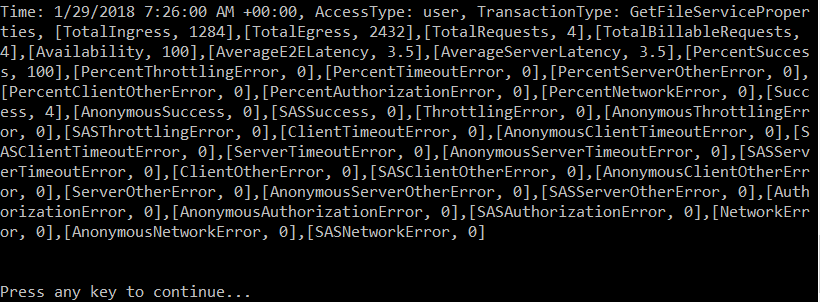

# 如何使用 .NET SDK 获取存储服务度量值

本示例代码演示如何通过 .NET SDK 访问时间粒度为分钟级别、访问时间段为一天的存储度量值信息，相关结果在控制台窗口中输出。
该实例使用了 Azure 存储库，主要使用 `CloudAnalyticsClient` 类，使得我们更加方便的访问存储相关的度量值信息。

## 添加相关依赖

```csharp
using Microsoft.Azure; //Namespace for CloudConfigurationManager
using Microsoft.WindowsAzure; // Namespace for CloudConfigurationManager
using Microsoft.WindowsAzure.Storage; // Namespace for CloudStorageAccount
using Microsoft.WindowsAzure.Storage.Analytics;
using Microsoft.WindowsAzure.Storage.Shared.Protocol;
```

## 配置文件

.NET 的 Azure 存储客户端库支持使用存储连接字符串来配置终结点并用于访问存储服务的凭据，配置存储服务的连接字符串需要打开 `app.config` 文件，添加 `<appSettings>`，如下：

```xml
<configuration>
    <startup> 
        <supportedRuntime version="v4.0" sku=".NETFramework,Version=v4.5.2" />
    </startup>
      <appSettings>
        <add key="StorageConnectionString" value="DefaultEndpointsProtocol=https;AccountName=account-name;AccountKey=account-key;EndpointSuffix=core.chinacloudapi.cn" />
      </appSettings>
</configuration>
```

## 代码实现

通过 `CloudStorageAccount` 创建 `CloudAnalyticsClient` ：

```csharp
CloudStorageAccount storageAccount = CloudStorageAccount.Parse(CloudConfigurationManager.GetSetting("StorageConnectionString"));
var client = storageAccount.CreateCloudAnalyticsClient();
```

使用 `CloudAnalyticsClient` 来获取存储中的度量值数据：

```csharp
private static void PrintMinuteMetrics(CloudAnalyticsClient analyticsClient, DateTimeOffset startDateTime, DateTimeOffset endDateTime)
{
    // Convert the dates to the format used in the PartitionKey  
    var start = startDateTime.ToUniversalTime().ToString("yyyyMMdd'T'HHmm");
    var end = endDateTime.ToUniversalTime().ToString("yyyyMMdd'T'HHmm");
    var services = Enum.GetValues(typeof(StorageService));
    foreach (StorageService service in services)
    {
        Console.WriteLine("Minute Metrics for Service {0} from {1} to {2} UTC", service, start, end);
        var metricsQuery = analyticsClient.CreateMinuteMetricsQuery(service, StorageLocation.Primary);
        var t = analyticsClient.GetMinuteMetricsTable(service);
        var opContext = new OperationContext();
        var query =
                from entity in metricsQuery
                where entity.PartitionKey.CompareTo(start) >= 0 && entity.PartitionKey.CompareTo(end) <= 0
                select entity;
        var results = query.ToList().Where(m => m.RowKey.StartsWith("user"));
        var resultString = results.Aggregate(new StringBuilder(), (builder, metrics) => builder.AppendLine(MetricsString(metrics, opContext))).ToString();
        Console.WriteLine(resultString);
    }
    Console.Write("\nPress any key to continue... ");
    Console.ReadLine();
}

private static string MetricsString(MetricsEntity entity, OperationContext opContext)
{
    var entityProperties = entity.WriteEntity(opContext);
    var entityString =
            string.Format("Time: {0}, ", entity.Time) +
            string.Format("AccessType: {0}, ", entity.AccessType) +
            string.Format("TransactionType: {0}, ", entity.TransactionType) +
            string.Join(",", entityProperties.Select(e => new KeyValuePair<string, string>(e.Key.ToString(), e.Value.PropertyAsObject.ToString())));
    return entityString;
}
```

## 运行结果

