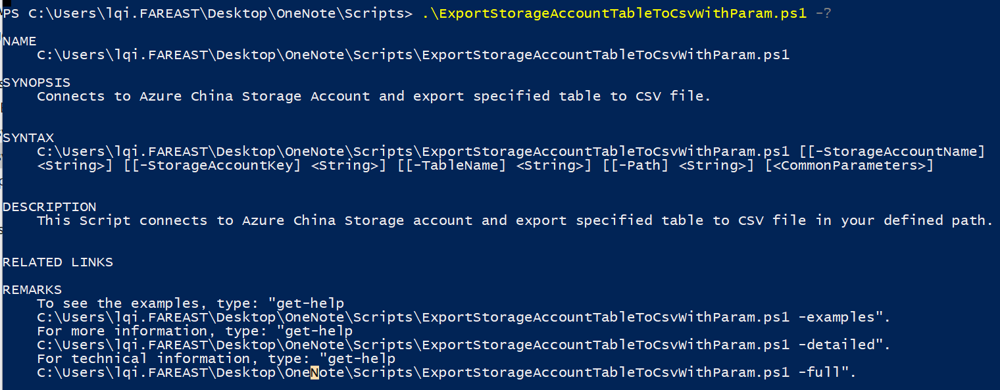

# 使用 PowerShell 将存储服务表数据导出到 csv 文件

Azure Powershell 提供对 Azure 存储账号中的块、表、文件、队列的各种操作，详细的命令列表请参考：[Azure 存储的 PowerShell 命令](https://docs.microsoft.com/en-us/powershell/module/azure.storage/?view=azurermps-4.4.1)。 其中对于表存储的操作比较有限，只能查询，创建，删除表文件和管理访问策略等。

用户想要对其中的数据进行操作，可以参考[Azure 存储服务表数据操作](https://blogs.technet.microsoft.com/paulomarques/2017/01/17/working-with-azure-storage-tables-from-powershell/) 中的方法。该博客中能涵盖所有基本的表数据操作。但还有一点遗憾，不能将查询出来的数据保存下来。

本篇介绍如何将 Azure 中国区环境中的表数据全部下载到本地 csv 文件中。如果需要用到其他环境，请修改脚本中对应的终结点。

```PowerShell
$CloudStorageAccount = New-Object Microsoft.WindowsAzure.Storage.CloudStorageAccount($Creds, "core.chinacloudapi.cn",$true) 
```

## 下载链接

[ExportStorageAccountTableToCsvWithParam.ps1](https://github.com/wacn/AOG-CodeSample/blob/master/Storage/Script/ExportStorageAccountTableToCsvWithParam/ExportStorageAccountTableToCsvWithParam.ps1)


## 脚本用法

可通过脚本名加上 `-?` 查询用法：



## 基本格式

.\ExportStorageAccountTableToCsvWithParam.ps1 -StorageAccountName "storagename" -StorageAccountKey "key" -TableName "TableName" -Path "C:\Test\" 

## 示例结果


