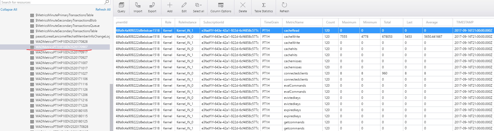
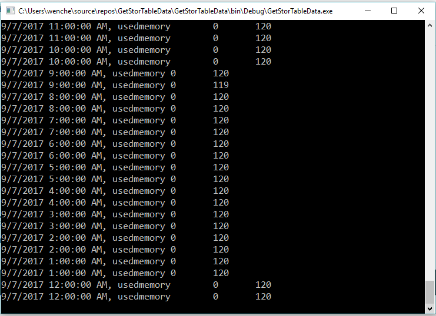

# 如何使用 .NET SDK 读取存储服务 Table 中的数据获取与 Redis 相关的度量值

用户可以通过 [Azure 门户](https://portal.azure.cn)或者 [Azure Monitor REST API](https://docs.microsoft.com/en-us/rest/api/monitor/) 方便的获取到不同服务的度量值信息，由于 Azure 中国区部分产品的相关功能还在完善过程中，可能无法通过以上两种方式获取到相关的数据，比如 Redis。<br>
但是部分服务的度量值数据会保留在配置在 Azure 门户上相应的存储服务的 Table 中，我们可以通过读取 Table 中的数据来获取相关的度量值信息。本示例代码演示如何通过获取 Table 中的数据来获取 Redis 服务的度量值信息，相关数据最终在控制台窗口输出，用户也可以根据自身需求将数据写入本地 CSV 文件。另外，读取其他服务存储在 Table 中的数据的方法也类似。

保存在存储服务 Table 中跟 Redis 服务相关的度量值数据：

可以使用 [Azure Storage Explorer](https://azure.microsoft.com/en-us/features/storage-explorer/) 工具来查看保存在存储 Table 中跟 Redis 服务相关的度量值数据。通过观察发现 Table 中用来存储跟 Redis 服务相关的数据为每 10 天生成一张表，本示例代码中演示获取其中一张名 `WADMetricsPT1HP10DV2S20170907` 的表中的部分度量值数据，例如：`TIMESTAMP`、`MetricName`、`Count`及`Average`，用户也可以根据自己的需求添加更改需要获取的度量值数据。



## 添加相关依赖

```csharp
using Microsoft.Azure; // Namespace for CloudConfigurationManager
using Microsoft.WindowsAzure.Storage; // Namespace for StorageAccounts
using Microsoft.WindowsAzure.Storage.Table; // Namespace for Table storage types
```

## 配置文件

.NET 的 Azure 存储客户端库支持使用存储连接字符串来配置终结点并用于访问存储服务的凭据，配置存储服务的连接字符串需要打开 app.config 文件，添加 `<appSettings>`，如下：

```xml
<configuration>
    <startup> 
        <supportedRuntime version="v4.0" sku=".NETFramework,Version=v4.5.2" />
    </startup>
      <appSettings>
        <add key="StorageConnectionString" value="DefaultEndpointsProtocol=https;AccountName=account-name;AccountKey=account-key;EndpointSuffix=core.chinacloudapi.cn" />
      </appSettings>
</configuration>
```

## 代码实现

通过使用派生自`TableEntity`的`CustomerEntity`类创建自定义实体类：

> [!NOTE]
> 本示例代码中演示获取实体的属性数据为：`TIMESTAMP`、`MetricName`、`Count` 及 `Average`，用户在自己实际应用需求中添加自己需要的属性数据时需要考虑不同数据的类型是不一样的。
> 另外在本示例中使用实体的分区键和行键共同唯一地标识表中的实体。

```csharp
public class CustomerEntity : TableEntity
{
    public CustomerEntity(string PartitionKey, string RowKey)
    {
        this.PartitionKey = PartitionKey;
        this.RowKey = RowKey;
    }
    public CustomerEntity() { }
    public DateTime TIMESTAMP { get; set; }
    public string MetricName { get; set; }
    public int Average { get; set; }
    public int Count { get; set; }
}
```
创建 `CloudTableClient`：
```csharp
CloudStorageAccount storageAccount = CloudStorageAccount.Parse(CloudConfigurationManager.GetSetting("StorageConnectionString"));
CloudTableClient tableClient = storageAccount.CreateCloudTableClient();
//set you table name, my example is WADMetricsPT1HP10DV2S20170907
CloudTable table = tableClient.GetTableReference("WADMetricsPT1HP10DV2S20170907");
```

使用 `TableQuery` 对象检索分区中所有的实体从而获取需要的属性数据：
通过 `TableQuery` 对象生成查询操作：`PartitionKey = “your partitionkey”`，并将查询结果输出。

```csharp
TableQuery<CustomerEntity> query = new TableQuery<CustomerEntity>().Where(TableQuery.GenerateFilterCondition("PartitionKey ", QueryComparisons.Equal, "your partitionkey"));
// Print the fields for each customer.
foreach (CustomerEntity entity in table.ExecuteQuery(query))
{
    Console.WriteLine("{0}, {1}\t{2}\t{3}", entity.TIMESTAMP,  entity.MetricName, entity.Average, entity.Count);
}
```

运行结果：

