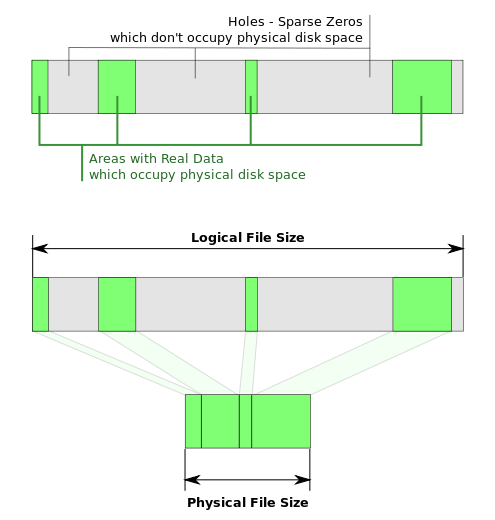

# 使用 PowerShell 脚本查询 Azure 虚拟机标准磁盘用量

众所周知，在使用非托管磁盘或非高级存储虚拟机时，Azure 会按实际用量收费。
这里我们引入两个概念：

1. 页面 Blob 的大小 (Size)，即页面 Blob 文件的实际占用空间。
2. 页面 Blob 的长度 (Length)，指的是客户在生成一个 VHD 文件时指定的磁盘大小。

页面 Blob，即虚拟机磁盘的 VHD 文件实质上是稀疏文件 (Sparse File)，只有非空的数据块会被写入到磁盘，其他空闲数据块会被填充为 0。Azure 存储对于页面 Blob，只会按其大小，即实际占用空间收费。


<center>（图片转自 Wikipedia）</center>

在了解了页面 Blob 文件计费原理之后，第二个问题便随之而来 – 用户要如何查看一个页面 Blob 文件的真实用量呢？

针对标准存储的 Blob 文件，Azure 在 `AzureStorageBlob` 类中提供了 `GetPageRanges` 方法来查询页面文件的实际用量。相关代码可以在 [在容器或帐户中获取 Windows Azure Blobs(w/快照)的实际用量](https://gallery.technet.microsoft.com/scriptcenter/Get-Billable-Size-of-32175802) 中的脚本里找到。另外，[wazvhdsize v1.0](https://github.com/sandrinodimattia/WindowsAzure-VhdSize/releases) 提供了一个开源工具 wazvhdsize，使用了同样的方法来计算页面文件的实际用量。

利用这个开源工具，我们就可以编写 PowerShell 脚本来查询每个订阅下挂载到虚拟机的所有普通磁盘的实际用量。

## PowerShell 脚本

脚本 `Get-AsmVMDiskSize.ps1` 和 `Get-ArmVMDiskSize.ps1` 分别查询 ASM 和 ARM 部署模式下所有虚拟机的普通磁盘用量，将结果输出到位于 `%UserProfile%\Downloads\wazvhdsize-v1.0` 文件夹下的 .csv 文件中。

用户需要首先安装最新版本的 [PowerShell AzureRM 模块](https://docs.microsoft.com/zh-cn/powershell/azure/install-azurerm-ps?view=azurermps-4.3.1) ，然后下载 [wazvhdsize 工具](https://github.com/sandrinodimattia/WindowsAzure-VhdSize/releases)，解压到 `%UserProfile%\Downloads` 文件夹下，最后运行脚本，提供订阅号并登陆账号，即可成功抓取普通磁盘的实际用量。

脚本下载链接：

[Get-ArmVMDiskSize.ps1](https://github.com/wacn/AOG-CodeSample/blob/master/PowerShell/Get-ArmVMDiskSize.ps1)

[Get-AsmVMDiskSize.ps1](https://github.com/wacn/AOG-CodeSample/blob/master/PowerShell/Get-AsmVMDiskSize.ps1)

示例运行结果如下：

```PowerShell
PS C:\> .\Get-ArmVMDiskSize.ps1 xxxxxxx-xxxx-xxxx-xxxxxxxxxx

ARM part starts!
The VM chesh2012wMD2 is using Managed Disks.
The VM chesh2012wMD2 contains 2 data disk(s).
The VM chesh2016c contains 1 data disk(s).
The VM cheshkv2012 is using Managed Disks.
The VM cheshkv2012 contains 1 data disk(s).
The VM cheshkvcent73 is using Managed Disks.
The VM cheshkvcent73 contains 1 data disk(s).
The VM cheshsles12 is using Managed Disks.
The VM cheshsles12 contains no data disk.
ARM part finished! 
```

## 相关限制

1. 由于需要使用 `Managed Disk` 相关命令，脚本 `Get-ArmVMDiskSize.ps1` 只支持 `PowerShell AzureRM 4.0.0` 以上版本，建议以 4.2.1 运行。
2. 托管磁盘和非托管高级磁盘的收费方式是以磁盘大小收费，用户无需关心这两类磁盘的实际用量。脚本对这两类磁盘只会显示页面文件长度。具体收费请参考:[存储价格详情](https://www.azure.cn/pricing/details/storage/) 中的磁盘存储。
3. 由于 `AzureStorageBlob` 类的 `GetPageRanges` 方法在执行时需要抓取页面 Blob 的实际大小，在有正在进行的写操作时抓取磁盘大小会失败，脚本在处理这类情况时会提醒用户磁盘已被占用。建议用户在关机状态或者低工作负荷时对磁盘进行抓取，以免失败。
4. 脚本只会抓取附加在虚拟机上的磁盘，并不会抓取未附加的磁盘，所以并不能用来评估订阅中所有存储账号的所有页面文件大小。如果用户需要对存储账号的计费空间进行评估，请使用[在容器或帐户中获取 Windows Azure Blobs(w/快照)的实际用量](https://gallery.technet.microsoft.com/scriptcenter/Get-Billable-Size-of-32175802)中的脚本。