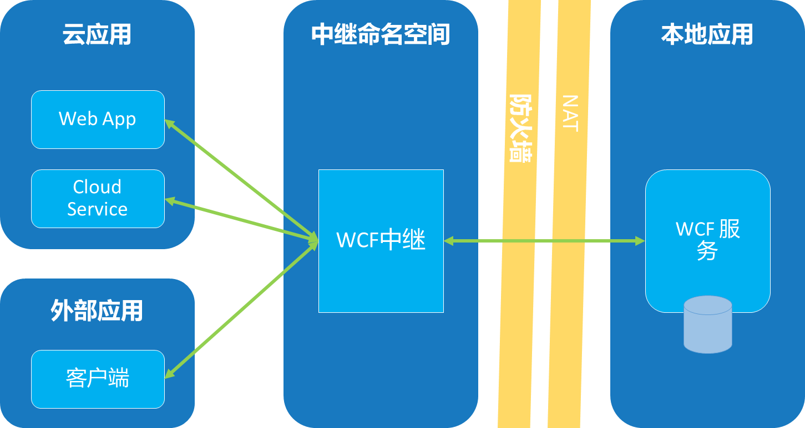
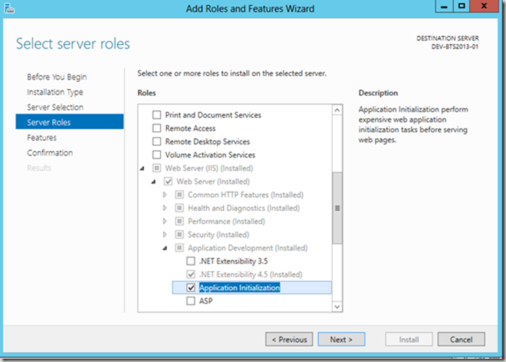
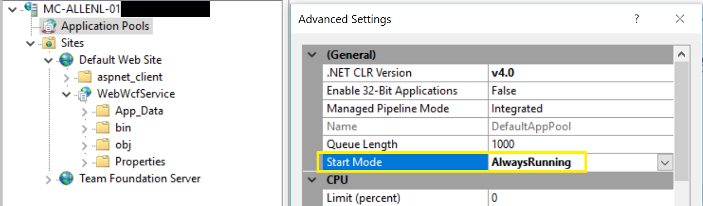
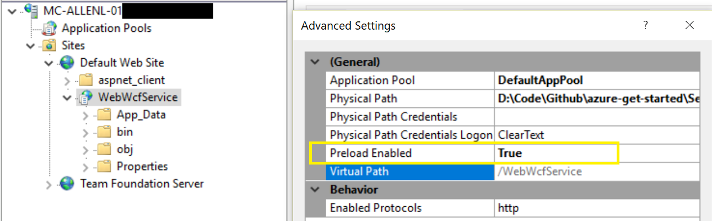

# 构建混合应用方式之 - WCF 中继

使用 VPN 或者 ER 服务建立云服务和本地服务网络通道来搭建混合应用的方式，需要网络设备的配合和比较复杂的网络配置，所以不是特别的方便。如果是不希望对本地网络环境做修改，而只是服务层面的混合，那么可以使用一个更方便的服务 – Azure 中继服务。基于 Azure 中继服务访问本地服务，客户端不需要与本地服务建立直接连接，也不需要了解服务所在的位置，并且本地服务无需在防火墙上打开任何入站端口。

Azure 中继服务支持传统的单向消息传送、请求/响应消息传送和对等消息传送。它还支持 Internet 范围的事件分发，以实现发布-订阅方案和双向套接字通信，从而提高点到点通信效率。在中继消息传送模式中，本地服务会通过出站端口连接至中继服务，并为绑定至特定会合地址的通信创建一个双向套接字。然后，客户端可以通过将消息发送到抵达会合地址的中继服务来与本地服务通信。

目前 Azure 提供两种中继服务，WCF（Windows Communication Foundation）中继和混合连接。其中 WCF 中继是传统的服务，适合于基于 WCF 的本地服务。（关于 WCF 请参阅 [WCF 官方文档](https://msdn.microsoft.com/zh-cn/library/dd456779(v=vs.110).aspx)）。而混合连接使用开放标准 Web 套接字，可实现多平台方案，适用性更广。

本文介绍如何使用 WCF 中继来构建混合应用。

## WCF 中继

WCF 中继允许你向公有云公开位于企业网络内的 WCF 服务，而无需打开防火墙连接，也无需对企业网络基础结构进行彻底的更改。而且它还允许你安全的控制谁可以访问这些服务。另外对你原来的 WCF 项目所需要做的改动也是很小的。



## 基于 TCP 的 SOAP 访问

适用于支持 SOAP 协议的客户端。

### 创建 WCF 中继服务

可以登陆 [Azure 中国门户网站](https://portal.azure.cn/)，按照界面提示一步步创建。也可以通过 PowerShell 命令，如下，其中创建 WCF 中继时，WcfRelayType 设置为 NetTcp。RequiresTransportSecurity 和 RequiresClientAuthorization 默认都是 true，这里显示指定只是处于演示作用。

```PowerShell
# login to Azure China with your account
Login-AzureRmAccount -Environment AzureChinaCloud

$rgName = "relaydemorg"
$namespaceName = "relaydemons"
$location = "China East"
$relayType = "NetTcp"
$relayName = "tcpdata"

New-AzureRmResourceGroup -Name $rgName -Location $location
New-AzureRmRelayNamespace -ResourceGroupName $rgName -Name $namespaceName -Location $location
New-AzureRmWcfRelay -ResourceGroupName $rgName -Namespace $namespaceName -Name $relayName -WcfRelayType $relayType -RequiresTransportSecurity $true -RequiresClientAuthorization $true
```

创建出来的 WCF 中继服务地址是`sb://relaydemons.servicebus.chinacloudapi.cn/tcpdata`

### 通过 WCF 中继公开本地 WCF 服务

给本地服务安装服务总线 NuGet 包，默认安装最新版本。

`PM> Install-Package WindowsAzure.ServiceBus`

安装完成后，在 config 文件里面会自动添加一些扩展的行为和绑定声明，如下所示：

```
<behaviorExtensions>
<add name="transportClientEndpointBehavior"
   type="Microsoft.ServiceBus.Configuration.TransportClientEndpointBehaviorElement, Microsoft.ServiceBus, Culture=neutral, PublicKeyToken=31bf3856ad364e35"/>
</behaviorExtensions>
<bindingExtensions>
    <add name="netTcpRelayBinding"
       type="Microsoft.ServiceBus.Configuration.NetTcpRelayBindingCollectionElement, Microsoft.ServiceBus, Culture=neutral, PublicKeyToken=31bf3856ad364e35"/>
</bindingExtensions>
```
### 文件配置方式

修改 config 文件，添加如下 endpointBehavior，其中 key 需要有监听权限。

```
<endpointBehaviors>
    <behavior name="sbTokenProvider">
        <transportClientEndpointBehavior>
            <tokenProvider>
                <sharedAccessSignature keyName="<listenKey>" key="<keyValue>" />
            </tokenProvider>
        </transportClientEndpointBehavior>
    </behavior>
</endpointBehaviors>
```

前面创建的 WCF 中继服务类型时 NetTcp，所以这里添加绑定为 netTcpRelayBinding 的终结点，并指向前面创建的 WCF 中继服务地址。

```
<endpoint contract="<yourcontract>"
          binding="netTcpRelayBinding"
          address="sb://relaydemons.servicebus.chinacloudapi.cn/tcpdata"
          behaviorConfiguration="sbTokenProvider"/>
```

### 代码方式

> [!NOTE]
> 这里中继服务地址不能用 `ServiceBusEnvironment.CreateServiceUri("sb", "namespace", "tcpdata"))` 来生成，因为它生成的地址不是中国 Azure 的。

```
string relaySvcAddress = "sb://relaydemons.servicebus.chinacloudapi.cn/tcpdata";
ServiceHost sh = new ServiceHost(typeof(<yourservice>));
sh.AddServiceEndpoint(typeof(<yourservice>), new NetTcpRelayBinding(), relaySvcAddress)
    .EndpointBehaviors.Add(new TransportClientEndpointBehavior
    {
        TokenProvider = TokenProvider.CreateSharedAccessSignatureTokenProvider("listenKey", "keyValue")
    });
```

因为 WCF 支持对同一个服务使用多个网络终结点，所以可以在添加中继服务终结点以便外部访问的同时保留现有的内部终结点。

### 创建客户端进行 SOAP 访问

客户端也需要安装服务总线 NuGet 包，相应的中继服务相关扩展也会自动添加在 Config 文件中。

文件配置方式，跟服务端一样，也需要添加同样的 endpointBehavior，只是 key 换成需要发送权限。另外添加跟服务端完全一致的终结点配置。

```
<endpointBehaviors>
    <behavior name="sbTokenProvider">
        <transportClientEndpointBehavior>
            <tokenProvider>
                <sharedAccessSignature keyName="<sendKey>" key="<keyValue>" />
            </tokenProvider>
        </transportClientEndpointBehavior>
    </behavior>
</endpointBehaviors>
```

代码方式也是跟服务端类似，添加相应的 NetTcpBinding，终结点地址和 TransportClientEndpointBehavior。

```
string relaySvcAddress = "sb://relaydemons.servicebus.chinacloudapi.cn/tcpdata";
var cf = new ChannelFactory<yourcontract>(
         new NetTcpRelayBinding(),
         new EndpointAddress(relaySvcAddress));

cf.Endpoint.Behaviors.Add(new TransportClientEndpointBehavior
{ 
         TokenProvider = TokenProvider.CreateSharedAccessSignatureTokenProvider("<sendKey>","<keyValue>") 
});
```

## 基于 HTTP 的 REST 访问

WCF 服务本身支持服务以 REST 的形式公开出来，那么同样的，客户端也希望能用普通的 HTTP 来访问。对于这种形式，WCF 中继服务也是支持的。

### 创建 WCF 中继服务
跟前面 TCP 方式的步骤一样，唯一的区别是 WcfRelayType 设置为 Http，服务名称也做相应的命名，比如 httpdata。这样创建出来的 WCF 中继服务地址是`https://relaydemons.servicebus.chinacloudapi.cn/httpdata`

### 通过 WCF 中继公开本地 WCF 服务

与 TCP 方式对比，有两个不一样的地方:

1. Host 使用 WebServiceHost
2. 绑定使用 WebHttpRelayBinding

通过 HTTP 方式公开，默认情况下是可以允许任何客户端访问的，这样不安全，所以需要在 WebHttpRelayBinding 里配置 RelayClientAuthenticationType 为 RelayAccessToken，这样客户端就必须提供正确令牌才能访问。

### 文件配置方式

```
<system.serviceModel>
  <bindings>
    <webHttpRelayBinding>
      <binding name="default">
        <security relayClientAuthenticationType="RelayAccessToken"/>
      </binding>
    </webHttpRelayBinding>
  </bindings>
    <behaviors>
      <endpointBehaviors>
        <behavior name="sbTokenProvider">
          <transportClientEndpointBehavior>
            <tokenProvider>
              <sharedAccessSignature keyName="listenKey" key="keyValue" />
            </tokenProvider>
          </transportClientEndpointBehavior>
        </behavior>
      </endpointBehaviors>
    </behaviors>
    <services>
        <service name="yourservice">
          <endpoint name="sbRelayEndpoint" 
                    address="https://relaydemons.servicebus.chinacloudapi.cn/httpdata" 
                    binding="webHttpRelayBinding" 
                    bindingConfiguration="default"
                    behaviorConfiguration="sbTokenProvider"
                    contract="yourcontract" />
        </service>
    </services>
    <extensions>
        <!—Install Microsoft Service Bus NuGet package will automatically add needed all extensions -->
        ……
</extensions>
</system.serviceModel>
```

### 代码方式

```
string relaySvcAddress = "https://relaydemons.servicebus.chinacloudapi.cn/httpdata";
WebServiceHost wsh = new WebServiceHost(typeof(yourservice));  
wsh.AddServiceEndpoint(
    typeof(yourservice), 
    new WebHttpRelayBinding(
        EndToEndWebHttpSecurityMode.Transport, 
        RelayClientAuthenticationType.RelayAccessToken), 
    relaySvcAddress)
    .EndpointBehaviors.Add(new TransportClientEndpointBehavior
    {
        TokenProvider = TokenProvider.CreateSharedAccessSignatureTokenProvider("listeningKey", "keyValue")
    });
```

### 客户端

因为前面服务端配置为安全访问方式，所以客户端需要提供正确令牌。那么如何生成令牌呢？有两种方式，一是利用服务总线包里的内置方法，二是自己生成，前者增加了对服务总线包的依赖性，但简单方便，后者需要对服务总线令牌的要求有一定的了解。以下提供两种方式的代码示例。

#### 利用服务总线包的内置方法

```
var token = TokenProvider.CreateSharedAccessSignatureTokenProvider("keyname", "key").GetWebTokenAsync(resourceUri, string.Empty, true, TimeSpan.FromDays(7)).Result;
```

#### 自己生成

```
private string createToken(string resourceUri, string keyName, string key)
{
    TimeSpan sinceEpoch = DateTime.UtcNow - new DateTime(1970, 1, 1);
    var week = 60 * 60 * 24 * 7;
    var expiry = Convert.ToString((int)sinceEpoch.TotalSeconds + week);
    string stringToSign = HttpUtility.UrlEncode(resourceUri) + "\n" + expiry;
    HMACSHA256 hmac = new HMACSHA256(Encoding.UTF8.GetBytes(key));
    var signature = Convert.ToBase64String(hmac.ComputeHash(Encoding.UTF8.GetBytes(stringToSign)));
    var sasToken = String.Format(CultureInfo.InvariantCulture, 
        "SharedAccessSignature sr={0}&sig={1}&se={2}&skn={3}", 
        HttpUtility.UrlEncode(resourceUri), 
        HttpUtility.UrlEncode(signature), 
        expiry, 
        keyName);
return sasToken;
}
```

示例代码中的 resourceUri 就是前面创建的中继服务地址：`https://relaydemons.servicebus.chinacloudapi.cn/httpdata`。

有了令牌后，就可以使用 Http 客户端来调用了，比如使用 HttpClient。

```
string relaySvcAddress = "https://relaydemons.servicebus.chinacloudapi.cn/httpdata";
using (var httpClient = new HttpClient())
{
     httpClient.DefaultRequestHeaders.Add("Authorization", token);
     var requestUri = $"{relaySvcAddress}/yourapimethod";
     using (var response = httpClient.GetAsync(requestUri).Result)
     {
          // handle response
     }
}
```
> [!TIP]
> 直接把服务总线的 Key 提供在客户端是不安全的，可以另外提供一个专门生成 token 的服务，这样客户端就可以需要的时候就从那个服务获取 token，而不是直接拿到 Key 自己生成。

## 使用 IIS 托管服务

当本地服务是用 IIS 的方式来托管时，有一个特别需要注意的地方，IIS 托管的服务只有在接受到请求后才会启动，所以如果一开始直接调用通过中继公开出来的服务是会失败的，因为本地托管在 IIS 里的服务还没启动，也就还没与中继服务建立链接，因此需要一些额外的配置来预热。那么该如何配置来预热呢？

可以按照以下步骤通过 IIS 的 Application Initialization 功能来做到：

1. 确保 Application Initialization 功能已经安装。（角色 => Web Server (IIS) => Web Server => Application Development）

    

2. 设置 Web 应用对应的 ApplicationPool 启动模式为 AlwaysRunning :

    

3. 设置 Web 应用 Preload Enabled 为 True :

    

4. 添加如下初始页配置到 Web 应用的 web.config 中，一般初始页设置为访问 WCF SVC 页面即可。

    ```
    <system.webServer>
    <applicationInitialization>
        <add initializationPage="/WebDataService.svc"/>
    </applicationInitialization>
    </system.webServer>

    ```

这样的话，就相当于 Web 应用部署好之后会马上访问配置好的初始页来进行预热，从而与 Service Bus Relay 建立好链接，客户端就可以访问了。如果 IIS 重启也会执行预热操作以保证服务的运行。

## 完整示例代码

[WcfRelayDemo.WebApi](https://github.com/wacn/AOG-CodeSample/tree/master/ServiceBus/CSharp/WcfRelayDemo.WebApi)