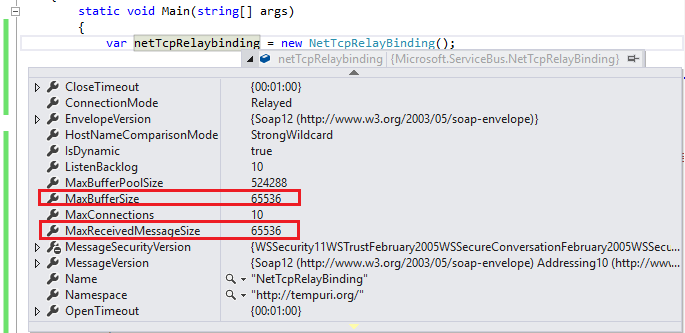
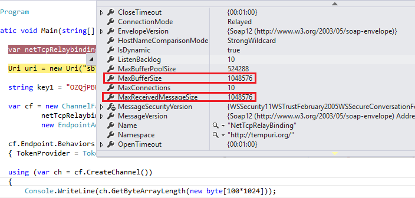

# 使用 netTCPRelay 绑定的 WCF 中继发送大于 64k 消息时报通信异常

## 问题描述

使用 netTCPRelay 绑定的 WCF 中继发送消息时，如果消息小于 64k，程序正常运行；如果消息大于 64k, 就会报通信异常。

## 问题分析

使用 netTCPRelay Windows Communication Foundation (WCF) 绑定打开的中继不将消息视为单条消息，而视为流经系统的数据流。使用此绑定时，只有发送方和侦听器可以识别发送和接收的单条分帧消息。对于使用 netTCPRelay 绑定的中继，所有数据都将被视为用于计算可计费消息的数据流。更多详细信息，请参考[这篇文章](https://docs.azure.cn/zh-cn/service-bus-relay/relay-faq)。

但是在默认情况下，使用 netTCPRelayBinding 时，消息的最大缓冲和接收尺寸为 64k(65536), 所以如果发送的消息大于 64k，就会报通信异常。

## 解决方案

NetTcpRelayBinding 类定义了 [MaxBufferSize](https://docs.microsoft.com/dotnet/api/microsoft.servicebus.nettcprelaybindingbase.maxbuffersize?view=azure-dotnet#Microsoft_ServiceBus_NetTcpRelayBindingBase_MaxBufferSize) 和 [MaxReceivedMessageSize](https://docs.microsoft.com/dotnet/api/microsoft.servicebus.nettcprelaybindingbase.maxreceivedmessagesize?view=azure-dotnet) 属性，通过设置他们的值可以修改上限值。

### 示例如下：

默认情况下， NetTcpRelayBinding 和 MaxBufferSize 的值为： 65536（64k）。



使用下面的代码设置属性值：

#### 服务主机：

```
ServiceHost sh = new ServiceHost(typeof(ProblemSolver));
// 设置 MaxBufferSize 和 MaxReceivedMessageSize 的值。
var netTcpbinding = new NetTcpBinding() { MaxBufferSize = 1024 * 1024, MaxReceivedMessageSize = 1024 * 1024 };
var netTcpRelayBinding = new NetTcpRelayBinding() { MaxBufferSize = 1024 * 1024, MaxReceivedMessageSize = 1024 * 1024 };

sh.AddServiceEndpoint(
    typeof(IProblemSolver), netTcpbinding,
    "net.tcp://localhost:9358/solver");

// 将字符串 namespace 替换为命名空间名称
Uri uri = new Uri("sb://<namespace>.servicebus.chinacloudapi.cn/solver");

// 将 yourKey 替换为 WCF 中继的 SAS 密钥
string key1 = "yourKey";

sh.AddServiceEndpoint(
    typeof(IProblemSolver), netTcpRelayBinding,
    uri)
    .Behaviors.Add(new TransportClientEndpointBehavior
    {
        TokenProvider = TokenProvider.CreateSharedAccessSignatureTokenProvider("RootManageSharedAccessKey", key1)
    });

sh.Open();

Console.WriteLine("Press ENTER to close");
Console.ReadLine();

sh.Close();
```

#### 客户端：

```
// 设置 MaxBufferSize 和 MaxReceivedMessageSize 的值。
var netTcpRelaybinding = new NetTcpRelayBinding() { MaxBufferSize=1024*1024, MaxReceivedMessageSize=1024*1024 };

// 将字符串 namespace 替换为命名空间名称
Uri uri = new Uri("sb://<namespace>.servicebus.chinacloudapi.cn/solver");

////将 yourKey 替换为 WCF 中继的 SAS 密钥
string key1 = "yourKey";

var cf = new ChannelFactory<IProblemSolverChannel>(
        netTcpRelaybinding,
        new EndpointAddress(uri));

cf.Endpoint.Behaviors.Add(new TransportClientEndpointBehavior
{ TokenProvider = TokenProvider.CreateSharedAccessSignatureTokenProvider("RootManageSharedAccessKey", key1) });

using (var ch = cf.CreateChannel())
{
    Console.WriteLine(ch.GetByteArrayLength(new byte[100*1024]));
}
```

### 截图如下：



### 结果如下：


## 参考文档

- [WCF 中继](https://docs.azure.cn/service-bus-relay/relay-wcf-dotnet-get-started)
- [中继常见问题](https://docs.azure.cn/service-bus-relay/relay-faq)
- [NetTcpRelayBinding 类](https://docs.microsoft.com/dotnet/api/microsoft.servicebus.nettcprelaybindingbase?view=azure-dotnet)