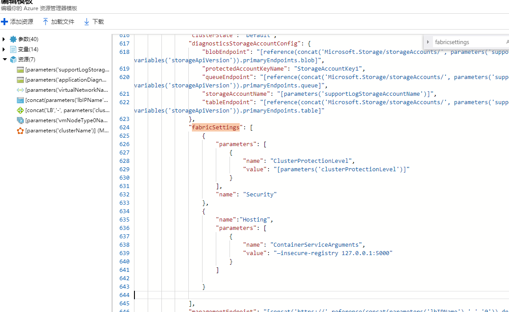

# 如何在 Service Fabric 配置 Docker Daemon 启动参数

通过模板部署 Service Fabric ，在模板中搜索 **fabric Settings**，在 **fabric Settings** 里添加如下代码（示例是与不安全的注册表通信）：

```json
,{
    "name":"Hosting",
    "parameters": [
        {
            "name": "ContainerServiceArguments",
            "value": "—insecure-registry 127.0.0.1:5000"
        }
    ]
}
```

添加代码处如图所示：



然后保存，重新部署。

## 其他资源

- [ServiceFabric 启动daemon程序](https://docs.azure.cn/zh-cn/service-fabric/service-fabric-get-started-containers-linux#start-the-docker-daemon-with-custom-arguments)
- [Docker参数](https://docs.docker.com/engine/reference/commandline/dockerd/)