# 手动收缩 Service Fabric 的虚拟机规模集

Azure Service Fabric 集群的底层操作系统是基于 Azure VMSS。集群中根据配置和定义不同，可以包含多个 VMSS，每个 VMSS 又包括多个虚拟机实例。VMSS 的一个最大的特点就是能实现快速的实例数增加或减少，在保证 Service Fabric 集群服务负载的同时也避免资源浪费。

Azure Service Fabric 支持自动节点伸缩。但如果没有配置自动伸缩，您也可以手动调节其中每个 VMSS 中的实例数。相比于增加 VMSS 中的实例数并让 Service Fabric 识别到，减少 VMSS 的实例数需要一些额外的步骤以确保服务连续性。这篇文章主要描述如何实现 Service Fabric 中的某个 VMSS 的实例数的收缩（Scale Down）。

在开始前，您需要了解的信息有：

- **资源组**：存放 VMSS 和 Service Fabric 集群，以及其相关资源的容器。您需要知道资源组名称以找到对应的 VMSS。
- **VMSS 名称**：Service Fabric 可能使用多个 VMSS。您需要知道进行收缩的实例位于哪个 VMSS 中，避免错误操作。
- **Service Fabric 集群**：您需要知道被操作的 Service Fabric 的名称以便找到对应的终结点，查看集群配置信息，连接到 Service Fabric explorer。 

您需要准备的工具有：

- **Azure PowerShell**： 执行 VMSS 相关管理命令。
- **Service Fabric SDK**： 执行集群相关命令。

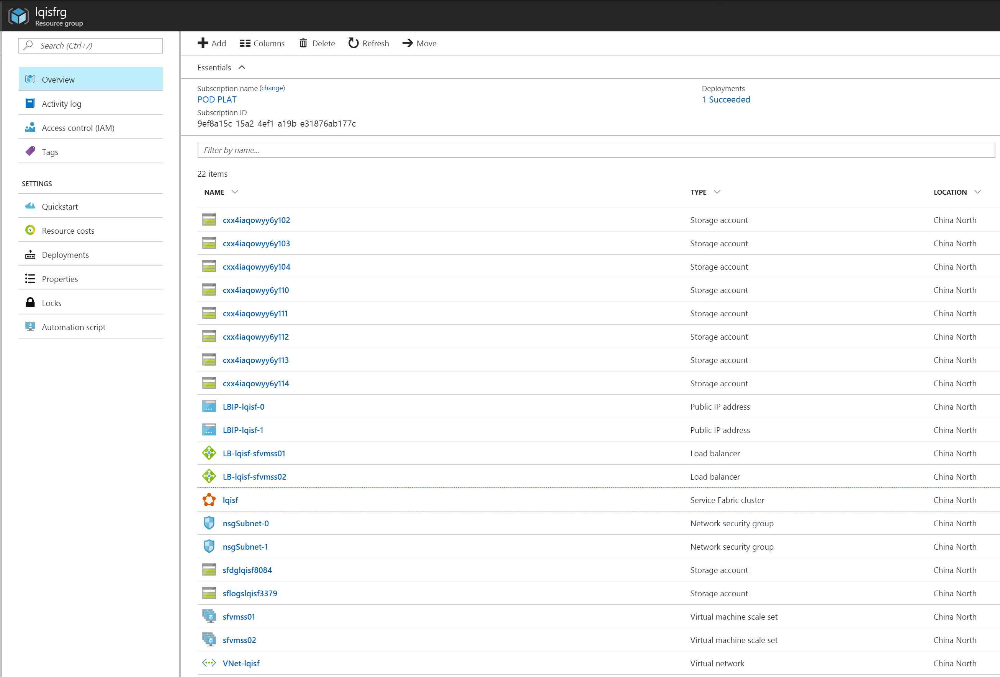

1. 首先通过连接到 Service Fabric 集群

    Service Fabric 的终结点可以在 [Azure 门户](https://portal.azure.cn)中 **Service Fabric 集群概览**界面找到。如果您配置了安全连接，您可能还需要提供证书等信息以连接到集群。

    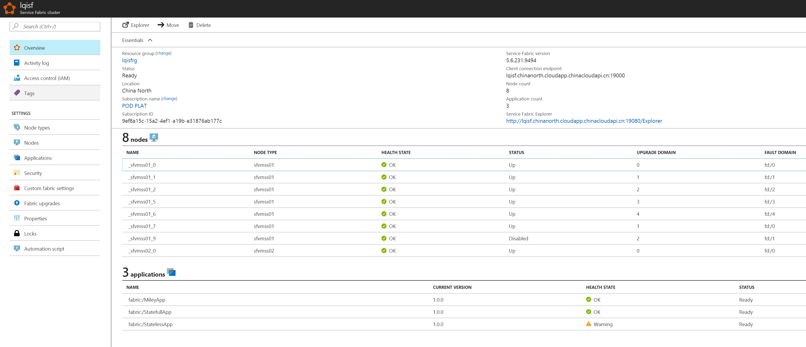

    PowerShell 中连接没有配置安全连接的 Service Fabric 集群的命令：

    ```PowerShell
    Connect-ServiceFabricCluster -ConnectionEndpoint <SF-endpoint>
    ```

    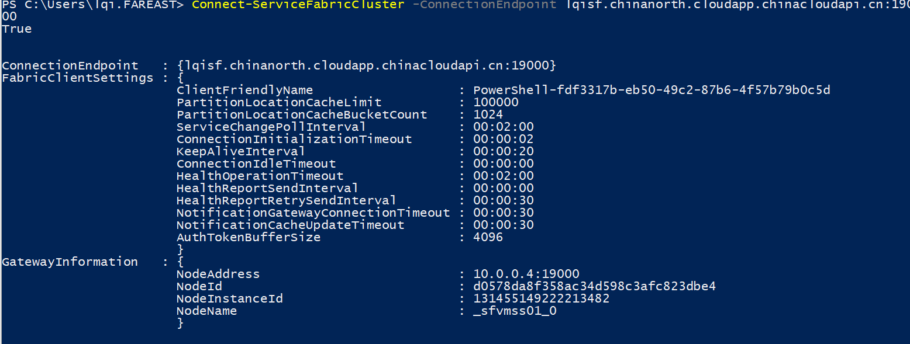

2. 从集群中禁用节点

    禁用的目的在于要删除该节点，因此是 `RemoveNode`。

    ```PowerShell
    Disable-ServiceFabricNode  -NodeName <node_name> -Intent RemoveNode
    ```

    > [!IMPORTANT]
    > 该操作从集群中最新（节点序列号最大）的节点开始操作。因为 VMSS 在进行收缩时，总是先从最新创建的实例开始删除，这样能保证禁用的集群节点和删除的 VMSS 实例是一致的，避免误操作。VMSS 根据创建的顺序将节点的名字以数字结果来命名，一般最大的数字即为最新的节点。如图，示例中最大的即为 `_sfvmss01_9`。

    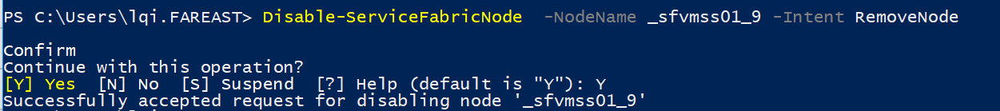

    命令执行后，等待节点变为 `disabled` 状态。确认方法：

    - 在 Azure 门户中 Service Fabric 界面，`Status` 变为 `disabled`:

        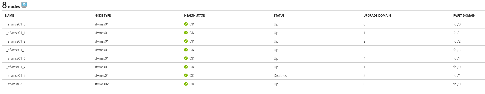

    - 在 Service Fabric Explorer 中，`Nodes` 中节点变为 `Disabled`:

        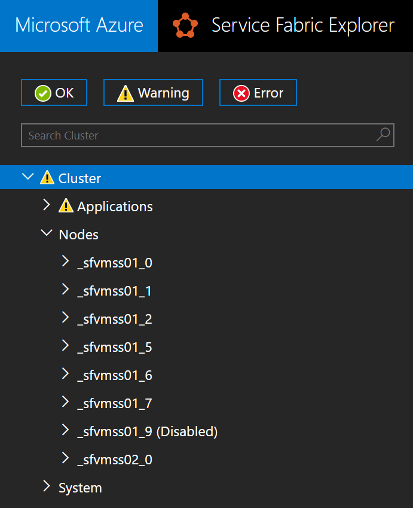

    - 在 PowerShell 中, 通过 `Get-ServiceFabricNode`命令获取节点状态，其中`NodeStatus`变为 `Disabled`。

        

        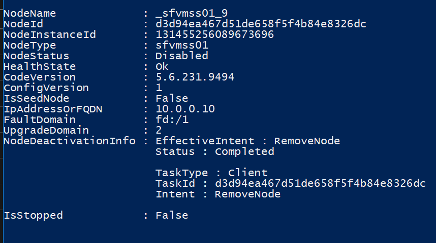

3. 若有多个节点要移除，请重复第 2 步直到所有要移除的节点变为 `Disabled`。

    > [!IMPORTANT]
    > 每次禁用节点都应该选择现有节点中命名数字最大的，因为 VMSS 进行收缩时默认会删除最新创建的实例。这里我们以移除两个节点为例。

    > [!IMPORTANT]
    > 不要将 Service Fabric 主节点使用的 VMSS 收缩到其可靠层所允许的实例数以下，否则整个集群会出现问题。具体请参考:[Service Fabric 群集容量规划注意事项](https://docs.azure.cn/zh-cn/service-fabric/service-fabric-cluster-capacity)。

    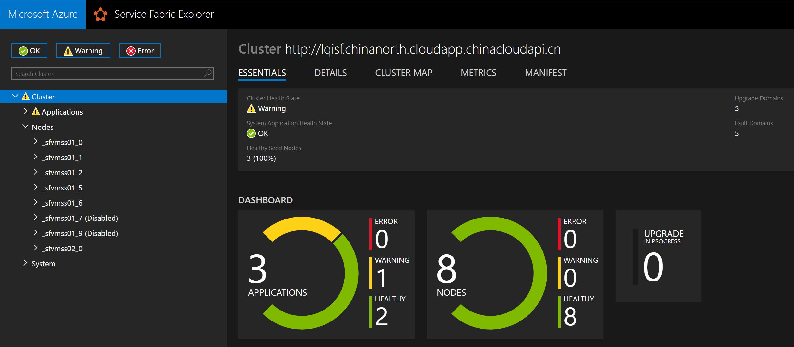

4. 对 Service Fabric 所在的 VMSS 进行收缩。

    1. 首先定位到您进行缩放的 VMSS，在门户中 VMSS 界面中 Instances 边栏查看实例数和实例状态。示例中有 7 个实例，我们将收缩到 5 个（前面已经禁用了 2 个最大实例上的 Service Fabric 服务）。

        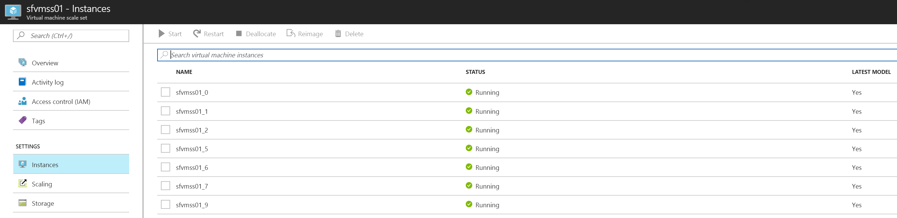

    2. 登录 Azure 订阅

        ```PowerShell
        Login-AzureRmAccount -EnvironmentName azurechinacloud
        ```

    3. 获取 VMSS profile 并更新 VMSS 以实现实例收缩。

        将 `$vmss.Sku.Capacity` 置为 VMSS 最终的节点数。

        ```PowerShell
        $vmss = Get-AzureRmVmss -ResourceGroupName <resource_group>  -VMScaleSetName <vmssname>
        $vmss.Sku.Capacity = 5
        Update-AzureRmVmss -ResourceGroupName <resource_group>  -Name <vmssname> -VirtualMachineScaleSet $vmss
        ```

        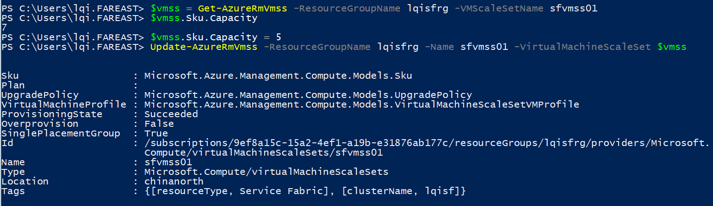

    4. 在 Azure 门户中，您可以看到 VMSS 最新的实例正在被删除。

        
    5. 等待收缩完成，你可以看到实例数已经变成 5 个。

        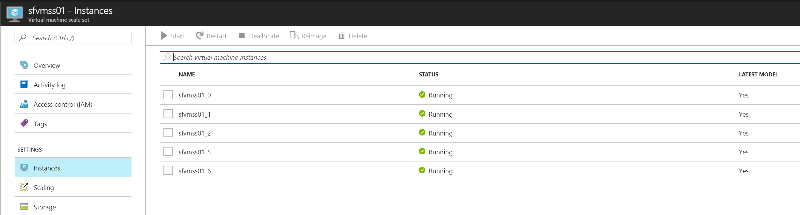

5. 更新 Service Fabric 集群

    在 VMSS 将实例删除后，Service Fabric 集群中的某些状态会发生变化。这时 Service Fabric 集群不认为节点已经删除，而是当它无法与节点进行通信后，误认为节点暂时发生错误，后续可能还会恢复。因此，我们要手动操作告诉 Service Fabric 集群这些节点应该被移除。

    1. VMSS 收缩完成后，Service Fabric 中显示的状态。如果如下面所示，被删除的节点显示错为 Error（Down），这是正常的现象。

        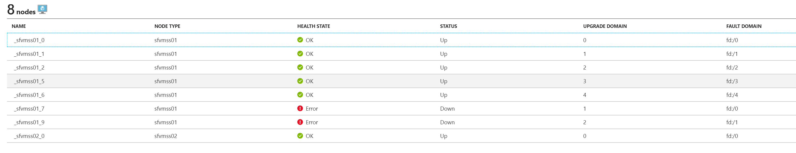

        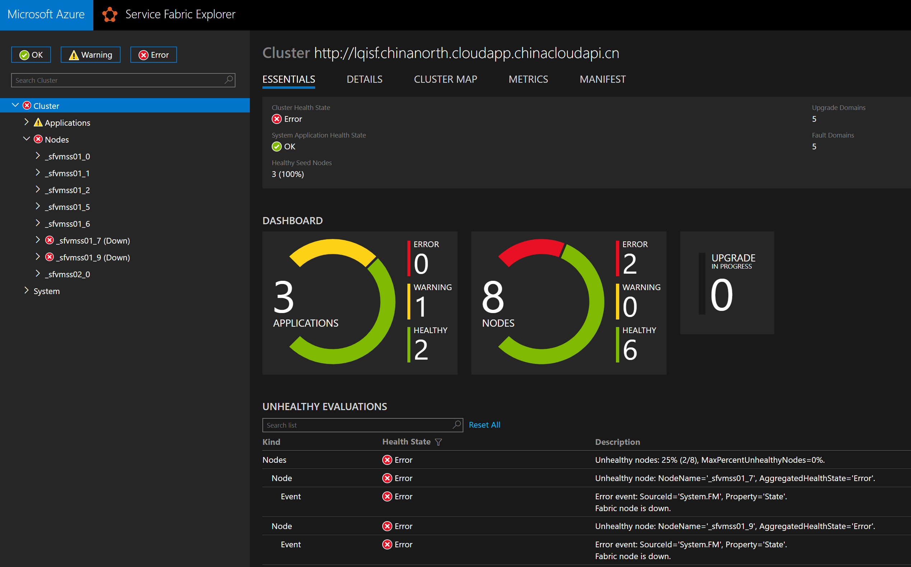

    2. 我们需要手动执行一些操做将删除的节点从集群中移除。通过图形化界面或者命令行都能完成该操作。

        - 你可以选择在 Service Fabric explore 中点击到需要移除的节点，点击 **Remove  node state**，在弹出的对话框中输入节点名确认移除。

            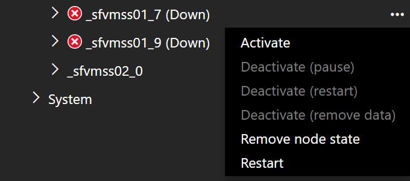

            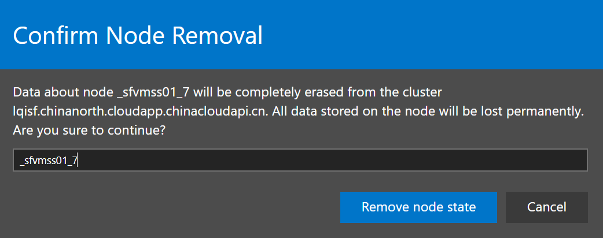

        - 执行 PowerShell 命令移除

            ```PowerShell
            Remove-ServiceFabricNodeState -NodeName <nodename>
            ```

            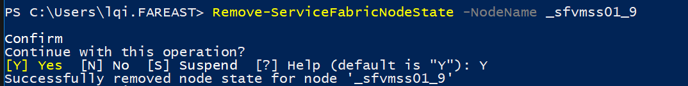
    3. 完成之后查看 Service fabric 集群状态，可能需要几分钟等待信息同步。

    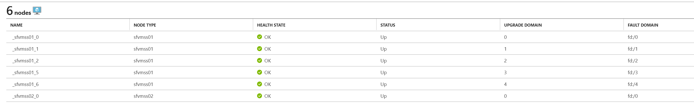

    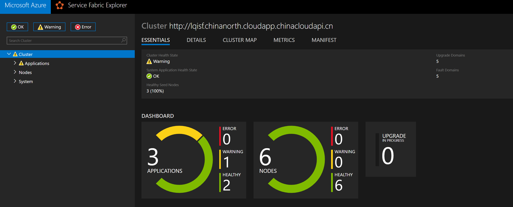