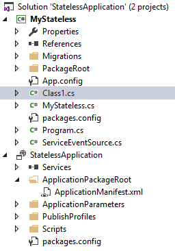
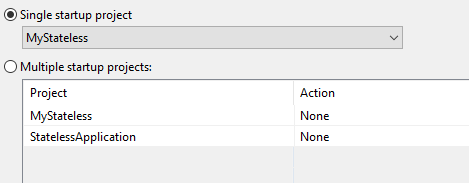
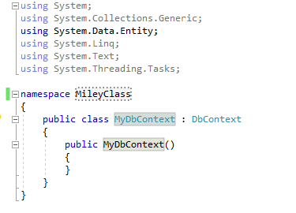
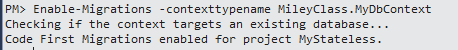

# 如何在 Servcie Fabric 项目中运行 Entity Framework 的 Enable-Migrations 命令

当我们在创建 Service Fabric 项目后，想要利用 Entity Framework 的 CodeFrist 将数据插入数据库时可能会遇到以下问题。

## 问题描述

使用 Visual studio 中的 nuget 管理将 Entity Framework 引入 Service Fabric 项目后，开启 Enable-Migrations，会提示 Application 项目没有安装 EntityFramework。

当我们尝试在 Application 中引入 EntityFramework 时报错：

`Install-Package : Failed to add reference. The package 'EntityFramework' tried to add a framework reference to 'System.ComponentModel.DataAnnotations' which was not found in the GAC. This is possibly a bug in the package. Please contact the package owners for assistance.`

## 解决方法

我们以 Stateless 类型的 Service Fabric 项目为例：

1. 首先要确保在执行 Enable-Migrations 的时候，设定的 Default project 为 stateless project (如下面的例子：MyStateless ):

    

    该 Service Fabric 项目的结构如下：

    

2. 保证 stateless project (例如：MyStateless) 已被设置为 Single  startup Project:

    

3. 由于 Enable-Migrations 依赖于 MyDbContext Class，因此需要建立了一个 xxx.cs 的文件，在这个文件中对该类进行定义：

    

4. 运行 Enable-Migrations 命令时要指定 ContextTypeName 为之前 xxx.cs 文件中的 MyDbContext Class，例如：`Enable-Migrations -contexttypename MileyClass.MyDbContext`。

## 运行结果

