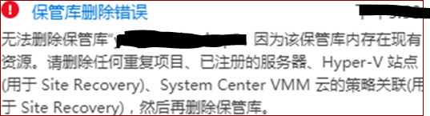
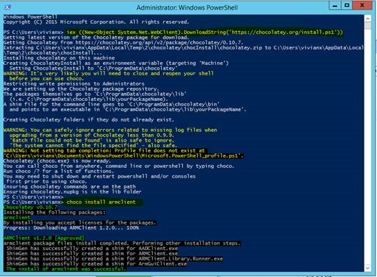
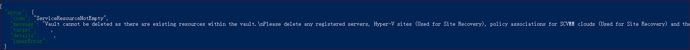

# 无法删除恢复服务保管库—因为该保管库中存在现有资源

## 问题描述

在 Azure 恢复服务中进行了 Azure 虚拟机的备份。当尝试停止保护，并删除备份项后无法从 Azure 门户删除 Azure 恢复服务保管库。 报错：

> 无法删除保管库 “保管库名”，因为该保管库中存在现有资源。请删除任何重复项目、已注册的服务器、Hyper-V 站点 （用于 Site Recovery）、System Center VMM 云的策略关联（用于 Site Recovery）,然后再删除保管库。



## 原因分析

保管库中仍然有残留的注册项未被删除。

## 排错过程

参考文档[强制删除保管库](https://docs.azure.cn/zh-cn/backup/backup-azure-delete-vault#delete-the-recovery-services-vault-by-force)。

具体步骤如下：

1. 以管理员方式运行 PowerShell 并 [安装 Chocolatey](https://chocolatey.org/docs/installation#install-with-powershellexe)。

2. 然后运行 `choco install armclient`。

    

3. 定位到 `C:\ProgramData\chocolatey\bin\` 文件夹。

4. 运行命令登录：

    ```powershell
    set ARMCLIENT_ENV=MOONCAKE
    .\ARMClient.exe login Mooncake
    ```

    

5. 登录成功后运行以下脚本来删除：

    ```powershell
    ARMClient.exe delete subscriptions/{subscriptionId}/resourceGroups/{resourceGroupName}/providers/Microsoft.RecoveryServices/Vaults/{vaultName}?api-version=2016-06-01 -verbose
    ```

6. 如果仍然报错：

    

7. 请运行以下脚本查看是否有注册项残留：

    ```powershell
    get "/subscriptions/{subscriptionId}/resourceGroups/{resourceGroupName}/providers/Microsoft.RecoveryServices/vaults/{vaultName}/registeredIdentities/iaasvmcontainerv2;{ResourceGroupName};{vmname}?api-version=2016-06-01"
    ```

    如果该命令有返回值，证明该注册项仍然存在，请用以下命令进行删除：

    ```powershell
    Delete "/subscriptions/{subscriptionId}/resourceGroups/{resourceGroupName}/providers/Microsoft.RecoveryServices/vaults/{vaultName}/registeredIdentities/iaasvmcontainerv2;{ResourceGroupName};{vmname}?api-version=2016-06-01"
    ```

8. 删除成功后再次尝试删除保管库。

## 更多参考

[Registered Identities - Delete](https://docs.microsoft.com/en-us/rest/api/recoveryservices/registeredidentities/delete)

更多问题您也可以访问 [MSDN 上的 Azure 论坛](https://social.msdn.microsoft.com/Forums/zh-CN/home?forum=windowsazurezhchs)。 您可以在这些论坛上发布您的问题。 此外，还可以通过在 [Azure 支持](https://www.azure.cn/support/contact/)站点上选择 “**获取支持**” 来发出 Azure 支持请求。
