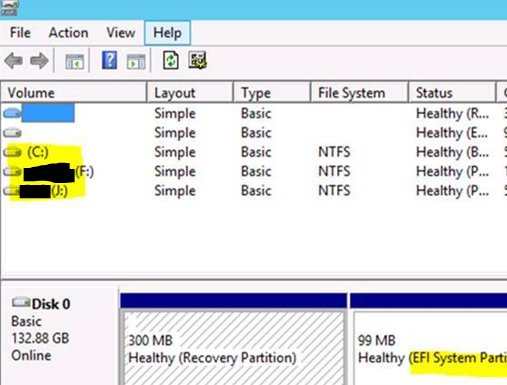
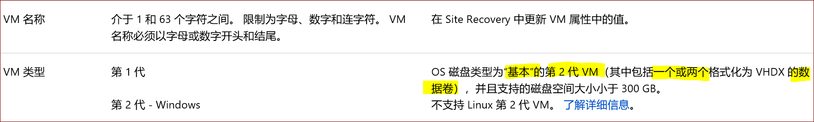

# Azure 站点恢复的排错 -- 错误 ID18090

## 问题描述

Azure Site Recovery (ASR) Hyper-V to Azure 初始复制失败，报错如下：

> **错误 ID18090** 
> 错误消息复制虚拟机 xxxx 失败，因为工作流验证失败(错误代码: 80790033 时间戳 #####) 
> 提供程序错误 Starting initial replication failed for virtual machine as number of partitions in the os disk exceeded the number of allowed partitions. 
> 可能的原因操作系统磁盘中的分区数超出了允许的分区数。

## 问题分析

出现该错误是因为要复制的 Hyper-V 虚拟机系统盘的数据卷数量超过了限制。

可以通过以下步骤进行问题排查：

1. 查看 VM 中的磁盘分区情况：

    磁盘管理器：在虚拟机开始搜索 `diskmgmt.msc` 打开磁盘管理器。

    

    从磁盘管理器中得知以下信息：

    - 磁盘大小
    - OS disk 总共被分了 5 个区，其中三个为数据卷
    - 该虚拟机为 二代虚拟机 （UEFI 启动方式）

2. 然后参考 [Hyper-V 到 Azure 的支持矩阵](https://docs.azure.cn/zh-cn/site-recovery/hyper-v-azure-support-matrix#azure-vm-requirements)，得到如下信息。

    

    对于二代虚拟机，只支持 1 个或 2 个数据卷。由于该虚拟机有 3 个数据分区，所以超过了限制。

## 解决方法

1. 备份数据后删除一个分区
2. 对磁盘重新格式化。

## 更多信息

[第 2 代虚拟机概述](https://msdn.microsoft.com/zh-cn/library/dn282285%28v=ws.11%29.aspx?f=255&MSPPError=-2147217396)