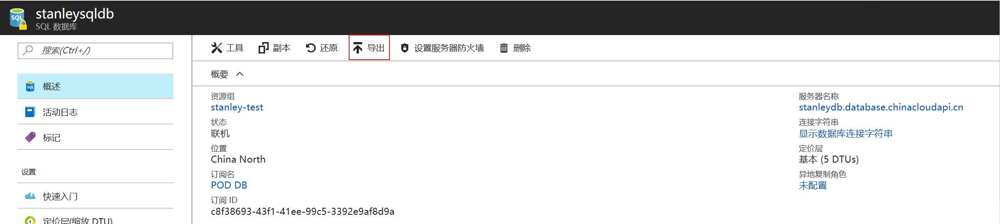
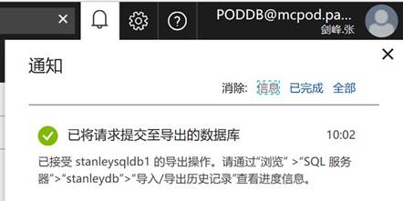
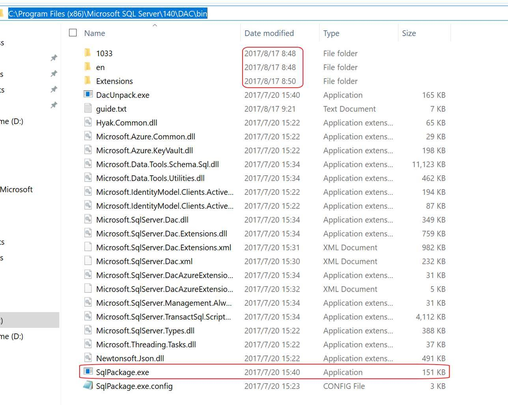
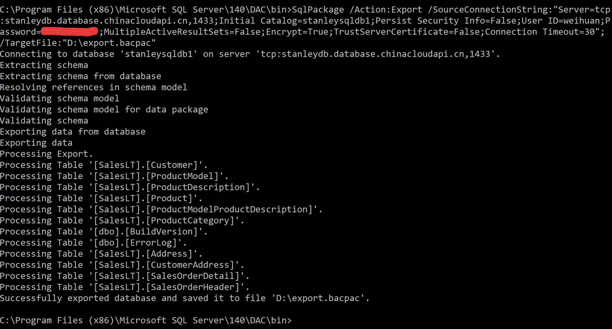

# 有关 Azure SQL 数据库导出功能的常见问题及回答

在 [Azure Portal](https://portal.azure.cn) 上，用户可以在 Azure SQL 数据库页面上通过点击 “**导出按钮**”，方便地将数据库导出为 bacpac 文件存放在存储账户的容器中。



以下是有关 Azure SQL 数据库导出功能的几个常见问题及回答，供读者参考：

## 问题一

**问**：数据库导出时间较长，即便是导出空数据库也需花费十几分钟，且在导出完成前进度一直显示为 0%，可否在 [Azure Portal](https://portal.azure.cn) 上中止导出操作？

**答**：在 [Azure Portal](https://portal.azure.cn) 的数据库页面上点击 “**导出**” 按钮后，导出请求被提交到后台 Job 的等待队列中，因此在 [Azure Portal](https://portal.azure.cn) 上只显示 “**已将请求提交至导出的数据库**”。



之所以是客户反映说空数据库导出花了 13 分钟，并且导出进度百分比直接从 0% 到 100%，是由于导出请求需要在队列等待一段时间才能执行。

而因为数据库的 size 太小（空白数据库的大小仅为 4MB，导出的 bacpac 文件仅为 3KB），使得执行导出操作所需的时间非常少，因此客户在 [Azure Portal](https://portal.azure.cn) 上所看到的进度是由 0% 直接跳至 100%。

此外，由于此进程是在 Azure 后台运行，客户是无法终止该导出进程的。

## 问题二

**问**：数据库导出失败，报错信息如下：

**报错 1** :

```
Error SQL71562: Procedure: [Schema_Name].[Procedure_Name] has an unresolved reference to object [Database_Name].[Schema_Name].[Table_Name].[Column_Name]. External references are not supported when creating a package from this platform.
```

**报错 2** :

```
Error encountered during the service operation. One or more unsupported elements were found in the schema used as part of a data package. Error SQL71564: Error validating element [Schema_Name].[Procedure_Name]: The element [Schema_Name].[Procedure_Name] cannot be deployed as the script body is encrypted.
```

**答**：对于报错 1，由官网链接 : [解析迁移到 SQL 数据库的过程中的 Transact-SQL 差异](https://docs.azure.cn/zh-cn/sql-database/sql-database-transact-sql-information)可知，Azure SQL 数据库不支持三段式(即`[Database_Name].[Schema_Name].[Table_Name]`的形式)跨库查询语句，故出现此报错。我们建议客户将数据库中含有三段式的对象中三段式对象名的`[Database_Name].`部分删除后，再执行导出操作。

对于报错 2，Azure 数据库不支持加密对象的导出，故出现此报错。我们建议客户执行 ALTER 命令对加密了的存储过程或触发器执行解密操作：

例如，假设创建存储过程的语句为：

```SQL
CREATE PROCEDURE dbo.proc_date
WITH ENCRYPTION
AS
BEGIN
  SELECT * FROM dbo.Date
End
GO
```

则执行以下 ALTER 语句完成解密过程，注意二者的区别仅在于 ALTER 语句删除了`WITH ENCRYPTION`的部分。

```SQL
ALTER PROCEDURE dbo.proc_date
AS
BEGIN
  SELECT * FROM dbo.Date
End
GO
```

此外，由于客户往往对生产环境中的数据库进行修改持谨慎态度，因此建议先在 [Azure Portal](https://portal.azure.cn) 上还原出一个备用数据库，然后在还原出来的数据库上进行修改并执行导出操作。


## 问题三

**问**：数据库导出过程无报错，但 CPU 使用率长期处于 100%，导出进度百分比始终为 0%，导出进程无法结束。

**答**：如问题一的回答所言，客户无法直接终止 [Azure Portal](https://portal.azure.cn) 上的导出操作，因此如有需要可以联系微软后台工程师终止导出进程。

出现这种故障的原因之一是客户数据库的 Schema 过于庞大(例如单个数据库中有十多万张表，数百万列)，导致导出 Schema 的过程中系统负载过重，引发导出进程一再重启而无法继续。

针对这类问题，客户可参考以下两种备用方案，任选其一即可：

1. 将 cfwinerp_2017-07-25T02-13Z 升级为 P 级别数据库后，再次尝试在 [Azure Portal](https://portal.azure.cn) 上执行导出操作；
2. 在本地下载并安装最新版的 DacFramework.msi，然后选择在命令行界面上运行 SqlPackage.exe 执行数据库导出任务，推荐选择配置较好的机器上进行操作。

其中第二种方法可参考以下示例的步骤：

1. 在 [此处](https://www.microsoft.com/zh-cn/download/details.aspx?id=55713) 下载最新版的 DacFramework.msi 并安装；
2. 打开 SQL Server 下 DAC 的 bin 文件夹(在我本机地址为 C:\Program Files (x86)\Microsoft SQL Server\140\DAC\bin)，

    根据 1033，en 和 Extensions 三个文件夹的修改时间确认 DacFramework.msi 已更新成功，同时可找到 SqlPakage.exe 文件；
    
    

3. 用管理员账号运行 cmd，切换目录至 DAC 的 Bin 文件夹下后，执行以下命令：

    ```
    SqlPackage /Action:Export /SourceConnectionString:" Server=tcp:stanleydb.database.chinacloudapi.cn,1433;Initial Catalog=stanleysqldb1;Persist Security Info=False;User ID={your_username};Password={your_password};MultipleActiveResultSets=False;Encrypt=True;TrustServerCertificate=False;Connection Timeout=30;"; /TargetFile:"D:\export.bacpac"
    ```

    其中连接字符串信息和目标文件位置可根据实际情况来填写。

4. 命令执行完毕后，可发现已成功在所选的路径下创建 bacpac 文件。

    