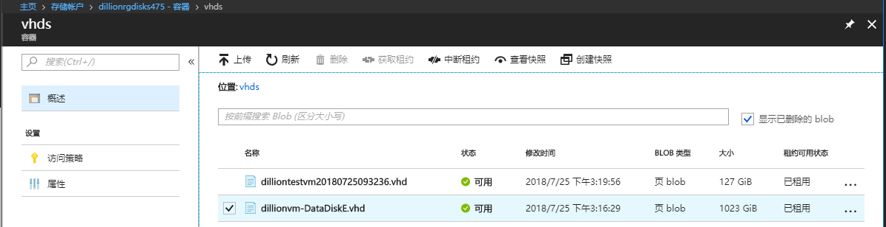
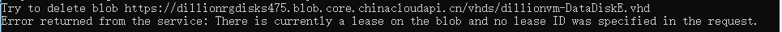
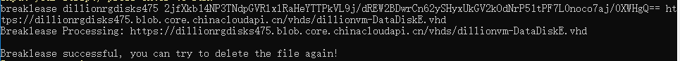
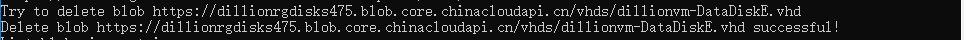

# Page Blob 文件释放租约工具

## **问题描述**

有些情况下，我们删除 Page Blob 文件会报告以下错误：

`There is currently a lease on the blob and no lease ID was specified in the request.`

## **解决方法**

从[这里](https://github.com/hello-azure/pageblob-breaklease/)下载工具。
语法格式：

```
breaklease <accountName> <accountKey> <page blob url>
	 
breaklease dillionrgdisks475 2jfXkb14NP3TNdpGVRlxlRaHeYTTPkVL9j/dREW2BDwrCn62ySHyxUkGV2kOdNrP51tPF7L0noco7aj/0XWHgQ== https://dillionrgdisks475.blob.core.chinacloudapi.cn/vhds/dillionvm-DataDiskE.vhdd
```

## **测试示例**

1.	测试删除一个挂载的磁盘，由于该磁盘被占用，删除会报告以下错误：
	 
	
	
 
2.	运行工具，执行：

	```
	breaklease dillionrgdisks475 2jfXkb14NP3TNdpGVRlxlRaHeYTTPkVL9j/dREW2BDwrCn62ySHyxUkGV2kOdNrP51tPF7L0noco7aj/0XWHgQ== https://dillionrgdisks475.blob.core.chinacloudapi.cn/vhds/dillionvm-DataDiskE.vhdd
	```

	
	释放租约成功后，成功删除文件：
 
	

## 相关参考

[通过 .NET 开始使用 Azure Blob 存储](https://docs.azure.cn/storage/blobs/storage-quickstart-blobs-dotnet?tabs=windows#writing-to-an-append-blob)

[如何查找并删除未被使用的非托管磁盘源 .vhd 文件](https://docs.azure.cn/articles/azure-operations-guide/virtual-machines/aog-virtual-machines-how-to-find-and-delete-unused-vhds)