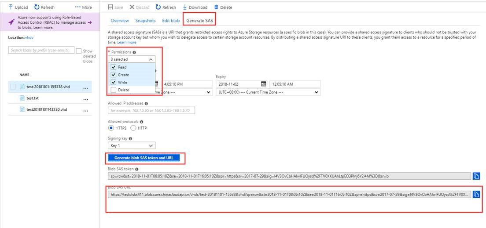
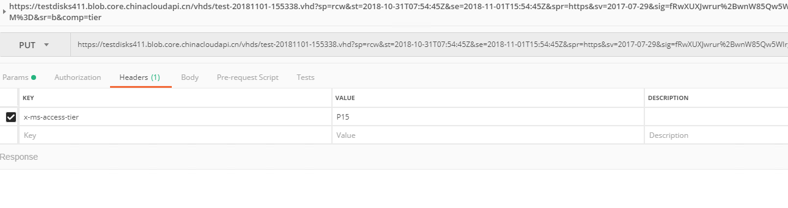
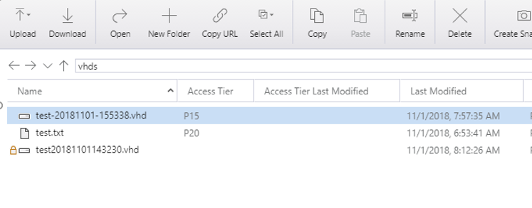

# 如何设置页 Blob 和非托管磁盘的高级访问层

在 Azure 门户创建的高级非托管磁盘，默认是没有指定高级访问层的，很多情况下，我们需要显示指定高级非托管磁盘和页 Blob 的高级访问层。 目前我们只能通过 PowerShell 或者 REST API 的方式来创建和修改页 Blob 和非托管磁盘的高级访问层。

## 使用 PowerShell 创建指定高级访问层的页 Blob

我们可以使用 PowerShell 命令 `Set-AzureStorageBlobContent`，在创建 PageBlob 时，指定 PremiumPageBlobTier 即可。实例代码：

```powershell
$Metadata = @{"key" = "value"; "name" = "test"}
$context = New-AzureStorageContext -ConnectionString "<storage-connection-string>"
Set-AzureStorageBlobContent -File "E:\\test.txt" -Container "test" -Metadata $Metadata -BlobType Page -PremiumPageBlobTier P20 -Context $context.Context
```

高级别的层级，例如 P60 也可以通过此方法来创建。<br>
该命令的更多用法请参阅 [Set-AzureStorageBlobContent](https://docs.microsoft.com/en-us/powershell/module/azure.storage/set-azurestorageblobcontent?view=azurermps-6.11.0 )。

## 使用 REST API 的方式来修改已创建的页 Blob 或者高级非托管磁盘的高级访问层

1. 首先，找到要修改的非托管磁盘，需要先将该磁盘与虚拟机分离。

2. 之后，在 Storage 中找到该磁盘存储的 VHD 文件，并生成 SAS Token ：

    

    生成之后 Copy 生成的 URL ，在 URL 中追加 *&comp=tier*，得到类似以下 URL ：

    `https://testdisks411.blob.core.chinacloudapi.cn/vhds/test-20181101-155338.vhd?sp=rcw&st=2018-10-31T07:54:45Z&se=2018-11-01T15:54:45Z&spr=https&sv=2017-07-29&sig=fRwXUXJwrur%2BwnW85Qw5WIrgzpE8zzng0Tc54owf09M%3D&sr=b&comp=tier`

3. 之后，在本地安装 PostMan ，再选择 PUT 请求方式，输入上一步组合的 URL ，并且在请求 Header 中加入 `x-ms-access-tier` ,  并填写值为 `p15` 。之后发送请求，返回状态 `status` 为 `200`，即表示修改成功。

    

4. 修改之后也可以使用 Storage Explorer 查看该 VHD 文件的 Tier ，如下图：

    